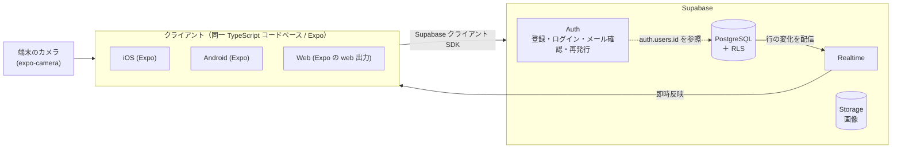
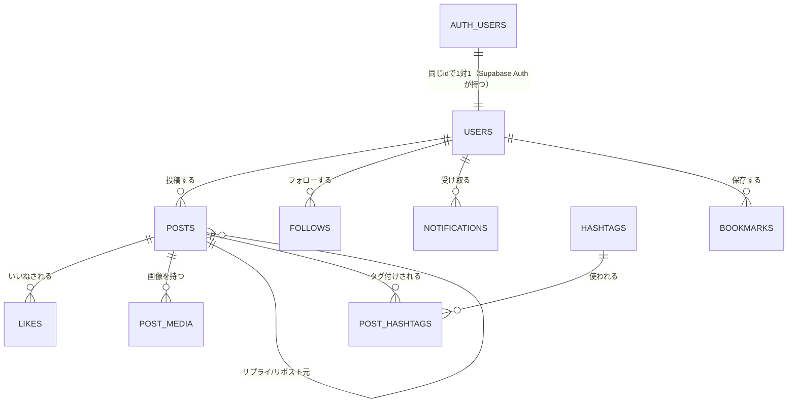

# 03. 基本設計書

ステータス: ドラフト（局長レビュー待ち）
改訂: 2026-07-26。技術構成が Expo + Supabase へ変わったため §1・§3・§5 を差し替え、
§2 に FR13〜FR15 由来の画面を追加した（経緯は `02_技術選定書.md`）。

## 1. システム構成図

**旧構成から消えたもの**: NestJS API サーバー / Redis / BullMQ ワーカー / S3互換ストレージ /
自前 WebSocket。学習者が触るのは **Expo と Supabase の2つだけ**になった。

**RLS（Row Level Security ＝ 行レベルセキュリティ）**が図の中心にある理由: サーバーを
自分で書かない構成では、「他人の投稿を消せない」といった権限のルールを置く場所が
DB しかない。本教材で新しく教える中心概念はここ。

## 2. 画面一覧

| # | 画面名 | 概要 | 関連機能要件 |
|---|---|---|---|
| 1 | ログイン | メール/パスワードでログイン | FR1 |
| 2 | 新規登録 | アカウント作成 | FR1 |
| 3 | タイムライン | フォロー中ユーザーの投稿一覧（ホーム） | FR4 |
| 4 | 投稿作成 | テキスト＋画像を添付して投稿 | FR3 |
| 5 | 投稿詳細 | 投稿本文＋リプライスレッド表示 | FR5 |
| 6 | プロフィール | 自分/他人のプロフィールと投稿一覧 | FR2 |
| 7 | プロフィール編集 | 表示名・bio・画像の編集 | FR2 |
| 8 | フォロー中一覧 / フォロワー一覧 | ユーザーリスト表示 | FR8 |
| 9 | 通知 | いいね・リプライ・リポスト・フォロー通知一覧 | FR9 |
| 10 | 検索 | 投稿・ユーザーのキーワード検索 | FR10 |
| 11 | ハッシュタグ一覧 | 特定タグの投稿一覧 | FR11 |
| 12 | ブックマーク一覧 | 保存した投稿一覧 | FR12 |
| 13 | メール確認待ち | 登録直後の案内と再送。メール内リンクからアプリへ戻る（ディープリンク） | FR13 |
| 13-2 | **プロフィール初期設定** | **初回ログイン時に表示ID（username）と表示名を決める**。登録時はメールとパスワードしか受け取らないため、この画面を通らないと表示IDが空のままになる（2026-07-27 の B20 決定で新設） | FR1, FR2 |
| 14 | パスワード再発行の申請 | メールアドレスを入力して再設定メールを送る | FR14 |
| 15 | パスワード再設定 | メールのリンクから開き、新しいパスワードを設定する | FR14 |

**旧12画面はすべて生存**。13〜15 は 2026-07-26 の局長決定（C-4）で FR13・FR14 が
増えたことによる追加。カメラ撮影（FR15）は画面を新設せず、投稿作成画面（#4）の中で
撮影を起動する形にする（画面数を増やさずネイティブ機能を体験させるため）。

## 3. 主要ユースケース（代表例）

### UC1: 投稿してタイムラインに反映される

1. ユーザーが投稿作成画面でテキストを入力し、端末のカメラで撮影するか写真を選ぶ
2. アプリが画像を Supabase Storage へ直接アップロードする
3. アプリが `posts` テーブルへ行を挿入する。**「自分の user_id でしか挿入できない」ことは
   RLS が保証する**（アプリ側のチェックを信用しない）
4. フォロワーがタイムラインを開いていれば、Supabase Realtime が行の追加を配信して即時反映

### UC2: いいねすると相手に通知が届く

1. ユーザーが投稿にいいねする
2. アプリが `likes` テーブルに行を挿入する
3. `notifications` への通知行の作成は **DB のトリガー関数**で行う
   （サーバーが無い構成では、アプリの書き忘れを防ぐ置き場所が DB しかないため）
4. 投稿主がアプリを開いていれば Supabase Realtime で即時通知、
   閉じていれば次回アクセス時に通知一覧へ反映

### UC3: 新規登録してメール確認を通す（FR13）

1. ユーザーがメールアドレスとパスワードで登録する
2. Supabase Auth が確認メールを送る。アプリは「メール確認待ち」画面（#13）を出す
3. ユーザーがメール内のリンクを開くと、**ディープリンクでアプリが起動**して確認が完了する
4. 確認が済むまでは、RLS により投稿の書き込みができない
5. **確認が済んだ直後、プロフィール初期設定画面（#13-2）へ進む**。ここで表示ID（username）と
   表示名を決める。登録時に受け取るのはメールとパスワードだけなので、**この画面を通さないと
   表示IDが空のまま残り、プロフィールのURLが作れない**（2026-07-27 の B20 決定）
6. 表示IDが既に使われていた場合は、DB の一意制約が違反を返すので、その場で
   「このIDは使われています」と出して選び直させる

**この導線を省くと何が起きるか**: 表示IDが空のアカウントが無期限に残る。
他人のタイムラインでの表示も、プロフィールのURLも作れない。
**B20 で登録時の必須指定を外した代償が、この画面である。**

**教材としての注意**（2026-07-28 決着・16 §B14）: Supabase 標準のメール送信は
**組織のメンバーとして登録したアドレスにしか届かない**。演習用に適当なアドレスで
アカウントを作っても1通目から届かないので、**通数（1時間2通）を待っても解決しない**。
よってこの UC3 は**学習者本人のアドレス1つ**で教える。複数アカウントが要る章
（タイムライン・通知・フォロー）は**メール確認を切った状態**で進め、
切る手順と本番で切らない理由を教材に書く。

## 4. ER図（概要 — 詳細は `05_DB設計書.md`）

## 5. 未決定事項（詳細設計フェーズで確定させる）

- 各画面のコンポーネント分割・状態管理方針（Supabase クライアントの購読をどこに置くか）
- 実機ビルド・配布を教材内でどこまでやらせるか（Expo Go までに留めるか、EAS Build を使うか）
- ディープリンクの設定方法（`app.json` のスキーム設定と Supabase 側のリダイレクト URL の対応）
- 通知行の作成を DB トリガーで書く範囲（UC2 の3で述べた方式の具体化）

**旧構成由来の未決定事項は消滅**: Capacitor のネイティブビルド設定
（`ios/`・`android/` プロジェクトの生成タイミング）は、Expo が管理するため論点ごと無くなった。
