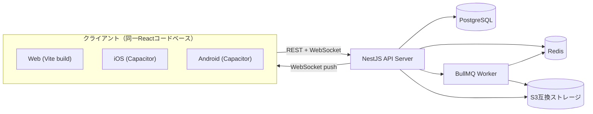
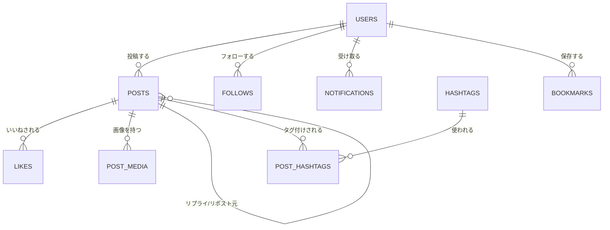

# 03. 基本設計書

ステータス: ドラフト（局長レビュー待ち）

## 1. システム構成図

## 2. 画面一覧

| # | 画面名 | 概要 | 関連機能要件 |
|---|---|---|---|
| 1 | ログイン | メール/パスワードでログイン | FR1 |
| 2 | 新規登録 | アカウント作成 | FR1 |
| 3 | タイムライン | フォロー中ユーザーの投稿一覧（ホーム） | FR4 |
| 4 | 投稿作成 | テキスト＋画像を添付して投稿 | FR3 |
| 5 | 投稿詳細 | 投稿本文＋リプライスレッド表示 | FR5 |
| 6 | プロフィール | 自分/他人のプロフィールと投稿一覧 | FR2 |
| 7 | プロフィール編集 | 表示名・bio・画像の編集 | FR2 |
| 8 | フォロー中一覧 / フォロワー一覧 | ユーザーリスト表示 | FR8 |
| 9 | 通知 | いいね・リプライ・リポスト・フォロー通知一覧 | FR9 |
| 10 | 検索 | 投稿・ユーザーのキーワード検索 | FR10 |
| 11 | ハッシュタグ一覧 | 特定タグの投稿一覧 | FR11 |
| 12 | ブックマーク一覧 | 保存した投稿一覧 | FR12 |

## 3. 主要ユースケース（代表例）

### UC1: 投稿してタイムラインに反映される

1. ユーザーが投稿作成画面でテキスト・画像を入力し送信
2. APIが投稿をDBに保存、画像はストレージにアップロード
3. フォロワーへの通知対象を判定し、非同期ジョブ（BullMQ）でファンアウト
4. フォロワーがタイムラインを開いている場合、WebSocketで新着を即時反映

### UC2: いいねすると相手に通知が届く

1. ユーザーが投稿にいいねする
2. APIが `likes` テーブルに記録し、投稿主への通知を作成
3. 投稿主がアプリを開いていればWebSocketでリアルタイム通知、
   閉じていれば次回アクセス時に通知一覧へ反映

## 4. ER図（概要 — 詳細は `05_DB設計書.md`）

## 5. 未決定事項（詳細設計フェーズで確定させる）

- 各画面のコンポーネント分割・状態管理方針（TanStack Query併用の有無）
- Capacitorのネイティブビルド設定（`ios/`・`android/` プロジェクトの生成タイミング）
