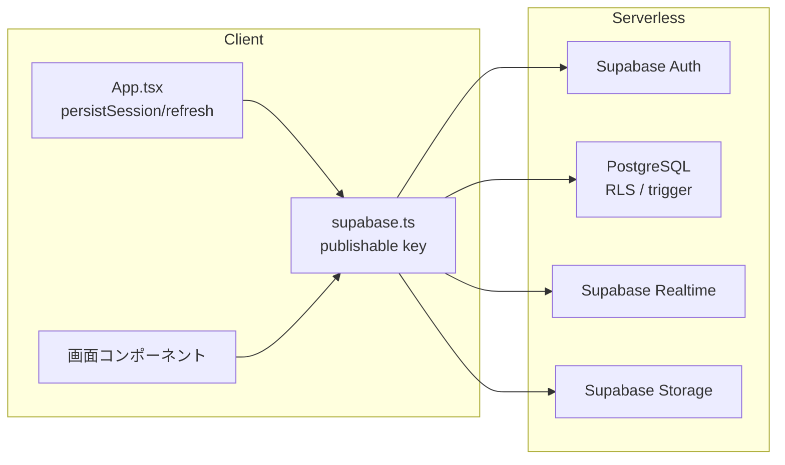

# 04. 詳細設計書

ステータス: **未着手（Phase 1）→ ドラフト先行版**

**本稿は 03_基本設計書.md と 05_DB設計書.md のドラフト版に基づく仮案である。**
03/05 の局長承認後に最終確定する。承認前の先行記述であり、基本設計の変更に伴う
見直しを受ける。

## 着手条件

`03_基本設計書.md` の画面一覧・システム構成図・ER図（概要）に局長の承認が
出た時点で着手する。ウォーターフォールの原則に従い、基本設計が確定する前に
画面ごとの詳細（コンポーネント分割・状態管理・バリデーションルール）へ
先回りしない。

## 着手後にこのファイルへ記載する内容（目次予定）

目次は 2026-07-26 の構成振り直し（Expo + Supabase）に合わせて改訂した。

1. 画面ごとの詳細設計（`03_基本設計書.md` の画面一覧 **15画面**それぞれについて）
   - コンポーネント構成図（React Native の `View` / `Text` / `Pressable` 単位）
   - 状態管理（ローカル state / Supabase クライアントの購読をどこに置くか）
   - 入力バリデーションルール（文字数制限・必須項目・画像ファイル制約）
   - エラー時の表示仕様
   - **Round 12 追加**: 各画面で使う Supabase キー種別（publishable key のみ）の確認
2. **ネイティブ設定の詳細**（`app.json` の権限設定・カメラ権限のダイアログ文言・
   **ディープリンクのスキーム設定**と Supabase 側リダイレクト URL の対応。
   **Round 12 追加**: SDK 57 固定なら development build が必要なケース、メール確認・再発行に
   カスタムスキームを持つ development build が必要な件を具体化。`16_決定バックログ.md` B16/B17/B18 と連動）
3. **Realtime の購読対象一覧**と再接続時の挙動
   - **Round 12 追加**: 対象テーブルを `supabase_realtime` publication に追加するマイグレーション、
     購読開始前の初回 fetch、再接続後の再 fetch、重複排除の実装方針
4. **機能・ファイル・環境の依存グラフ**（章分割＝10のG1の入力。Codex R1 M3対応）
   - **Round 12 追加**: 秘密情報の配置（publishable key のみアプリへ、secret/service_role は禁止）
5. 学習者開発環境の詳細（**Node と npm と Expo Go のみ**。対応OS の範囲＝16 B15 と連動。
   旧目次にあった Docker Compose 構成は、起動するミドルウェアが無くなったため消滅）
   - **Round 12 追加**: `npx create-expo-app@latest` の既定値（移行期間中 SDK 54）と
     `--template default@sdk-57` の使い分け、Node 版と SDK 版の組み合わせ
6. **Web 版の公開設計**（公開先・HTTPS・秘密情報・後片付け。旧「早期公開体験」は
   パートD へ移動した — Codex R2 MAJOR9 の趣旨は生存）
   - **Round 12 追加**: 公開リポジトリでの publishable key 扱い、ビルド時のキー注入方法
7. **RLS ポリシーの実装単位**（どのテーブルのポリシーをどの章で書かせるか。05 §5 と連動）
   - **Round 12 追加**: `notifications` の列単位 UPDATE 権限（`read_at` のみ）実装方針、
     `posts` の DELETE 拒否・`deleted_at` 更新のみ許可する実装方針

---

## 1. 画面ごとの詳細設計

### 1.1 ログイン（画面 #1）

| 項目 | 詳細 |
|---|---|
| コンポーネント | `View`（`LoginScreen`）/`TextInput`（メール・パスワード）/`Pressable`（ログインボタン・新規登録導線）/`Text`（エラー表示） |
| 状態管理 | `email`, `password` を `useState`。`supabase.auth.signInWithPassword` を呼び出し、成功時は `session` グローバル状態を更新 |
| バリデーション | メールは非空。パスワードは8文字以上。API 側でも Supabase Auth のレート制限あり |
| エラー表示 | `error.message` を `Text` で表示。`Email not confirmed` の場合は「メール確認を完了してください」と表示 |
| Round 12 関連 | Supabase クライアントは publishable key のみ使用。secret/service_role キーは埋め込まない |

### 1.2 新規登録（画面 #2）

| 項目 | 詳細 |
|---|---|
| コンポーネント | `View`/`TextInput`（メール・パスワード・username・表示名）/`Pressable`（登録ボタン） |
| 状態管理 | `email`, `password`, `username`, `displayName` を `useState` |
| バリデーション | メール非空・パスワード8文字以上。username は教材内で一意にするため英数字アンダースコア 3〜30 文字、重複不可。`displayName` は未入力時は `username` をコピー |
| 挙動 | `supabase.auth.signUp` 時に `options.data: { username, display_name: displayName }` を渡す。メール確認待ち画面へ遷移 |
| Round 12 関連 | `auth.users` 作成トリガーが `users` 行を生成。トリガー失敗時は新規登録自体が失敗する。B20 で username を登録画面で必須とする方針 |

### 1.3 タイムライン（画面 #3）

| 項目 | 詳細 |
|---|---|
| コンポーネント | `FlatList`（投稿一覧）/`View`（投稿カード）/`Image`/`Text`/`Pressable`（いいね・リプライ） |
| 状態管理 | 投稿リスト `posts`、ページネーション `cursor`、リアルタイム購読 `channel`。購読開始前に `posts` テーブルから初回取得、再接続後に再取得 |
| バリデーション | 投稿カードは `deleted_at IS NULL` のみ表示 |
| Realtime | `supabase_realtime` publication の `posts` テーブルに対して INSERT/UPDATE を購読。購読開始前の初回取得と、受信時の重複排除を実装 |
| Round 12 関連 | パフォーマンス目標は「ローカル 200ms」から見直し。DB 側 `EXPLAIN ANALYZE` とクライアント体感時間を分離して測定 |

### 1.4 投稿作成（画面 #4）

| 項目 | 詳細 |
|---|---|
| コンポーネント | `View`/`TextInput`（本文）/`Pressable`（画像選択・カメラ起動・投稿ボタン）/`Image`（プレビュー） |
| 状態管理 | `body`, `mediaUris`（プレビュー用）、`isPosting` |
| バリデーション | 本文 0〜280 文字。画像最大4枚、JPEG/PNG のみ、1枚5MB以下。クライアント側と Storage bucket 側の両方で制限 |
| 挙動 | 画像を Storage へアップロード → `posts` と `post_media` へ insert。成功後はタイムラインへ戻る |
| Round 12 関連 | `posts.id` / `created_at` は DB default `gen_random_uuid()` / `now()`。アプリ側で生成しない。Storage パスは `{auth.uid}/{post_id}/{uuid}.{ext}` |

### 1.5 通知（画面 #9）

| 項目 | 詳細 |
|---|---|
| コンポーネント | `FlatList`（通知一覧）/`View`（通知カード）/`Pressable`（既読マーク・遷移） |
| 状態管理 | `notifications` リスト、`unreadCount`。購読開始前に `notifications` テーブルから本人分を取得、再接続後に再取得 |
| バリデーション | 通知カードは `recipient_id = auth.uid()` のみ表示（RLS） |
| Realtime | `supabase_realtime` publication の `notifications` テーブルに対して INSERT を購読。受信時の重複排除 |
| 既読化 | `read_at` 列のみ UPDATE 可能。`UPDATE notifications SET read_at = now() WHERE id = :id` |
| Round 12 関連 | RLS で `authenticated` から `notifications` 全体の UPDATE を revoke し、`read_at` 列のみ GRANT。改造アプリが `actor_id` / `type` を書き換えられない |

### 1.6 メール確認待ち（画面 #13）

| 項目 | 詳細 |
|---|---|
| コンポーネント | `View`/`Text`（確認待ちメッセージ）/`Pressable`（再送ボタン） |
| 状態管理 | `email`, `resendCount` |
| 挙動 | ユーザーがメール内リンクをタップすると、カスタムスキームの deep link でアプリが起動。Expo Go の `exp://` スキームでは限定的なため、SDK 57 固定なら development build が必要 |
| Round 12 関連 | Supabase 標準メール送信は 1 時間 2 通まで。B14 でカスタム SMTP の要否を実測。B18 で development build のタイミングを確定 |

### 1.7 パスワード再設定（画面 #15）

| 項目 | 詳細 |
|---|---|
| コンポーネント | `View`/`TextInput`（新パスワード）/`Pressable`（確定ボタン） |
| 状態管理 | `newPassword`, `error` |
| バリデーション | 8文字以上 |
| 挙動 | メールリンクから deep link で遷移。`supabase.auth.updateUser({ password: newPassword })` |
| Round 12 関連 | パスワード再発行リンクもメール確認と同様に development build が必要なケースあり |

## 2. ネイティブ設定の詳細

### 2.1 app.json（Expo 設定）

```json
{
  "expo": {
    "scheme": "snsapp",
    "plugins": [
      ["expo-camera", { "cameraPermission": "投稿用に写真を撮影するためカメラを使用します" }]
    ]
  }
}
```

### 2.2 deep link / ディープリンク

- アプリ固有スキーム: `snsapp://`
- Supabase ダッシュボードの Authentication → URL Configuration で
  `snsapp://auth/callback` と `snsapp://auth/reset-password` を登録
- Expo Go では `exp://{tunnel-url}/--/auth/callback` のような制限付き URL になるため、
  メール確認・再発行の安定動作には `app.json` の `scheme` を持つ development build が必要

## 3. Realtime の購読対象一覧

| テーブル | イベント | 購読画面 | 備考 |
|---|---|---|---|
| posts | INSERT, UPDATE | タイムライン | 新規投稿・論理削除の反映。購読開始前に `select`、再接続後に再 `select` |
| notifications | INSERT | 通知 | 本人宛通知のリアルタイム反映。重複排除必須 |
| likes | INSERT, DELETE | タイムライン・投稿詳細 | いいね数の即時反映 |
| follows | INSERT | プロフィール・フォロー一覧 | フォロー状態の即時反映 |

## 4. 機能・ファイル・環境の依存グラフ



## 5. 学習者開発環境の詳細

### 5.1 必要なツール

- Node.js LTS（教材執筆時点で 22.x。SDK 57 の場合は 22.13.x 以上）
- npm
- Expo Go（iOS/Android 実機）
- （任意）development build を作る場合は EAS CLI

### 5.2 プロジェクト作成

```bash
# SDK 57 を使う場合（移行期間中は物理端末 Expo Go が非対応の可能性あり）
npx create-expo-app --template default@sdk-57 sns-app

# 移行期間中に Expo Go で動かす場合
npx create-expo-app -t expo-template-blank-typescript sns-app
```

## 6. Web 版の公開設計

- 出力: `npx expo export:web` で `dist/` 生成
- 公開先: 教材では `localhost:3000` または GitHub Pages を想定（B6 で確定）
- 秘密情報: `.env` の `EXPO_PUBLIC_SUPABASE_PUBLISHABLE_KEY` のみ使用
- 公開リポジトリであっても publishable key は晒して問題ない（RLS が守る）。
  ただし secret / service_role は絶対に含めない

## 7. RLS ポリシーの実装単位

| 章 | 実装する RLS |
|---|---|
| 投稿作成章 | `posts`, `post_media` の INSERT/UPDATE |
| プロフィール章 | `users` の UPDATE |
| 通知章 | `notifications` の SELECT + `read_at` 列のみ UPDATE |
| フォロー章 | `follows` の INSERT/DELETE |
| ブックマーク章 | `bookmarks` の SELECT/INSERT/DELETE |
| 画像アップロード章 | `storage.objects` の INSERT/DELETE |

## 参照元

- 画面一覧: `03_基本設計書.md` セクション2
- 機能要件: `01_要件定義書.md` セクション2
