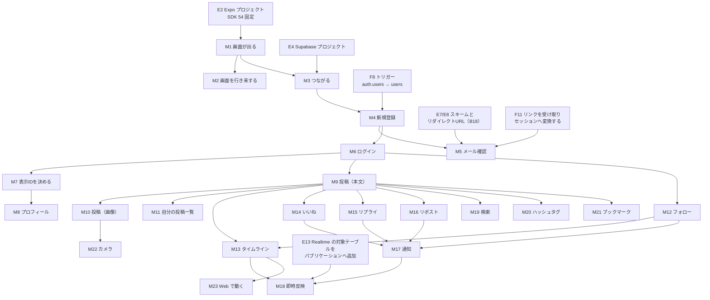

# 04. 詳細設計書

ステータス: **ドラフト・局長レビュー待ち（Phase 1）**

着手条件は 2026-08-06 の Phase 0 承認で満たされた。

---

## 0. 本書の位置づけと読み方

### 0.1 これは製品の設計書ではない

本書は **教材の章を書くための設計図**である。読者は初学者から中級手前のインターンと
有料の学習者で、彼らが自分の手で書くコードの順序と分量を決めるのが本書の役割になる。
したがって各項目は「どう作るか」だけでなく「**どの段階で学習者に書かせるか**」を持つ。

章IDは凍結前（`10_教材制作フロー.md` G1 / `16_決定バックログ.md` B1）なので、
本書は **パート単位**（`15_カリキュラム骨子案.md` の A0 / A / B / C / D / E）でしか
割り付けを書かない。章の粒度で書くと B1 の凍結より先に章割りを既成事実にしてしまう。

本書の一番重い出力は §4 の依存グラフである。これは G1 の入力になる。

### 0.2 未決定の扱い

`16_決定バックログ.md` が未決定の唯一の正本（16 A1）である。本書は次の書き分けをする。

| 印 | 意味 |
|---|---|
| （決定） | 既存文書から導出できる。本書で書き下ろす |
| **（初期案）** | 本書の案。凍結はしていない。台帳の該当項目が閉じるまで確定として扱わない |
| **【未決 Bxx】** | 台帳に番号がある未決。本書は待つ側 |
| **【未決・要起票】** | 台帳に番号が無い未決。本書の返答で起票を求めた |

**16 A3 に従い、未決には必ず決定タイミングを書く。**期限は工程上の時点で書く
（「章分割表の凍結前」「06 の凍結前」「パートB の通知の章の実装PR前」など）。日付では書かない。

**期限は置いて終わりではない。**本書は当初「06 の着手前」「08 の着手前」を期限に使っていたが、
**06 と 08 が 2026-08-09 に書き下ろされた時点で、その時点は過ぎ去った**。
期限切れを放置するのは、期限を書かないのと同じ結果になる（16 A3、および 16 B14 が
手戻り#18 として残した型）。**参照先の文書が進んだら、本書の期限も同じPRで置き直す。**
2026-08-09 の置き直しの記録は §10 にある。

### 0.3 画面の参照は名前で行う

`03_基本設計書.md` §2 の表は連番 #1〜#15 に #13-2 を挟んだ 16 行である。
**本書は画面を名前で参照し、番号を節番号や割り付けの見出しに持ち込まない。**
理由は `decisions/D1_教材の置き場と章IDの規約.md` D1-3 が章IDについて述べたものと同じで、
名前に順序を密輸入させると並べ替えのたびに参照が壊れるためである。
番号を使うのは 03 §2 の表そのものを引くときだけにする。

**【未決・要起票】画面IDの体系。**飛び番（13-2）と、03 §2 の表の行数（16 行）・
03 本文の「旧12画面はすべて生存」・「フォロー中一覧 / フォロワー一覧」が1行で2画面ぶんを
持つことの3つが噛み合っておらず、画面の数え方が文書内で一致しない。
期限は章分割表の凍結前（B1）。**06 §7.2 U1 が同じ論点を同じ期限で持っている。**

**この項目が閉じるまで、本書は画面の総数を書かない。**§1.2 の見出しと §4.2 の F5 が
「16画面」と断定していたのを 2026-08-09 に外した。自分で数え方を未決と書きながら、
その数値を別の節で確定として使っていた。

---

## 1. 画面ごとの詳細設計

### 1.1 全画面に共通する土台

#### 状態の4分類

画面ごとに状態を数え上げる前に、**どの画面でも同じ4種類しか出てこない**ことを先に決める。
教材でもこの4分類を最初の画面で導入し、以降の画面では「またこの4つ」で済ませる。

| 種類 | 中身 | 消える条件 |
|---|---|---|
| S1 サーバー由来のデータ | Supabase から取ってきた行 | 画面を離れる／再取得する |
| S2 入力中の値 | テキスト入力・選択した画像 | 送信に成功する／画面を離れる |
| S3 通信中フラグ | 取得中・送信中・アップロード中 | 通信が終わる |
| S4 エラー | 入力エラー／操作の失敗／取得の失敗 | 入力し直す／再試行する |

**（初期案）** S1〜S4 はいずれも画面の中に置く。画面をまたいで共有するのは
**認証状態だけ**とし、それはアプリ全体で1つにする（§9）。
Realtime の購読をどこに置くかは分離して扱う（§3）。

**【未決・要起票】各画面のコンポーネント分割と状態の置き場。**
`03_基本設計書.md` §5 の未決定4件のうち、この1件だけ台帳に番号が無い。
04 §1 と §9 の中心論点である。
**当初の期限は「06 の着手前」だったが、06 は 2026-08-09 に本文へ書き下ろされ、期限は切れた。**
06 側はこの項目に U 番号を付けず、§1 のデータアクセス一覧を粒度未確定のまま書いている。
**期限を置き直す: 章分割表の凍結前（B1）。**置き場が決まらないと1章に書かせる分量が
決まらず、章を割れないため。

#### エラー表示の3種

本書は**エラーを出す場所と種別**を決める。**文言そのものは決めない。**
文体の正本は `12_文体・AI臭さ排除方針.md` であり、画面文言を本書で先に固めると
文体の凍結（G2）と二重管理になる。

| 種別 | 出す場所 | 例に当たるもの |
|---|---|---|
| E1 入力エラー | 該当する入力欄の直下 | 文字数超過・必須未入力・形式違反 |
| E2 操作の失敗 | 画面上部の帯。操作をやり直せる状態を保つ | 投稿の送信失敗・ログイン失敗 |
| E3 取得の失敗 | 一覧の中身の代わりに置き、再試行の操作を伴う | タイムラインの取得失敗 |

Supabase が返すエラーをこの3種のどれへ落とすかの対応表は **06 §6 が正本**になる。
本書は画面側の受け口だけを決める。

**【未決・要起票】エラー文言の作り方の共通規則。**
本書が種別しか決めないため、文言の決め方（誰が・どの粒度で書くか、
DB の制約違反をそのまま見せてよい範囲）が宙に浮く。期限は本番1章目の凍結前。

#### 画像の検証

`01_要件定義書.md` §3 は「画像アップロードは MIME タイプ・拡張子・サイズを検証」と
断定するが、**どこで検証するかは決まっていない**【未決 B21】。
本書は画面側の検証を書くが、これを「決まった検証」として書かない。
改造したクライアントは画面側の検証を迂回できるので、Storage のバケット側で
MIME と容量の上限を設定するかどうかが B21 の中身である。期限は P1。

### 1.2 画面ごとの一覧（03 §2 の表の行ごと）

見出しに画面の総数を書かない。**数え方そのものが §0.3 で未決だから**である
（飛び番 13-2 と、1行で2画面ぶんを持つ「フォロー中一覧 / フォロワー一覧」）。
数を書くのは §0.3 の項目が閉じてからにする。

「止めている未決」は、**その画面の設計を今日確定できない理由**を指す。

| 画面 | 機能要件 | 主な部品 | 状態 | 入力の検証 | エラー表示 | 止めている未決 |
|---|---|---|---|---|---|---|
| ログイン | FR1 | メール入力 / パスワード入力 / 送信 / 新規登録へ / パスワード再発行へ | S2 S3 S4 | メールの形式・空でないこと | E1 E2 | パスワードの強度規則は Supabase 側の設定に従う。設定値は未定 |
| 新規登録 | FR1 | メール入力 / パスワード入力 / 送信 / ログインへ | S2 S3 S4 | 同上。**受け取るのはメールとパスワードだけ**（FR1） | E1 E2 | 確認用パスワード欄を置くか【未決・要起票。期限は章分割表の凍結前（B1）】 |
| メール確認待ち | FR13 | 案内文 / 再送 / メールアプリを開く導線 | S3 S4＋再送のクールダウン | 入力なし | E2 | B14（1時間2通）/ B18（戻り先） → §1.4 |
| プロフィール初期設定 | FR1 FR2 | 表示ID入力 / 表示名入力 / 送信 | S2 S3 S4 | 表示ID 30字・表示名 50字（05 の型と一致） | E1 E2 | B24 / B25 / 入力規則【未決・要起票】 → §7 |
| タイムライン | FR4 | 縦リスト / 投稿カード / 追加読み込み / 投稿作成へ | S1 S3 S4 | 入力なし | E3 | B4（プル型／プッシュ型）/ B22（取りこぼし）/ B27（削除済み）/ B25（表示ID 未設定の見せ方。§7.5）/ B10（空に見える） |
| 投稿作成 | FR3 FR15 | 本文入力 / 残り文字数 / 画像プレビュー / 画像を選ぶ / 撮影 / 送信 | S2 S3 S4 | 本文 280 字 / 画像 4 枚 | E1 E2 | 05 §4 課題2・課題3 / B21 / 途中失敗の扱い【未決・要起票】 → §1.3 |
| 投稿詳細 | FR5 FR6 FR7 FR12 | 投稿本体 / リプライ一覧 / リプライ入力 / いいね / リポスト / ブックマーク | S1 S2 S3 S4 | 本文 280 字 | E1 E2 E3 | B27（削除済みの見せ方）/ 05 §4 課題4（リプライと引用の同時指定） |
| プロフィール | FR2 FR8 | ヘッダー画像 / アイコン / 表示名 / 表示ID / bio / フォロー数 / フォロー操作 / 投稿一覧 | S1 S3 S4 | 入力なし | E3 | B25（表示ID 未設定の他人をどう出すか） |
| プロフィール編集 | FR2 | 表示名 / bio / アイコン / ヘッダー / 保存 | S2 S3 S4 | 表示名 50 字 / bio 160 字 / 画像 | E1 E2 | B21 |
| フォロー中一覧 / フォロワー一覧 | FR8 | 切り替え / ユーザー行の縦リスト / フォロー操作 | S1 S3 S4 | 入力なし | E3 | 1画面にするか2画面にするか【未決 06 U1。期限は章分割表の凍結前（B1）】/ B25 |
| 通知 | FR9 | 通知行の縦リスト / 既読化 | S1 S3 S4 | 入力なし | E3 | B7 / B28 / 既読化の手段（§8）/ B22 |
| 検索 | FR10 | 検索語入力 / 投稿結果 / ユーザー結果 | S1 S2 S3 S4 | 空文字で検索させない | E1 E3 | 05 §4 課題5（検索方式と索引）/ B25（表示ID 未設定の見せ方。§7.5）/ B10 |
| ハッシュタグ一覧 | FR11 | タグ名 / 投稿の縦リスト | S1 S3 S4 | 入力なし | E3 | 05 §4 課題5 / B27 |
| ブックマーク一覧 | FR12 | 投稿の縦リスト | S1 S3 S4 | 入力なし | E3 | B27 |
| パスワード再発行の申請 | FR14 | メール入力 / 送信 / 送信済みの案内 | S2 S3 S4 | メールの形式 | E1 E2 | B14（送信通数）/ B18（メールから戻る導線） |
| パスワード再設定 | FR14 | 新しいパスワード入力 / 送信 | S2 S3 S4 | パスワードの強度規則 | E1 E2 | B18（この画面はディープリンクからしか開かない） |

**表に現れない共通の依存**: どの画面も、Supabase クライアントが初期化され、
セッションの状態が確定していなければ何も描けない（§9）。
このため「画面が出る」より前に「セッションの状態が3値である」ことが要る。

### 1.3 投稿作成画面（厚く書く）

学習者がつまずく理由は、**この1画面の中で書き込みが4か所に散る**ことにある。
1テーブルへ1行入れる画面ではない。

#### 部品構成

```
画面
├─ ヘッダー（閉じる / 投稿する）
├─ 本文入力（複数行）
├─ 残り文字数の表示
├─ 画像プレビュー（0〜4枚。1枚ずつ取り消せる）
└─ 添付の操作（写真を選ぶ / その場で撮る）
```

撮影（FR15）は**この画面から起動し、専用画面を作らない**（03 §2）。
つまりカメラは部品の1つであって画面ではない。

#### 状態

| 分類 | 中身 |
|---|---|
| S2 | 本文テキスト / 選んだ画像の配列（端末上のファイルの位置と表示順） |
| S3 | アップロード中（画像ごと）／投稿の送信中 |
| S4 | 入力エラー（文字数・枚数）／送信の失敗 |

画像は**アップロードが先に終わる**ので、S3 は「画像ごとの進行」と「投稿全体の送信中」の
2段になる。この2段構えが初学者の混乱点になるので、教材では画像なしの投稿を先に作り、
画像は後から足す順序にする**（初期案）**。
**この初期案の根拠は S3 の2段構えだけではない。**下の「書き込みの順序」手順1（端末上の
ファイルをアップロードに渡せる形へ変換する）が同じ章に乗ると、1章に山が2つ入る。

#### 入力の検証

| 対象 | 値 | 根拠 | 状態 |
|---|---|---|---|
| 本文の長さ | 280 字 | 01 FR3 / 05 `posts.body` varchar(280) | 決定 |
| 画像の枚数 | 4 枚 | 01 FR3 / 05 `post_media.order` 0〜3 | 画面側は決定。**DB 層でどう保証するかは 05 §4 課題2 で未決** |
| 本文も画像も無い投稿 | 止める | — | **05 §4 課題3 で未決。**`posts.body` は無条件 NULL 可なので、いまの定義では空投稿が作れる |
| 画像の形式・容量 | — | — | **【未決 B21】**。画面側だけで止めるか、Storage でも止めるか |

#### 書き込みの順序

1. 端末で選んだ（または撮った）画像を、**アップロードに渡せる形へ変換する**
2. 変換したものを Supabase Storage の**自分のフォルダ配下**へ上げる（05 Storage 節）
3. `posts` へ1行入れる（`author_id = auth.uid()` を RLS が保証する。03 UC1-3）
4. `post_media` へ画像の枚数ぶん入れる（`url` と `order`）
5. 本文からハッシュタグを抽出し、**タグを取得する、無ければ作る**。得た `hashtags.id` で
   `post_hashtags` を結ぶ（FR11）

**手順1 を独立した段として立てた理由**。React Native の `fetch` は Blob の実体を持たないので、
`fetch(uri).then(r => r.blob())` で作ったものを渡すと **0 バイトのファイルが Storage に置かれる**。
端末上のファイルの位置（uri）をそのまま渡す形も、`FormData` を渡す形も同じく通らない。
Supabase の Expo 向けの手順はいずれもバイナリを明示的に作ってから渡す形を取っている。
**「画像を上げる」を1行で書くと、この画面の最初の手順が空白のまま章になる。**

**【未決・要起票】アップロードに渡す形をどう作るか。**
ArrayBuffer を作る形か、base64 を経由する形かを**実測していない**ので断定しない。
期限は**パートB の投稿の章（画像）の実装PR前**。06 §5 もパスとポリシーしか書いておらず、
渡す引数の形はどの文書にも無い。

**【未決・要起票】手順5 の「取得する、無ければ作る」をどう1操作で書くか。**
05 の `hashtags.tag` は UNIQUE NOT NULL なので、既出のタグを素直に INSERT すると一意制約に当たる。
**そして素直な upsert（`insert ... on conflict do update`）は採れない** — PostgreSQL は
対象行への UPDATE 権限と UPDATE ポリシーを要求するが、§8.2 の `hashtags` は
「ログイン済みなら INSERT 可 / UPDATE・DELETE 不可」だからである。
競合を無視する形（`on conflict do nothing`）なら INSERT だけで通るが、**既存行が返らない**ので
`post_hashtags` に入れる `hashtag_id` が取れず、取り直しの SELECT が別に要る。
採れる形は (a) 競合無視の INSERT ＋ 再 SELECT、(b) タグ解決だけを行う `security definer` 関数を1本置く、
の2つで、どちらにするかが決まっていない。06 §1 のデータアクセス一覧の行数が変わる。
期限は **06 の凍結前**（06 §7 U9〔タグ本体の正規化〕と同じ操作にかかるため、そこと同時に決める）。

**【未決・要起票】2〜5 の途中で失敗したときの扱い。**
自前のサーバーが無い構成では、この4つを1つのトランザクションにまとめる置き場がない。
`posts` は入ったが `post_media` が入らなかった投稿、画像だけが Storage に残る状態が
起きうる。DB 関数に1本まとめるのか、失敗を許容して後始末を書くのかが決まっていない。
06 §1 のデータアクセス一覧と §3 のトリガー仕様の両方に効く。
**当初の期限は「06 の着手前」だったが、06 は 2026-08-09 に本文へ書き下ろされ、期限は切れた。**
06 側はこの項目に U 番号を付けていない（近いのは §5.3 の3〔孤児ファイル〕＝U13 だけで、
`posts` と `post_media` の食い違いは扱っていない）。**期限を置き直す: 06 の凍結前。**

#### 教材上の位置

- 本文だけの投稿 → **パートB**（15 の扱う範囲に「投稿」がある）
- 画像の添付と Storage → **パートB**（同じく「Storage（画像）」がある）
- カメラでの撮影 → **パートC**（15 が「カメラをこのパートに置く」と明記）

**同じ画面が2つのパートにまたがる。**章分割ではこれを「投稿作成画面はパートBで
いったん完成扱いにし、パートC で撮影の導線を足す」形にする**（初期案）**。
B1 はこの前提で 15 のパート境界と噛み合う。

### 1.4 メール確認待ち画面（厚く書く）

この画面が難しいのは、**画面の上に部品がほとんど無いのに、裏で4つの仕組みが動く**ためである。
学習者から見ると「何も起きない画面」で止まる。

#### 動いている4つの仕組み

1. Supabase Auth が確認メールを送る
2. メール内のリンクからディープリンクでアプリが起動する（01 FR13 / 02 R1）
3. **アプリが受け取ったリンクの URL を自分で読み、セッションへ変換する**
4. セッションが確立し、確認済みの状態になる

**3 を自動で起きるものとして書かない。**§9.2 の 5 で「URL からセッションを読み取らない」を
自ら指定しているうえ、React Native にはブラウザのアドレス欄が無い。リンクで起動したアプリは
URL を受け取るだけなので、**そこに載って戻ってくる値をアプリ側で取り出してセッションへ渡す
処理を書かない限り、セッションは確立しない**。Supabase の Expo 向けの手順も、受け取った URL を
自前で解析してセッションへ変換する関数を書かせている。

**「Supabase を使えばメール確認がタダで付く」わけではない**（02 R1）。
2 と 3 の実装が要ることが、この画面を教材の山にしている。
**3 の受け口はファイルノード F11（§4.2）として立てた。**

#### 部品と状態

| 部品 | 役割 |
|---|---|
| 案内文 | どのアドレスへ送ったかを出す |
| 再送 | もう一度送る。連打を防ぐためのクールダウンを持つ |
| メールアプリを開く導線 | 端末のメールアプリへ移る |
| 別のアドレスで登録し直す導線 | 打ち間違えたときの唯一の逃げ道 |

状態は S3（送信中）・S4（送信の失敗）・再送のクールダウンの3つに閉じる。S1 が無い。

#### 復帰の経路が2つある

| 経路 | 起きること |
|---|---|
| (a) 同じ端末でリンクを開く | ディープリンクでアプリが起動し、確認が完了する |
| (b) 別の端末・PC でリンクを開く | アプリが無いのでブラウザが開く。**アプリ側の画面は待ったままになる** |

**【未決 B18】**が決まるまで (a) の実装形が確定しない。
Expo Go で開くときのリンクと、専用ビルドで開くときのリンクが同じ形になるとは限らない。
B18 は論点を「EAS Build を教えるか」から「**認証の確認用にどの時点で専用ビルドを作るか**」へ
書き換えている。期限は P1。
**B18 で決まるのはリンクの形だけではない。**上の 3（受け口の処理）が
「URL に載ったトークンをそのまま渡す形」になるか「コードを交換する形」になるかも
リンクの形に従属するので、**B18 の記述に受け口の処理形を含める**必要がある。

**【未決・要起票】(b) の復帰経路。**別端末でリンクを開いた学習者がアプリへ戻る手段が
設計に無い。B18 に含めるか別立てにするかを決める。
**当初の期限は「06 の着手前」だったが、06 は 2026-08-09 に本文へ書き下ろされ、期限は切れた。**
06 §1.2 のメール確認待ち（#13）の行は B14・B18 を挙げるだけで、この項目に U 番号は付いていない。
**期限を置き直す: P1（B18 と同時。B18 に含めるかどうかがこの項目の中身だから）。**

#### 送信通数の上限

Supabase 標準のメール送信は**1時間に2通まで**（02 R2 / 03 §3）。
**この画面の再送ボタンが、教材の中で最初にその上限へ当たる場所**になる。
上限に当たったときに何が返るかが分かっていないと、この画面のエラー表示（E2）が書けない。

**【未決 B14】カスタム SMTP の要否。期限は章分割表の凍結前（B1）。**
16 が 2026-07-28 に期限を再設定したものが正本である。
`01_要件定義書.md` §4 と `02_技術選定書.md` §7 は「捨て試作で実測」のままだが、
捨て試作は 2026-07-27 に完了しており、**その期限はもう存在しない**。
01・02 の該当記述は 16 に合わせる是正が要る。

#### 教材上の注意（B1 へ渡す）

この画面は**画面の見た目に変化を作りにくい**。動いている4つの仕組みのうち2つが
アプリの外にある（1 と 2）。**3（リンクをセッションへ変換する）はアプリの中にあるが、
画面には何も現れない。**`decisions/D5_章の骨格.md` D5-3 の章分割表「見える変化」列では
`tool`（ログ・ツール画面での確認）に寄る章になりやすく、`tool` が3章連続すると G1 が FAIL する。
**メール確認・パスワード再発行を連続で並べると、この FAIL に当たる。**
章の並べ方で回避するのか、11 の原則5 の例外手続き（10 の軽量改訂）で通すのかを B1 で判断する。

### 1.5 プロフィール初期設定画面

本書 **§7** に一本化した。ここでは §1.2 の表の行だけを持つ。

---

## 2. ネイティブ設定の詳細

### 2.1 `app.json` に書く項目

| 項目 | 何のために要るか | 状態 |
|---|---|---|
| スキーム | メールのリンクからアプリを開くため（FR13 / FR14） | **【未決 B18】** |
| iOS のバンドル識別子 / Android のパッケージ名 | 専用ビルドを作る場合に要る | **【未決 B5】** |
| カメラの権限 | FR15 | 決定（項目が要ることは確定） |
| 写真ライブラリの権限 | FR3 の画像添付 | 決定 |
| 権限ダイアログの文言 | OS が利用者に出す説明文 | 決定（項目が要ることと、**日本語**で書くことは確定。01 スコープ外に i18n があり日本語UI固定）／**その文が実機のダイアログに出るかは【未決 B5】【未決 B18】に従属** |

権限ダイアログの文言は、**利用者が読む唯一の「なぜこの権限が要るか」**である。

**ただし、ストア版の Expo Go ではこの文は出ない。**`app.json` に書いた権限文言は、
prebuild／ビルドの時点でネイティブのマニフェスト（`Info.plist` / `AndroidManifest.xml`）へ
焼き込まれる。ストアから入れる Expo Go は **Expo Go 自身のマニフェスト**で動くので、
学習者の `app.json` の記述は反映されず、Expo Go 自身の文言のダイアログが出る。
バンドル識別子が「専用ビルドを作る場合に要る＝B5」なのと**同じ依存関係**にあり、
権限文言だけが B5 から独立した「決定」にはならない。

したがって「開発者が書いた文がそのまま OS のダイアログに出る」を見せる案は、
**専用ビルドを作る章がある場合にのみ成立する**（初期案）。B5 が Expo Go 止まりに決着したら、
この見せ方は採れない。**その場合にカメラの章で見せられるのは「権限を求められる／拒否できる／
拒否したときにアプリが落ちない」までである**（08 §4 の H3 が扱う範囲と一致する）。

### 2.2 スキームと Supabase 側リダイレクト URL の対応

メール確認（FR13）とパスワード再設定（FR14）は、どちらも
**メール内のリンク → アプリ**という経路を通る。ここは2か所を揃える必要がある。

1. アプリ側: `app.json` のスキーム
2. Supabase 側: 許可するリダイレクト先の一覧

**片方だけ直しても動かない。**片側だけを直して詰まるのは初学者が必ず踏む型なので、
教材では2か所を並べて出し、片方を消すと何が返るかを見せる**（初期案）**。

**【未決 B18】**が閉じるまで、この2か所に書く値が確定しない。
Expo Go で動かす場合と専用ビルドの場合で値が変わりうる。期限は P1。

### 2.3 実機ビルドをどこまでやらせるか

**【未決 B5】**。Expo Go で動かすところまでで終えるか、EAS Build で自分の署名済みアプリを
作るところまでやらせるか。B18 により、この論点は「実務に近づけるか」ではなく
「**認証の確認を成立させるのにビルドが要るか**」へ書き換わっている。期限は P1。

B5 と B18 が決まらないと、§4 の依存グラフの環境ノード E7・E8 が確定せず、
`08_テスト計画書.md` の項目4（実機でしか確認できない項目）と項目7（モバイル試験基準）が書けない。

---

## 3. Realtime の購読対象一覧と再接続時の挙動

### 3.1 購読の一覧

**購読契約の正本は 06 §4 である。**06 §4.1 が「購読するもの／フィルタ／画面への反映／
購読を始める時点／解除の時点」の5項目を1組で決めると書いており、本書はそのうち
**画面側が持つ列（反映先・状態）だけ**を持つ。行は 06 §4.2 と同数・同順にする。

| 購読するもの（06 §4.2） | 反映先 | 機能要件 | 状態 |
|---|---|---|---|
| `posts` の追加 → タイムライン（#3） | 一覧の先頭に足す。既に並んでいる id は足さない | FR4 | **フォロー関係での絞り込みが購読側で書けるかは未検証。【未決 06 U6】期限は 06 の凍結前** |
| `notifications` の追加（`recipient_id = 自分`）→ 通知（#9） | 一覧の先頭に足し、未読の数を増やす | FR9 | 初期案。**B28 のトリガー範囲に従属する** |
| `likes` の追加 → 投稿詳細（#5） | いいね数を増やす | FR7 | 初期案 |
| `likes` の **削除** → 投稿詳細（#5） | 届いた行の `post_id` を**アプリ側で判定してから**いいね数を減らす | FR7 | 初期案。**行を分けたのは契約の形が違うため** — Realtime は DELETE イベントにフィルタを適用せず RLS も適用しないので、購読している端末には `likes` の削除が全部届く（06 §4.2）。判定を書かないと**他人の投稿のいいね解除でこの画面の数が減る**。判定はアプリ側の処理なので、この行は本書の担当である |
| `posts` の追加（リプライ）→ 投稿詳細（#5） | スレッドの末尾に足す | FR5 | 初期案 |

**04 にあって 06 に無い購読が2つあった。**行を揃えるにあたり、次のとおり扱う。

| 04 の旧記述 | 扱い |
|---|---|
| `likes` の反映先に「タイムラインのカード」を含める | **落とした（初期案）。**Postgres Changes のフィルタは1つの列に対する単純な比較しか書けないので、`post_id` が1つに定まる投稿詳細では書けても、タイムラインに並ぶ複数の投稿のいいね数は同じ形では絞れない。絞れなければ全件を受け取ってアプリ側で捨てることになり、06 §4.4 の2 が `posts` について指摘した「他人のぶんが端末に届いてから捨てられる」と同じ状態になる。**posts と同じ【未決 06 U6】の実測に従属する** |
| `follows` の追加・削除 → プロフィールのフォロー数 | **【未決・要起票】**06 §4.2 にこの購読は無い。プロフィールのフォロー数を即時反映の対象にするか（＝画面を開き直したときの再取得で足りるか）が、どちらの文書にも書かれていない。期限は**パートB のフォローの章の実装PR前** |

**（初期案）** 購読はアプリ全体に置かず、**それを表示している画面の中**に置く。
画面を離れたら購読を止める。理由は、購読を全体に上げると
「いま画面に出ていないもののために接続を保つ」構造になり、初学者に説明できる範囲を超えるためである。
確定は §1.1 で起票したコンポーネント分割の項目と同時に行う。

### 3.2 取りこぼしと再接続

**`03_基本設計書.md` UC1-4 の「フォロワーがタイムラインを開いていれば即時反映」は、
配信の保証ではない。**Realtime は全変更の配信を保証しない（16 B22）。
UC1 の文面だけを引き写すと、取りこぼしが無い前提の仕様になる。

埋めるべき穴は3つある。

| 穴 | 何が起きるか |
|---|---|
| 購読を始める前 | 購読が張られるまでの間に起きた変化が届かない。**初回の取得が別に要る** |
| 再接続の後 | 切れていた間の変化が届かない。**再取得が別に要る** |
| 初回取得と配信の重複 | 同じ行が2回リストへ入る。**重複の除き方が要る** |

**【未決 B22】この3つを仕様に入れるかどうか。期限は P1。**
入れる場合の置き場は §3.1 の購読と同じ場所になる（初回取得・再取得・重複排除は
購読の開始と終了に紐づくため）。入れない場合は、教材で
「見えていないだけで届いていない変化がある」と正直に書く必要がある。

### 3.3 教材上の扱い

15 が「リアルタイムの独立パートを廃止し、通知の章・タイムラインの章の中に溶かす」と
決めている。よって Realtime は §3.1 の反映先ごとにパートB へ分散する**（初期案）**。
B22 で3つの穴を埋めると決めた場合、埋める処理は購読と同じ章に入り、章の分量が増える。
B1 はこの分量差を見て章を割る。

---

## 4. 機能・ファイル・環境の依存グラフ

**本節が `10_教材制作フロー.md` G1（章分割の凍結）の入力になる。**
「この機能を書くには、このファイルとこの環境設定が先に要る」という順序関係を列挙する。
章の順序は 15 のパート構成とこの依存関係の両方を満たさなければならない。

### 4.1 環境ノード（E）

学習者の手元、または Supabase の管理画面で先に済ませておく必要があるもの。

| ID | 環境 | 先に要るもの | 状態 |
|---|---|---|---|
| E1 | Node（**20.19 以上**。SDK 54 の要求） | — | 決定（16 B-P0） |
| E2 | Expo プロジェクト（**SDK 54 固定**） | E1 | 決定（16 B-P0。`--template default@sdk-54`） |
| E3 | Expo Go（ストア版）と実機、または シミュレータ | E2 | **【未決 B26】**（実機で開けることを未確認）／**【未決 B15】**（対応OSの範囲） |
| E4 | Supabase プロジェクト | — | 決定 |
| E5 | publishable key をアプリから読めるようにする | E4 | **【未決・要起票】置き場**（05 は「入れてよい」と決めたが、どこに書くかは未定） |
| E6 | マイグレーションを適用する手段 | E4 | **【未決 B2】**（`supabase/` 配下の構造） |
| E7 | `app.json` のスキーム | E2 | **【未決 B18】** |
| E8 | Supabase 側のリダイレクト URL 許可 | E4 E7 | **【未決 B18】** |
| E9 | Storage のバケットとポリシー | E4 E6 | **【未決 B21】**（MIME・容量の上限を置くか） |
| E10 | シードデータ（複数アカウント・投稿） | E4 E6 | **【未決 B10】** |
| E11 | Web 出力の公開先 | E2 | **【未決 B6】** |
| E12 | メール送信（標準 or カスタム SMTP） | E4 | **【未決 B14】**（期限は章分割表の凍結前） |
| E13 | **Realtime の対象テーブルをパブリケーションへ追加する** | E4 E6 | **【未決・要起票】置き場**（下記） |
| E14 | **カメラ・写真ライブラリの権限の項目と文言**（`app.json`） | E2 | 項目は決定。**実機のダイアログに出るかは【未決 B5】**（§2.1） |

**E13 を立てた理由**: Realtime の購読を書いても、対象テーブルが `supabase_realtime`
パブリケーションに入っていなければ**1件も発火しない**。既定では新規テーブルは入っていない。
本書は Storage のバケット（E9）やマイグレーションの適用手段（E6）まで環境ノードに起こしながら、
これだけを落としていた。§3.2 が挙げる3つの穴（購読前・再接続後・重複）は**購読が発火している
前提**の話なので、この抜けは §3.2 では拾えない。

**【未決・要起票】Realtime を有効にする手順の置き場。**
管理画面のトグルで行わせるか、`alter publication` の SQL をマイグレーションに書かせるかが
決まっていない。16 B2（`supabase/` 配下に SQL を置く）と `decisions/D1_教材の置き場と章IDの規約.md`
D1-5（`listings/<章ID>/` が `supabase/` を丸ごと持つ）に照らすと**マイグレーション側へ寄る**が、
実際に何が要るかは**実測していない**ので断定しない。
期限は**購読を書かせる章（通知・タイムライン）の実装PR前**。

### 4.2 ファイルノード（F）

B2 の初期案（1リポジトリ・単一 Expo アプリ、`app/` と `supabase/`）を前提に置く。
**B2 が確定するまで、下表の配置は初期案である。**

| ID | ファイルの役割 | 先に要るもの |
|---|---|---|
| F1 | Supabase クライアントの初期化（§9） | E2 E5 |
| F2 | 認証状態の保持と監視（§9） | F1 |
| F3 | ルートのレイアウトと画面の並び（Expo Router） | E2 |
| F4 | ログイン済みかどうかで行き先を分ける仕掛け | F2 F3 |
| F5 | 各画面のファイル（03 §2 の行ごと） | F3 |
| F6 | マイグレーション（テーブル定義） | E6 |
| F7 | RLS ポリシー（テーブルごと） | F6 |
| F8 | トリガー関数（`auth.users` → `users` / 通知） | F6 |
| F9 | Storage のポリシー | E9 |
| F10 | 画面をまたいで使う表示部品（投稿カード・ユーザー行） | F5 |
| F11 | **ディープリンクを受け取ってセッションへ変換する処理**（§1.4 の 3） | F1 F2 E7 |

**F6 には Realtime のパブリケーション追加（E13）が入りうる。**
16 B2 と D1-5 が `supabase/` 配下の SQL を「実行されるサーバー側のコードであり配布の対象」と
決めている以上、管理画面の操作より SQL へ寄せるほうが枠に収まる。
ただし置き場は未決（§4.1 の E13 の下）。

**F6・F7・F8・F9 は SQL であり、`16 B2` が明記するとおり
「実行されるサーバー側のコードであり、本構成の認可の境界そのもの」である。**
レビュー・テスト・配布の対象から落とさない。
`decisions/D1_教材の置き場と章IDの規約.md` D1-5 は、章ごとの `listings/<章ID>/` が
`supabase/` を丸ごと持ち、マイグレーションのファイル名に章IDを含めると決めている。

**【未決 06 U8】`post_media.order` の列名。**`order` は SQL の予約語で、
識別子として使うには引用が要る。05 にその注記が無く、教材のコード片をそのまま
写経させると落ちる。06 §7.2 U8 が同じ論点を持ち、**期限はパートB の投稿の章の実装PR前**。

**ただし、未決の書き方を「列名を変えるか注記を足すか」の2択にしない。**
引用で片づくのは SQL の識別子としての話であり、この構成のアプリはテーブルを PostgREST 経由で
叩く。**PostgREST は `order` を並べ替え指定のクエリパラメータとして使う**ため、`order` という名前の
列をクライアント側の絞り込みに渡すと並べ替え指定として解釈されて壊れる可能性がある。
そうであれば「注記を足す」は選択肢として成立せず、残るのは列名を変える案だけになる
（16 B-P0 が SDK 54 固定を「消去法ではなく実測で1つに絞られた」と書いたのと同じ形になる）。
**これは実測ではないので断定しない。**未決の中身を
「**`order` という列名がクライアント側の絞り込み・並べ替えでも使えるかを実測し、
使えないなら列名を変える**」へ改める。実測は 06 U8 と同じ枠・同じ期限に置く。

列名を変える場合の候補は `display_order` **（初期案）**。`position` は PostgreSQL の関数名と
同じ語なので避ける。候補を1つ添えておくのは、05 の是正PR をそのまま書けるようにするためである。

### 4.3 機能ノード（M）と依存

| ID | 機能 | 先に要るファイル | 先に要る環境 | 先に要る機能 | 未決 |
|---|---|---|---|---|---|
| M1 | 画面が1枚出る | F3 | E1 E2 E3 | — | B26 |
| M2 | 画面を行き来する | F3 F5 | E2 | M1 | — |
| M3 | Supabase につながる | F1 | E4 E5 | M1 | E5 の置き場 |
| M4 | 新規登録できる | F1 F2 F6 F8 | E4 E6 | M3 | B19 |
| M5 | メール確認を通す | F2 **F11** | E7 E8 E12 | M4 | **B18 B14 B5** |
| M6 | ログイン・ログアウトできる | F2 F4 | — | M4 | — |
| M7 | 表示IDと表示名を決める | F5 F7 | — | M6 | **B24 B25**・入力規則 |
| M8 | プロフィールを表示・編集する | F5 F7 F9 | E9 | M7 | B21 B25 |
| M9 | 本文だけの投稿ができる | F5 F6 F7 | E6 | M6 | 05 §4 課題3 |
| M10 | 画像付きの投稿ができる | F5 F6 F7 F9 | E9 | M9 | 05 §4 課題2・B21・途中失敗 |
| M11 | 自分の投稿一覧が出る | F5 F10 | — | M9 | B27 |
| M12 | フォローできる | F5 F6 F7 | E6 | M6 M8 | **06 U17**（自己フォローを許すか） |
| M13 | タイムラインが出る | F5 F10 | E10 | M9 M12 | **B4 B27 B10** |
| M14 | いいねできる | F5 F6 F7 | E6 | M9 | — |
| M15 | リプライとスレッド表示 | F5 F6 F10 | E6 | M9 | 05 §4 課題4 |
| M16 | リポスト・引用リポスト | F5 F6 | E6 | M9 | 05 §4 課題4 |
| M17 | 通知が出る | F5 F6 F7 F8 | E6 | M12 M14 M15 M16 | **B7 B28**・列制限（§8） |
| M18 | 即時に反映される（Realtime） | F5 | **E13** | M13 M17 | **B22**・E13 の置き場 |
| M19 | 検索できる | F5 F6 | E6 E10 | M9 M8 | **05 §4 課題5** |
| M20 | ハッシュタグが機能する | F5 F6 F7 | E6 | M9 | 05 §4 課題5 |
| M21 | ブックマークできる | F5 F6 F7 | E6 | M9 | — |
| M22 | カメラで撮って投稿する | F5 | **E14** | M10 | B5（実機の要否・権限文言が実際に出るか。§2.1） |
| M23 | 同じコードが Web で動く | F1 F3 F5 | E11 | M13 | **B6**・§9 の初期化が Web で通るか |

### 4.4 グラフ



### 4.5 このグラフから出る順序の制約

章分割（B1）が守らなければならない制約を、グラフから機械的に取り出す。

1. **M3（つながる）より前に、どのデータの章も置けない。**キーの扱い（05 の
   publishable / secret の区別）は M3 と同じ章に入る。05 が「キーを扱う最初の章で明示する」と
   決めているのは、この位置を指す。
2. **M4（新規登録）は F8（トリガー）と同時にしか成立しない。**根拠は2つある。
   - 05 の `posts.author_id` は `users.id` への FK なので、**`users` に行が無いアカウントは
     投稿できない**。トリガーが無い状態で作ったアカウントでは M9 以降が全部成立しない。
   - あとからトリガーを足しても、**それ以前に作った学習用アカウントには `users` 行が無い**。
     学習者が手で行を埋める作業が発生し、章の手順に無い操作が挟まる。

   **「トリガーが落ちると登録そのものが取り消される」を、この制約の根拠に使わない。**
   05 users 節と 16 B20 が言っているのは、`username` を NOT NULL のまま行を作ろうとして
   トリガーの INSERT が制約違反で落ちた場合の話である。**トリガーを作っていない状態では
   `auth.users` への登録は成功する**（`public.users` に行ができないだけ）。
   この話は M4 の章で「NOT NULL を外す理由」を説明する材料であり、置き場は §7 側になる。
3. **M7（表示ID）は M6 の直後に置く。**通さないと表示IDが空のまま残る（03 UC3）。
4. **M13（タイムライン）は M9 と M12 の両方が終わってから。**
   さらに E10（シードデータ）が無いと画面が空になり、11 の原則5「毎章、見える変化」を
   満たせない。**B10 は B1 と同時に決める必要がある。**
5. **M17（通知）は M12 M14 M15 M16 の後**。B28 が「どこまでをトリガーで作るか」を
   決めるまで、通知の章がいくつになるかが決まらない。
6. **M18（Realtime）は最後に足す層**であって、独立したパートにしない（15）。
7. **M22（カメラ）は M10 の後**。15 がカメラをパートC に置いているので、
   M10（画像投稿）はパートB に収まっていなければならない。
8. **M23（Web）は最後**（15 の C → D の理由）。

### 4.6 文書間の着手条件の連鎖

台帳の「いつ」列は大半が `P1` で粒度が粗い（16 B35 が未決のため）。
同じ `P1` でも、**06 に効くもの**と **08 だけに効くもの**が混ざっている。
起草の順序はこの連鎖で並べ直す。

```
03（画面一覧・UC） ─┬→ 04（本書） ──┬→ 08（テスト計画）
05（テーブル・RLS）─┴→ 06（データアクセス・RLS SQL・トリガー）─┘
```

**★ 本節の前提が 2026-08-09 に変わった。**本書は当初「06 が書けない」「08 だけが書けない」という
形で表を持っていたが、**06 も 08 も 2026-08-09 に本文へ書き下ろされた**
（06 は「スタブから本文へ書き下ろした」、08 は「着手条件は 04・06 の確定だが、両書は
2026-08-09 に本文へ書き下ろされた」）。06 は着手条件を満たさないまま先に書いた理由と代償を
自ら §0.2 に明記し、未決を §7 に期限つきで並べている。
**よって表は「書けない文書」ではなく「未決を抱えたまま書かれた箇所」を指す形へ改める。**

| 本書の要起票項目 | 06 側の対応 | 期限（06 §7.2 が置いた側を正とする） |
|---|---|---|
| notifications の列制限（§8.4） | **06 §7.2 U4** | パートB の通知の章の実装PR前 |
| 05 §5 の RLS 表の是正（§8.4） | **06 §7.2 U3** | 05 の局長承認前 |
| `post_media.order` の予約語（§4.2） | **06 §7.2 U8** | パートB の投稿の章の実装PR前 |
| Realtime の絞り込み範囲（§3.1） | **06 §7.2 U6** | 06 の凍結前 |
| E2E をどの成果物へ当てるか | **08 §12** が置き直した | 章分割表の凍結前（B1） |

**突き合わせて、本書側にしか無い項目が残った。**これらは 06 に U 番号が無いので、
本書が期限を持つ側になる（すべて 16 への要起票）。

| 本書だけが持つ未決 | 節 | 期限 |
|---|---|---|
| コンポーネント分割と状態の置き場 | §1.1 | 章分割表の凍結前（B1） |
| Storage へ渡す形の作り方 | §1.3 | パートB の投稿の章（画像）の実装PR前 |
| `hashtags` の「取得する、無ければ作る」の書き方 | §1.3 | 06 の凍結前 |
| 投稿の途中失敗の扱い（＝ Storage の孤児ファイル） | §1.3 | **章分割表の凍結前（B1）。06 U13 が引き取っている** |
| Realtime を有効にする手順の置き場（E13） | §4.1 | 購読を書かせる章の実装PR前 |
| `follows` の購読を持つか | §3.1 | パートB のフォローの章の実装PR前 |
| 表示IDの文字種と長さの下限 | §7.2 | 章分割表の凍結前（B1） |
| 入力中に空きを問い合わせるか | §7.3 | 章分割表の凍結前（B1） |
| メール確認の別端末からの復帰経路 | §1.4 | P1（B18 と同時） |

一方、次は**06 が未決を抱えたまま書き下ろした箇所**であり、本書の側で待つものではない。

| 06 が未決を抱えたまま書いた箇所 | 抱えている未決 |
|---|---|
| §2.4 `posts` の `using (deleted_at is null)` | B27（「この 1 行は B27 が決まるまで仮」と注記済み） |
| §2.7 `notifications` の列単位の手当て | 06 U4（2案が並んだまま） |
| §3.2 通知トリガーの表 | B28 / B7 / 06 U11 |
| §1.2 検索（#10）の行 | 05 §4 課題5（「決まるまでこの行は書けない」と明記） |
| §2.5 `post_media` の枚数制限 | 05 §4 課題2（`with check` では書けない） |

`08_テスト計画書.md` §9 に**数値を置いてはいけない**（01 §3 が「目安値は再定義中」、
B23 が「推測で置かない」と明記）。

**E2E をどの時点の成果物へ当てるか【未決。08 §12 が期限を置き直した】。**
`08_テスト計画書.md` §3 は E2E に「Expo の web 出力に対する Playwright」を想定するが、
15 のパート順では web 出力はパートD（終盤）にしか登場しない。
**パートB・C の段階では当てる対象が存在しない。**16 A9 は「E2E は主要動線1本に絞る」と
決めているので、その1本をいつ書かせるかが決まらないと 08 の §3 が閉じない。
**本書が置いた「08 の着手前」は、08 が 2026-08-09 に書かれた時点で切れた。**
08 §12 が「章分割表の凍結前（B1）」へ置き直しており、**そちらが正**である。

---

## 5. 学習者の開発環境

学習者に用意させるのは **Node と npm と Expo Go** だけである。
**ただしこれは、手元の実機で進む道に限った話である**（下の退路(3) を参照）。
旧構成にあった Docker Compose は、起動するミドルウェアが1つも無くなったため消滅した。

| 用意するもの | 版・条件 | 状態 |
|---|---|---|
| Node | **20.19 以上**（SDK 54 の要求。SDK 57 の 22.13 以上ではない） | 決定（16 B-P0） |
| npm | Node に同梱 | 決定 |
| エディタ | 指定しない | 決定 |
| Expo Go | ストア版。**SDK 54 のプロジェクトしか開けない** | 決定（16 B-P0）。**実機で開けることは未確認【未決 B26】** |
| スマートフォン | iOS または Android の実機 | **【未決 B15】** |
| PC | — | **【未決 B15】**（iOS 実機の確認に Mac が要るか） |
| Supabase のアカウント | 無料枠（DB 500MB / RAM 500MB、自動バックアップ無し） | **【未決・要起票】**（学習者に外部サービスの登録を求めることの案内方式）。期限は本番1章目の凍結前 |
| 開発ツール（Xcode / Android Studio） | **退路(3) を取る場合にだけ要る** | **【未決・要起票】**（下記）／**【未決 B15】**（iOS シミュレータには Mac が要る） |

**QR が読めなかったときの対処を教材に必ず書く**（16 B-P0）:
(1) プロジェクトの SDK 版を確かめる、(2) Android なら対応する Expo Go を入れ直せる、
(3) 端末が無ければシミュレータで進める。**有料の Apple 開発者登録が要る道は出さない。**

**【未決・要起票】退路(3) を取る学習者に何を入れさせるか。**
シミュレータを動かすには Xcode か Android Studio が要り、**iOS シミュレータは Mac でしか動かない**。
02 §2 の採用理由2 は「Xcode / Android Studio のセットアップこそが最大の挫折ポイントであり、
それが構造的に消えた」と書いている。**退路(3) を取った学習者は、その消えたはずの山に
案内が1行も無い状態で当たる。**B15（対応OS の範囲）は Mac の要否までしか扱っていないので、
B15 に含めるか別立てにするかを決める。
期限は**本番1章目の凍結前（B26 と同じ時点）**。実機で開けるかの確認結果しだいで、
退路(3) の重み——何人が実際にこの道を通るか——が変わるためである。

**版の有効期限**: SDK 54 への修正提供は次の SDK が出る 2026年9〜10月まで。
新しい Expo Go がストアに並ぶと学習者の Expo Go は自動で更新され、
SDK 54 のプロジェクトは開けなくなる。逃げ道は「専用ビルドを作る章を足す」で、
**B5・B18 と同じ論点に合流する**（16 B-P0）。

**【未決 B11】依存バージョンの固定値と更新ポリシー。**
lockfile で止められるのは npm の依存だけで、**Supabase 側の仕様変更は止まらず、
リポジトリの HEAD も変わらないため G5 では検知できない**。期限は P1。

---

## 6. Web 版の公開設計

**【未決 B6】公開先。期限は P1。**公開先が決まらないと、次の4つが書けない。

| 書けないもの | 理由 |
|---|---|
| HTTPS の扱い | 公開先が何を用意するかで変わる |
| publishable key の置き方 | Web ではキーがバンドルに入る。native と置き場の考え方が変わりうる |
| 後片付けの手順 | 学習者が課金や公開状態を残さないための手順は、公開先ごとに違う |
| パートD の章数 | 15 が「未実測」としている |

いま書けることは2つある。

1. **「1行も直さずに動く」とは書かない**（15 パートD）。native 前提の箇所は手当てが要る。
2. **§9 の初期化のうち、native 向けに指定した項目が Web でそのまま通るとは限らない。**
   端末に保存する場所（AsyncStorage）と、URL からセッションを読み取らないという指定
   （`detectSessionInUrl`）は、どちらもブラウザと前提が違う。

**【未決・要起票】§9 の初期化を Web 出力でそのまま動かしたときに何が起きるか。**
実測が要る。パートD の章の中身そのものになるので、B6 と同時に測る。期限は B6 と同じ P1。

秘密情報については、**secret key / `service_role` を Web の出力に入れないこと**が
native と同じく絶対条件になる（05）。RLS を迂回するため、公開先が何であっても変わらない。

---

## 7. プロフィール初期設定画面の詳細

2026-07-27 の B20 決定で新設した画面である。
**登録時に受け取るのはメールとパスワードだけ**（01 FR1）なので、
この画面を通らないと表示ID（`username`）が空のまま残る。

### 7.1 いつ出すか

`users` の `username` が NULL かどうかで判定する**（初期案）**。
判定を行う場所はセッションの復元が終わった直後であり、§9 の「3値の状態」が
確定していないと判定できない。ログインのたびに毎回問い合わせるか、
アプリの起動時に1回だけかは §1.1 で起票したコンポーネント分割の項目と同時に決める。

03 UC3 は「確認が済んだ直後にこの画面へ進む」と書いている。
ただし**既存の利用者がログインし直した場合も同じ判定に当たる**ので、
「新規登録の直後だけ」ではなく「username が空なら常に」で書く**（初期案）**。

### 7.2 表示IDの入力規則

| 項目 | 値 | 根拠 |
|---|---|---|
| 長さの上限 | 30 字 | 05 `users.username` varchar(30) |
| 一意性 | DB の UNIQUE 制約で受け止める | 05 / 16 B20 |
| 文字種 | — | **【未決・要起票】** |

**【未決・要起票】表示IDの文字種と長さの下限。**
05 は varchar(30) UNIQUE としか決めていない。表示IDはプロフィールの URL に使うので、
文字種を決めないと URL の形が決まらない。
**当初の期限は「06 の着手前」だったが、06 は 2026-08-09 に本文へ書き下ろされ、期限は切れた。**
06 §1.2 の #13-2 の行は B24・B25 を挙げるだけで、文字種に U 番号は付いていない。
**期限を置き直す: 章分割表の凍結前（B1）。**表示IDの URL の形は B25（未設定の見せ方）と
同じ画面群にかかるため。

**登録画面で受け取った値をそのまま信用しない**（16 B20）。Supabase の利用者メタデータは
利用者本人が後から書き換えられると公式が明記しているため、一意性の判断に使わない。
必ず DB 側の制約で受け止める。

### 7.3 重複したときの出し方

**DB の UNIQUE 制約違反をそのままアプリへ返し、その場で「このIDは使われています」に相当する
表示を出して選び直させる**（03 UC3-6 / 16 B20）。E1（入力欄の直下）に出す。

トリガーの中で重複を処理すると、同じ事象が「登録に失敗しました」になって原因が読めなくなる。
**この画面を分けた理由そのものがここにある。**

**【未決・要起票】入力中に空きを問い合わせるか。**
送信して制約違反を受けるだけにするか、入力の途中で照会するかが決まっていない。
後者は照会用のデータアクセスが1本増えるので 06 §1 に効く。
**当初の期限は「06 の着手前」だったが、06 は 2026-08-09 に本文へ書き下ろされ、期限は切れた。**
06 §1.2 の #13-2 の行は照会用のデータアクセスを持たないまま書かれている。
**期限を置き直す: 章分割表の凍結前（B1）。**データアクセスが1本増えるかどうかは章の分量に効く。

### 7.4 この画面を飛ばせるか

**【未決 B24】表示IDを最終的に必須にするか。期限は P1。**
後から `NOT NULL` を付けるのか、画面の誘導だけで済ませるのかで、この画面に
「あとで」の操作を置けるかどうかが決まる。

### 7.5 飛ばした場合に他人からどう見えるか

**【未決 B25】表示IDが未設定の利用者を他人からどう見せるか。期限は P1。**
タイムライン・プロフィール・検索結果の3か所で何を出すかが決まらない。
表示IDが空だとプロフィールの URL も作れない。
B25 が閉じるまで、§1.2 のタイムライン・プロフィール・検索の3画面の表示が確定しない。

### 7.6 教材上の位置

パートB の認証の区間、ログインの直後に置く**（初期案）**。
`users` テーブルの UPDATE ポリシー（`id = auth.uid()`）を学習者が最初に使う画面になるので、
**RLS の「自分の行だけ書ける」を初めて手で確かめる場所**として使える。

---

## 8. RLS ポリシーの実装単位

### 8.1 原則

- **テーブルを作る章で、そのテーブルのポリシーも一緒に書く**（05）。
  後からまとめて書くと必ず抜ける。
- 章末に「**アプリを改造して他人の行を触ろうとすると DB に拒否される**」実演を置く
  （05 / 11 / 15 の3文書が同じことを決めている）。
- 有効にし忘れたテーブルは全公開になる。これを1分で体験させて即修正する粒度にする（11 原則6）。

### 8.2 テーブルとパートの割り付け

パート境界は 15 が凍結対象としているので、そこから素直に導く。
**章の粒度は B1 待ちで、ここではパートまでしか書けない。**

| テーブル | ポリシーの中身 | パート | 一緒に作るもの |
|---|---|---|---|
| users | SELECT 全員 / UPDATE は `id = auth.uid()` / INSERT は直接許可しない | B（認証） | F8 のトリガー |
| posts | SELECT 全員（**`deleted_at IS NULL` は B27 待ちの初期案**）/ INSERT・UPDATE は `author_id = auth.uid()` / **DELETE は誰にも許可しない** | B（投稿） | 論理削除の UPDATE |
| post_media | SELECT 全員 / 書き込みは親 `posts` の author が自分の場合のみ。**この「親を見にいく `exists` が `posts` の RLS を通るか」は未実測（06 U2）** — 通らなければ、論理削除した自分の投稿の子行を自分でも触れなくなる | B（画像） | Storage のポリシー |
| likes | SELECT 全員 / 書き込みは `user_id = auth.uid()` | B（いいね） | — |
| follows | SELECT 全員 / 書き込みは `follower_id = auth.uid()`。**自己フォロー（`follower_id = followee_id`）を止めていない**（06 U17）。止めないと §8.4 の通知トリガーが自分宛の通知を作る | B（フォロー） | — |
| notifications | SELECT は本人のみ / アプリからの INSERT 不可 / **UPDATE は §8.4 を見よ** | B（通知） | F8 の通知トリガー |
| hashtags | SELECT 全員 / ログイン済みなら INSERT 可 / UPDATE・DELETE 不可。**UPDATE 不可の帰結として素直な upsert が使えない**（§1.3 の手順5）。**§1.3 の投稿作成（パートB）から書き込まれるのにパートC 割り付け**（B61） | C（ハッシュタグ） | — |
| post_hashtags | SELECT 全員 / 書き込みは親 `posts` の author が自分の場合のみ。**post_media と同じく 06 U2 の実測待ち**。加えて**このテーブルは §1.3 の投稿作成（パートB）から書き込まれるのにパートC に割り付いている**（B61） | C（ハッシュタグ） | — |
| bookmarks | SELECT・書き込みとも本人のみ。**§1.2 の投稿詳細（パートB）の部品から使われるのにパートC 割り付け**（B61） | C（ブックマーク） | — |
| Storage | アップロードは自分のフォルダ配下のみ / 閲覧は全員 | B（画像） | E9 |

パートの根拠: 15 のパートB が「認証・投稿・タイムライン・いいね・フォロー・プロフィール
＋RLS＋メール確認/パスワード再発行」、パートC が「検索・ハッシュタグ・ブックマーク・カメラ」。

### 8.3 キーの扱いを置く場所

| キー | アプリに入れてよいか |
|---|---|
| publishable key | **入れてよい**（RLS が効く） |
| secret key / `service_role` | **絶対に入れない**（RLS を迂回する） |

**キーを扱う最初の章**＝ §4.5 の制約1 の位置（M3）で明示する（05）。
「どっちを使うか分からなければ、名前に secret と付いているものは使わない」と書く。

**【未決・要起票】publishable key の置き場。**
05 は「入れてよい」と決めたが、`.env` に置くのか `app.json` に置くのかは決まっていない。
E5 が確定しないと M3 の章の手順が書けない。期限は章分割表の凍結前（B1）。

### 8.4 RLS を書いてもなお通る操作

**05 §5 の表と、その直後の★節が食い違ったまま並んでいる。**
表は notifications の「UPDATE は既読フラグのみ本人可」と書き、★節は
「それは RLS では書けない」と自ら打ち消している。**06 で SQL に書き下ろす段で必ずぶつかる。**

正しい書き方は次のとおりで、**05 の表側を是正する必要がある**。

| RLS が決めること | RLS が決めないこと |
|---|---|
| どの**行**を触れるか | どの**列**を触れるか |
| — | DELETE を論理削除に読み替えること |

したがって notifications は「**行は本人のみ。列の制限は別手段**」と書く。

| 守れないこと | 対処の候補 |
|---|---|
| 列を絞れない（`actor_id` も `type` も `created_at` も書き換えられる） | `authenticated` からテーブル全体の UPDATE を外して `read_at` 列だけに GRANT する / 既読化だけを行う関数を1本公開する |
| DELETE を論理削除に変えられない | `posts` の DELETE は誰にも許可しない。削除は `deleted_at` を立てる UPDATE として行う |

**【未決 06 U4】notifications の列制限をどちらの手段で行うか**（列単位 GRANT か専用関数か。
どちらでも `revoke update` は要る）。**期限はパートB の通知の章の実装PR前。**

**【未決 06 U3】05 §5 の RLS 表の是正**（「UPDATE は既読フラグのみ本人可」→
「行は本人のみ。列の制限は別手段」）。**期限は 05 の局長承認前。**

**本書が置いた「06 の着手前」は、06 が 2026-08-09 に本文へ書き下ろされた時点で切れた。**
06 §2.7 は表を直さないまま、2案を並記した状態で SQL を書き下ろしている。
**表を直さないまま教材へ渡すと、教材のポリシー SQL がそのまま嘘になる。**この危険は消えていない。

### 8.5 教材での見せ方

RLS の章の最後に、**RLS を書いたうえでなお通ってしまう操作を1つ実演し、
列単位の権限で塞ぐところまで見せる**（05）。
「RLS を書けば安心」という誤解を正す題材が、ここにしかない。

**【未決 B27】削除済み投稿を SELECT ポリシーで隠すか、画面側の絞り込みに任せるか。期限は P1。**
後者は改造したクライアントに素通しされる。この判断は §8.5 の実演の題材にもなりうる。

---

## 9. Supabase クライアントの初期化とセッションの寿命管理

### 9.1 なぜ独立した節が要るのか

`01_要件定義書.md` §3 は「セッションとトークン更新は Supabase の責務」と書いている。
**この1文だけを読むと、アプリ側に準備が要らないと読める。それは誤りである。**

トークンを発行し、期限を管理し、更新するのは確かに Supabase の責務である。
しかし **React Native にはブラウザが持っているものが無い**。
ブラウザ用と同じ初期化では動かない。

| ブラウザにあるもの | React Native では |
|---|---|
| `localStorage`（セッションの保存先） | **無い**。保存先を明示的に渡す |
| 完全な `URL` の実装 | **不完全**。補助ライブラリで補う |
| タブが開いている間はずっと動くという前提 | **無い**。アプリは背面へ回る |
| 画面遷移が URL で起きるという前提 | **無い**。URL からセッションを読み取らない |

### 9.2 初期化で指定するもの

| # | 指定 | 何のために |
|---|---|---|
| 1 | セッションの保存先に **AsyncStorage** を渡す | 端末にログイン状態を残す。渡さないとアプリを閉じるたびにログインし直しになる |
| 2 | **URL の補助ライブラリ**を先に読み込む | Supabase クライアントが URL を扱うため |
| 3 | セッションを**保存する** | 上記1と対になる指定 |
| 4 | トークンを**自動で更新する** | 期限切れでいきなり失敗しないため |
| 5 | **URL からセッションを読み取らない** | ブラウザ前提の挙動。native では切る |
| 6 | アプリが**前面へ戻ったら自動更新を開始し、背面へ回ったら止める** | 背面のアプリはタイマーが動く保証が無い |
| 7 | 更新処理が**二重に走らないようにする** | 同時に2本走ると片方が古いトークンで失敗する |
| 8 | **アプリがリンクの URL を受け取り、セッションへ変換する**（F11） | 5 で URL からの読み取りを切っているので、**メール確認とパスワード再設定はこれが無いと成立しない**（§1.4） |

**1〜5 は初期化の1か所に書く。6・7・8 は初期化の外側に置く別の処理である。**
この区別を曖昧にすると、6 を書き忘れたまま「設定は全部書いた」と思う状態になる。
**8 は 5 と対になっている。**5 だけを書いて 8 を書かないと、
「設定どおりに切ったのでリンクから戻っても何も起きない」画面ができあがる。

**【未決・要起票】7（二重起動の防止）の具体手段。**
Supabase クライアントが自前で持つ仕組みで足りるのか、アプリ側で排他を書く必要があるのかを
実測していない。期限は章分割表の凍結前（B1。書かせる分量が章の粒度に効くため）。

**【未決・要起票】6 を入れない場合に実際に何が起きるか。**
教材でこの設定の必要性を見せるには、入れない状態で背面へ回して戻る実測が要る。
「入れないと壊れる」と推測で書かない。期限は章分割表の凍結前（B1）。

### 9.3 セッションの状態は3値である

**起動直後、アプリは「ログイン中かどうか」を知らない。**
保存先から読み出す処理は非同期なので、確定するまでに時間がある。

| 状態 | 画面が出すもの |
|---|---|
| 不明（復元中） | 待ちの表示 |
| ログイン中 | タイムライン |
| 未ログイン | ログイン画面 |

**2値で書くと、起動のたびにログイン画面が一瞬出てからタイムラインへ飛ぶ。**
これは初学者が必ず作る不具合であり、原因が「非同期」であることに自力で辿り着きにくい。
教材ではこの3値を明示的に導入する**（初期案）**。

この3値は §7.1 のプロフィール初期設定の判定とも直結する。
`username` が空かどうかを見るには、その前にセッションが確定していなければならない。

### 9.4 認証状態の監視をどこに置くか

**（初期案）** 認証状態の変化を受け取る購読は**アプリ全体で1つ**にし、
ルートのレイアウト（F3）に置く。画面ごとに購読すると、
画面の数だけログイン・ログアウトの処理が走る。

Realtime の購読（§3.1）とは置き場が違う。**認証はアプリ全体、Realtime は画面ごと**という
対比になるので、教材ではこの2つを並べて「なぜ置き場が違うか」を説明する材料にする。

確定は §1.1 で起票したコンポーネント分割の項目と同時に行う。

### 9.5 教材での分け方

初期化は「1行ずつ意味がある設定」なので、**全部を最初にまとめて書かせない**。
11 の原則6（重いトピックは、それが無いと目の前の機能が動かない文脈が生まれた瞬間に
必要な分だけ扱う）に従い、必要になった順に足す**（初期案）**。

| 足す時点 | 足すもの |
|---|---|
| M3（Supabase につながる） | 2（URL の補助）・publishable key |
| M4〜M6（登録・ログイン） | 1・3（保存先と保存する指定）・§9.3 の3値 |
| M5（メール確認） | 5（URL からセッションを読み取らない）・**8（リンクをセッションへ変換する。F11）**・§2.2 のスキーム |
| ログイン状態が切れる不具合に当たった時点 | 4・6・7 |

最後の行は**開発ログに実際の詰まりが記録された場合にのみ**対話として書ける
（`decisions/D5_章の骨格.md` の要素4は「教材に載せる価値: 高」の詰まりがある章のみ）。
記録が無ければ要素6（章末のよくあるエラー）にも書けない。**創作しない。**

### 9.6 Web との違い

§6 に書いたとおり、1（AsyncStorage）と 5（URL からセッションを読み取らない）は
ブラウザと前提が逆になりうる。パートD で手当てが要る箇所の筆頭がここである。
実測が済むまで、パートD の章にこの手当てを書き込まない。

---

## 10. 本書が閉じるために要る決定の一覧

本書の各節が「初期案」を外して確定になる条件を、期限の早い順に並べる。

**★ 2026-08-09 の書き直し。**本表は当初「06 の着手前」を期限として5行、「08 の着手前」を
1行使っていた。**06 と 08 はどちらも 2026-08-09 に本文へ書き下ろされており、これらの期限は
書かれた時点で全部切れていた。**16 A3 が禁じた「タイミングの無い先送り」の変種であり、
16 B14 が手戻り#18 として記録した型と同じである。**期限を守れなかった事実をここに残したうえで、
06 §7.2 の U 番号と 08 §12 が置き直した期限に合わせて振り直した。**

| 期限 | 未決 | 本書のどこが確定するか |
|---|---|---|
| 05 の局長承認前 | **06 U3**（05 §5 の RLS 表の是正）〔旧: 06 の着手前〕 | §8.4 |
| 06 の凍結前 | **06 U6**（Realtime の購読が RLS を通るか・フィルタに書ける範囲） | §3.1 の `posts` と `likes` の行 |
| 06 の凍結前 | `hashtags` の「取得する、無ければ作る」の書き方【要起票】 | §1.3 の手順5、§8.2 の hashtags |
| 章分割表の凍結前（B1） | 投稿の途中失敗の扱い＝ **06 U13**（Storage の孤児ファイル）〔旧: 06 の着手前 → 06 の凍結前〕。**2026-08-09 訂正: 本書は「06 側はこの項目に U 番号を付けていない」と書いていたが誤りで、06 U13 が同じ論点を引き取り、片づけの有無が章数に効くことを理由に B1 へ置き直している** | §1.3 |
| 章分割表の凍結前（B1） | **B14**（カスタム SMTP） | §1.4 のエラー表示、パートB の章の並び |
| 章分割表の凍結前（B1） | 画面IDの体系【要起票】 | §0.3、§1.2 の見出し、§4.2 F5、章分割表の行 |
| 章分割表の凍結前（B1） | publishable key の置き場【要起票】 | §4.1 E5、§8.3 |
| 章分割表の凍結前（B1） | §9 の 6・7 の実測【要起票】 | §9.2、§9.5 |
| 章分割表の凍結前（B1） | コンポーネント分割と状態の置き場【要起票】〔旧: 06 の着手前〕 | §1.1、§3.1、§7.1、§9.4 |
| 章分割表の凍結前（B1） | 表示IDの文字種と長さの下限【要起票】〔旧: 06 の着手前〕 | §7.2 |
| 章分割表の凍結前（B1） | 入力中に空きを問い合わせるか【要起票】〔旧: 06 の着手前〕 | §7.3 |
| 章分割表の凍結前（B1） | 確認用パスワード欄を置くか【要起票】 | §1.2 の新規登録 |
| 章分割表の凍結前（B1） | E2E をどの成果物へ当てるか〔旧: 08 の着手前 → **08 §12 が置き直した**〕 | §4.6 |
| 本番1章目の凍結前 | **B26**（実機で開けるか） | §5、§4.1 E3 |
| 本番1章目の凍結前 | **B50**（3分を合否条件にするか） | §1 の各画面をどう章へ割るかの判定条件 |
| 本番1章目の凍結前 | エラー文言の規則【要起票】 | §1.1 |
| 本番1章目の凍結前 | Supabase アカウント登録の案内方式【要起票】 | §5 |
| 本番1章目の凍結前 | 退路(3)〔シミュレータ〕で要る開発ツールの案内【要起票】 | §5 |
| パートB の投稿の章の実装PR前 | **06 U8**（`order` の列名。**実測してから決める**）〔旧: 06 の着手前〕 | §4.2 |
| パートB の投稿の章（画像）の実装PR前 | Storage へ渡す形の作り方【要起票】 | §1.3 の手順1 |
| パートB の通知の章の実装PR前 | **06 U4**（列単位 GRANT か専用関数か）〔旧: 06 の着手前〕 | §8.4 |
| パートB のフォローの章の実装PR前 | `follows` の購読を持つか【要起票】 | §3.1 |
| 購読を書かせる章（通知・タイムライン）の実装PR前 | Realtime を有効にする手順の置き場【要起票】 | §4.1 E13、§4.2 F6、§4.3 M18 |
| パートB の投稿の章の実装PR前 | 05 §4 **課題2・課題3・課題4**【要起票】〔旧: 06 の着手前 → P1 → 06 §7.1 に合わせて分割〕 | §1.3、§1.2 の投稿詳細 |
| パートC の章分割が確定する前（B1） | 05 §4 **課題5**（検索の実現方式と索引）【要起票】 | §1.2 の検索 |
| パートB の通知の章の実装PR前 | 05 §4 **課題6**（`notifications.type` と FR9 の照合）【要起票】 | §8.4 |
| P1 | メール確認の別端末からの復帰経路【要起票】〔旧: 06 の着手前〕 | §1.4 |
| P1 | **B4 B7 B18 B19 B21 B22 B24 B25 B27 B28 B2 B5 B6 B10 B11 B15 B23** | §1〜§9 の広範囲 |

**05 §4 課題2〜6 を5件まとめて P1 に置いていたのは誤りだった（2026-08-09 訂正）。**
訂正前の本書は「06 と 08 の両方がそう扱っているため」を理由に挙げていたが、
**06 §7.1 は P1 に置いていない** — 課題2・3・4＝パートB の投稿の章の実装PR前、
課題5＝パートC の章分割が確定する前（B1）、課題6＝パートB の通知の章の実装PR前、と
1件ずつ別の期限を置いており、しかも「04 §10 が置いた期限は守られないまま過ぎた。
上の表はそれを置き直したものだ」と自ら宣言している。**06 の側が新しい。**
よって上の表を 06 §7.1 に合わせて3行に割った。同じ未決に2つの期限が立っている状態
（16 A3 が禁じた型そのもの）を解消するのが目的である。
この5件は B番号が付いていないので、**16 側で番号を振るまで期限の正本は 06 §7.1 である。**

**本書は上の表が空になるまで「確定」を名乗らない。**
`05_DB設計書.md` §4 が同じ形で13件を掲げているのと同じ扱いにする。

---

## 参照元

- 画面一覧・ユースケース: `03_基本設計書.md` §2・§3
- 機能要件・非機能要件: `01_要件定義書.md` §2・§3
- テーブル定義・RLS 方針: `05_DB設計書.md`
- パート構成: `15_カリキュラム骨子案.md` §1
- 章の骨格・章分割表の列: `decisions/D5_章の骨格.md`
- 章ID・ファイル配置: `decisions/D1_教材の置き場と章IDの規約.md`
- 未決定の正本: `16_決定バックログ.md`
