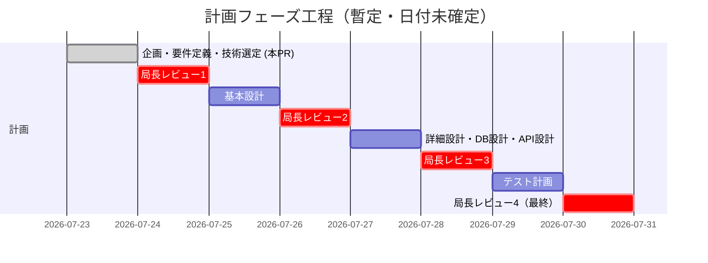

# 07. 開発スケジュール

ステータス: ドラフト（局長レビュー待ち）

本書の工程表は概要。**工程の順序・開始条件の正本は `14_マスターロードマップ.md`**（伴走フェーズへの統合を含む）。食い違う場合は14に従う（Codex R1 C1/M2対応）。

## 1. ウォーターフォール工程とゲート

各工程は前工程の局長承認を経てから着手する。前回までの反省（計画が固まらないまま
実装に入り手戻りが発生した）を踏まえ、このゲートを飛ばさない。

| # | 工程 | 成果物 | 完了条件（ゲート） |
|---|---|---|---|
| 1 | 企画 | `00_企画概要.md` | 目的・シリーズ位置づけに局長承認 |
| 2 | 要件定義 | `01_要件定義書.md` | 機能要件・非機能要件・スコープ外に局長承認 |
| 3 | 技術選定 | `02_技術選定書.md` | アーキテクチャ決定に局長承認 |
| 4 | 基本設計 | `03_基本設計書.md` | 画面一覧・構成図・ER図（概要）に局長承認 |
| 5 | 詳細設計 | `04_詳細設計書.md` | 画面ごとの詳細仕様に局長承認 |
| 6 | DB設計 | `05_DB設計書.md` | テーブル定義が機能要件を過不足なくカバー、局長承認 |
| 7 | API設計 | `06_API設計書.md` | エンドポイント仕様に局長承認 |
| 8 | テスト計画 | `08_テスト計画書.md` | テスト方針・観点に局長承認 |
| 9 | 伴走フェーズ（実装＋教材執筆） | アプリ本体と章形式の教材（章単位の伴走ループ — `10_教材制作フロー.md` §4） | 開始条件は「14のPhase 1・Phase 2の完了」（正本）。完了条件は14のPhase 3 |

**現在地: 工程1〜3（企画・要件定義・技術選定）のドラフトを本PRで提出。
工程4以降は局長レビューを経てから着手する。**

## 2. 今後のマイルストーン（暫定）

具体的な日付は局長との合意後に確定する。現時点では工程の順序と
依存関係のみを固定する。

## 3. 実装フェーズへの引き継ぎ条件

計画フェーズ完了後、実装フェーズは別途スケジュールを立てる
（`00_企画概要.md` の成功基準5点を参照）。実装フェーズのスケジュールには
以下を新規に見積もりへ含める必要がある（前作 `task-app` にはなかった要素）:

- Capacitorのネイティブビルド環境構築（Xcode / Android Studio セットアップ）
- WebSocket・非同期ジョブ（BullMQ）の動作確認環境
- 実機（iOS/Android）での動作確認手順の確立

## 4. 工数見積もりの方針（Codex R1 M20 / R2 MAJOR4対応）

見積もりは2段階で行う（Codex R3 M6 / R4 M2対応 — 章の実施はPhase 3開始後にしか
できないため、実測前提の見積もりをPhase 1に置かない）:

1. **参考見積（Phase 1・章分割凍結時）**: 章数×前作task-app教材の章平均実績による
   粗い参考値のみ。日付は約束しない
2. **ローリング見積（Phase 3、パート進入ごとに更新 — Codex R5 M2対応）**: 章は依存順の
   直列で進むため、全パートの実測を序盤に集めることはできない。各パートへ進入して
   序盤1〜2章の実測が出るたびに、そのパートを「パート内平均×章数」で確定し、
   未進入パートは「前作実績×既実測パートの補正係数」で暫定計上して全体を毎回更新する。
   全パート実測に基づく確定見積もりが揃うのは最終パート進入時 — これを正直に扱い、
   途中の全体値は常に「暫定」と明記する
§2のガント図は工程の順序を示す暫定図であり、日付・工期の約束ではない。
