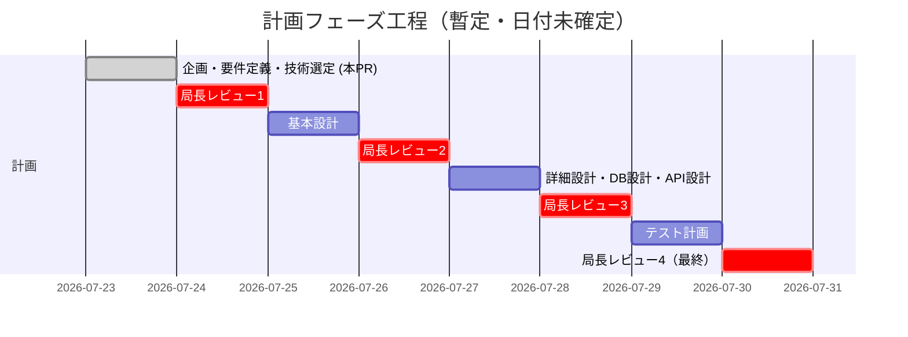

# 07. 開発スケジュール

ステータス: ドラフト（局長レビュー待ち）

本書の工程表は概要。**工程の順序・開始条件の正本は `14_マスターロードマップ.md`**（伴走フェーズへの統合を含む）。食い違う場合は14に従う（Codex R1 C1/M2対応）。

## 1. ウォーターフォール工程とゲート

各工程は前工程の局長承認を経てから着手する。前回までの反省（計画が固まらないまま
実装に入り手戻りが発生した）を踏まえ、このゲートを飛ばさない。

| # | 工程 | 成果物 | 完了条件（ゲート） |
|---|---|---|---|
| 1 | 企画 | `00_企画概要.md` | 目的・シリーズ位置づけに局長承認 |
| 2 | 要件定義 | `01_要件定義書.md` | 機能要件・非機能要件・スコープ外に局長承認 |
| 3 | 技術選定 | `02_技術選定書.md` | アーキテクチャ決定に局長承認 |
| 4 | 基本設計 | `03_基本設計書.md` | 画面一覧・構成図・ER図（概要）に局長承認 |
| 5 | 詳細設計 | `04_詳細設計書.md` | 画面ごとの詳細仕様に局長承認 |
| 6 | DB設計 | `05_DB設計書.md` | テーブル定義が機能要件を過不足なくカバー、局長承認 |
| 7 | API設計 | `06_API設計書.md` | **RLS ポリシー・トリガー・Realtime の購読契約・Storage のパスとポリシーに局長承認**（2026-08-09 訂正。旧「エンドポイント仕様に局長承認」は 2026-07-26 の構成振り直しで消滅した前提のまま残っていた — 02 §6 が「自前 API の仕様書を正本に置く前提そのものが消滅した」、06 §0.4 が「自前 API のエンドポイント一覧は復活させない」と決めている） |
| 8 | テスト計画 | `08_テスト計画書.md` | テスト方針・観点に局長承認 |
| 9 | 伴走フェーズ（実装＋教材執筆） | アプリ本体と章形式の教材（章単位の伴走ループ — `10_教材制作フロー.md` §4） | 開始条件は「14のPhase 1・Phase 2の完了」（正本）。完了条件は14のPhase 3 |

**現在地（2026-08-09 更新）: 工程1〜8 の文書がすべてドラフトとして存在する。**
Phase 0（00〜03・05・07・09〜16）は 2026-08-06 に局長承認。
工程5・7・8（04・06・08）は 2026-08-09 に本文を書き下ろした（**まだ承認前・凍結前**）。
工程9（伴走フェーズ）は開始条件（14 の Phase 1・Phase 2 の完了）を満たしていないため未着手。
旧記述「工程1〜3のドラフトを本PRで提出。工程4以降は局長レビューを経てから着手する」は、
04・06・08 が書き下ろされた現状と合っていなかったため差し替えた。

## 2. 今後のマイルストーン（暫定）

具体的な日付は局長との合意後に確定する。現時点では工程の順序と
依存関係のみを固定する。

## 3. 実装フェーズへの引き継ぎ条件

計画フェーズ完了後、実装フェーズは別途スケジュールを立てる
（`00_企画概要.md` の成功基準5点を参照）。実装フェーズのスケジュールには
以下を新規に見積もりへ含める必要がある（前作 `task-app` にはなかった要素）:

- 実機（iOS/Android）での動作確認手順の確立
- **ディープリンク**（メール内リンクからアプリを開く仕組み）の検証環境
- **RLS ポリシーの検証**（「他人の行を触れない」ことをテストで確かめる手順）
- **G6 対照版2本の作成と、改訂時の更新**（2026-08-06 追加。10 §4・D17-6）。
  1章につき `g6/<章ID>/plain.md`（対話を全部抜いた版）と `g6/<章ID>/minus.md`
  （「教材に載せる価値: 高」の詰まりの記述だけを抜いた版）を作り、G6 read を2ラウンド回す。
  改訂タグを打った章では2本とも同じPRで更新する

**2026-07-26 の構成振り直しで消えた見積もり項目**: Capacitor のネイティブビルド環境構築
（Xcode / Android Studio セットアップ）と、WebSocket・非同期ジョブ（BullMQ）の動作確認環境。
前者は Expo Go により不要、後者は Supabase Realtime により不要になった。

## 4. 工数見積もりの方針（Codex R1 M20 / R2 MAJOR4対応）

見積もりは2段階で行う（Codex R3 M6 / R4 M2対応 — 章の実施はPhase 3開始後にしか
できないため、実測前提の見積もりをPhase 1に置かない）:

1. **参考見積（Phase 1・章分割凍結時）**: 章数×前作task-app教材の章平均実績による
   粗い参考値のみ。日付は約束しない
2. **ローリング見積（Phase 3、パート進入ごとに更新 — Codex R5 M2対応）**: 章は依存順の
   直列で進むため、全パートの実測を序盤に集めることはできない。各パートへ進入して
   序盤1〜2章の実測が出るたびに、そのパートを「パート内平均×章数」で確定し、
   未進入パートは「前作実績×既実測パートの補正係数」で暫定計上して全体を毎回更新する。
   全パート実測に基づく確定見積もりが揃うのは最終パート進入時 — これを正直に扱い、
   途中の全体値は常に「暫定」と明記する

**ローリング見積の内訳に置く新設行（値は空欄。2026-08-06 — D17-6）**

| 項目 | 単位 | 値 |
|---|---|---|
| G6 対照版 `plain.md` の作成 | 1章あたり | **未実測**（B47） |
| G6 対照版 `minus.md` の作成 | 1章あたり | **未実測**（B47） |
| 改訂タグ1回あたりの対照版2本の更新 | 1回あたり | **未実測**（B47） |
| G6 read 2ラウンドの実行コスト | 1章あたり | **未実測**（B47。既定4体×2ラウンド、閾値ちょうどならもう1周回るため最大16体ぶん） |
| 組版 CSS テーマの作成（判型・級数・コードの折り返し・柱・ノンブル） | 一度きり | **未実測**（B57。2026-08-06 追加 — D23） |
| 図表・コードの紙面調整（版面はみ出しの手当て） | 1章あたり | **未実測**（B57） |
| 組版した PDF の目視検品 | 1章あたり | **未実測**（B57） |
| 改訂タグ1回あたりの再組版 | 1回あたり | **未実測**（B57） |

組版の4行について実測できているのは「1章の PDF ビルドが 4.1〜4.8 秒（Chromium キャッシュが
温まった状態）」だけであり、**これは工数ではない**。CSS テーマは1本も書いていない。
**G6 の対照版2本（`plain.md` / `minus.md`）を組版対象に含めるかも未決**で、含めると
上の3行が倍になる（`decisions/D23_Vivliostyle採用の影響.md` §6）。

場所だけ用意し、値は本番1章目の実施時に実測して埋める。現物の対照版は捨て試作の2本しかなく、
そのどちらも作成に掛かった時間が記録されていない（道具検証の記録 §13 の約28分は
2章目を1本通しで作った時間で、対照版の作成時間を切り出していない）。
**根拠のない数字をここに置くと、以降の全工程がその数字を前提に組まれる。**

「パート進入」の定義は 10 §4（D7-3）にある: そのパートに属するいずれかの章の実装PR
（実装変更が無い章はN/A証跡）が最初にマージされた時点。
§2のガント図は工程の順序を示す暫定図であり、日付・工期の約束ではない。
