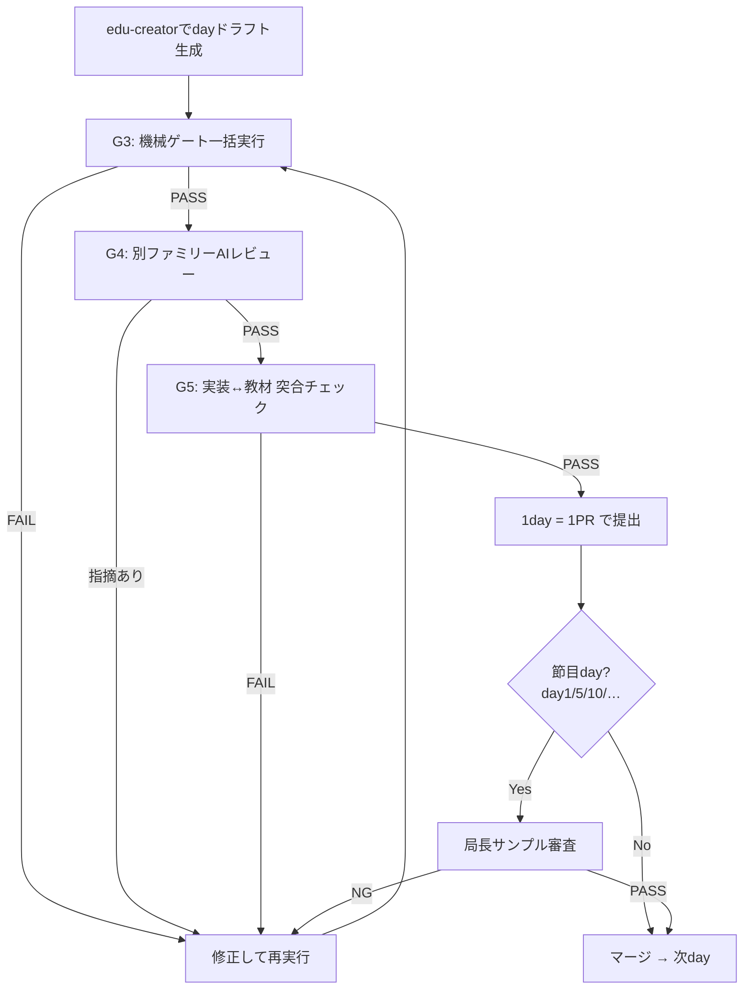

# 10. 教材制作フロー — task-app 16件の手戻りを二度と起こさないための工程設計

ステータス: ドラフト（局長レビュー待ち）

## 0. この文書の位置づけ

`07_開発スケジュール.md` は「アプリ本体」のウォーターフォール工程を定義する。
本書はその後段、**工程10「教材化」の中身**（day記事をどう作るか）を定義する。

前作 task-app（redmine-clone教材）の制作では、git履歴・issue/PR・レビュー結果を
横断調査した結果、**証拠つきの手戻りが16件**確認された。本書はその16件を
1件ずつ潰す形で工程を設計する。「なんとなく気をつける」は禁止。
すべての教訓は**機械ゲートか工程ゲートのどちらか**に落とす。

## 1. 前作の手戻り16件 → 対策の対応表

| # | 前作で起きたこと（証拠） | 本作での対策 | 対策の種類 |
|---|---|---|---|
| 1 | Day01販売ZIPに完成品混入（PR #296） | 教材執筆開始前に「学習者の開始状態」を成果物として定義・凍結（§3 G0） | 工程ゲート |
| 2 | Day07認証APIが既存実装と乖離（PR #296） | 教材は**完成済み実装から逆算**して書く。実装前に教材を書かない（§2 大原則1） | 工程ゲート |
| 3 | BLOCKED enum削除が教材に1.5ヶ月未反映（`8794135`→`0b66dbe`） | 実装変更→教材整合の機械チェック（教材内コードと実装の突合スクリプト）をCIに常設（§4 G5） | 機械ゲート |
| 4 | コメントAPI/UIの実装順と教材進行のズレ（PR #296） | day分割は詳細設計書の依存グラフから機械的に導出し、執筆前に凍結（§3 G1） | 工程ゲート |
| 5 | 外部レビューで26/30日が80点未満（review_results_gpt54.json） | 内部ゲート合格≠完成。**別ファミリーのAIによる外部レビュー**を全dayの必須工程に（§4 G4） | 工程ゲート |
| 6 | day01だけで60コミット・4波の修正ラウンド | 1day完成→レビュー→承認→次day、の**1day単位の直列ゲート**。全day書いてから直す方式を禁止（§2 大原則2） | 工程ゲート |
| 7 | マージ時点で18/30ファイルがゲートFAIL（issue #94） | ゲートFAILの状態でマージ・次工程進行を禁止（ブランチ保護＋CI必須化）（§4） | 機械ゲート |
| 8 | MUI→Tailwind移行が教材着手後に発生 | 本作は `02_技術選定書.md` 承認済みスタックを凍結。変更したくなったら教材執筆を**停止**して技術選定書の改訂承認から回す（§2 大原則3） | 工程ゲート |
| 9 | 差分更新が未実装で毎回フル再生成 | edu-creator汎用化（GENERICIZATION_PLAN.md）に差分更新の実装を含めるか、含めないなら「フル再生成前提の工程」と正直に設計（§5） | ツール |
| 10 | AIの「100%合格」虚偽報告（IMPROVEMENTS.md） | 合否判定はAIの主観禁止。全ゲートをexit codeを返すスクリプトに（§4） | 機械ゲート |
| 11 | 巨大混合コミット161ファイルのtriageに1週間（issue #101） | 1day = 1ブランチ = 1PR。混合コミット禁止（§3 G2） | 工程ゲート |
| 12 | ゲート違反の蓄積でコミット不能に（issue #258） | 違反は発生したdayのPR内で即解消。「あとでまとめて直す」を禁止（§2 大原則2の系） | 工程ゲート |
| 13 | 3回推敲上限で「警告付きそのまま保存」（main_pm.py L233） | 上限到達＝**自動保存ではなく人間へエスカレーション**に変更（edu-creator改修に含める）（§5） | ツール |
| 14 | 品質ゲート導入PR自体が頓挫→10日後に再導入（PR #248→#259） | ゲート類は**教材執筆開始前**に全部導入完了させる。執筆と並行でゲートを作らない（§3 G0） | 工程ゲート |
| 15 | ゲート自体の誤検知バグ（PR #268） | ゲートは導入時に既知の陽性/陰性サンプルでテストしてから有効化（§3 G0） | 機械ゲート |
| 16 | 文体ブレ（関西弁⇄丁寧体が日ごとにバラバラ）＋誇大・情緒的なAI臭い文体で局長に実害（issue #246、PR #266「こういう誇大表現やめてくれ」） | **文体スペックを執筆開始前に凍結**し、`check_tone.py` 相当（関西弁・AI構文・誇大表現・英語直訳調の検出）を1day目から必須ゲートに。task-appで完成済みのcheck_tone.pyを移植（§4 G3） | 機械ゲート |

## 2. 大原則（3つ）

1. **実装が先、教材が後。** 教材は「完成して動いているアプリ」を逆算して書く。
   実装が存在しない機能の教材を書かない（前作#2・#4の根絶）。
2. **1day単位で完結させる。** 執筆→機械ゲート→AIレビュー→局長サンプル確認（節目のみ）
   →承認→次day。全day書き上げてからまとめて直す方式は、前作でday01だけ60コミット・
   全35ファイル一括文体変換という結果を生んだので禁止（#6・#11・#12・#16の根絶）。
3. **凍結したものを変えるときは工程を巻き戻す。** スタック・文体スペック・day分割は
   凍結成果物。変更が必要になったら執筆を止めて上流文書の改訂承認から回す。
   「走りながら変える」が前作の手戻りの過半の根本原因（#3・#8の根絶）。

## 3. 執筆前ゲート（G0〜G2: ここを通るまで1文字も書かない）

### G0: 執筆環境の完成（前作#1・#14・#15対策）
- [ ] アプリ本体が完成し、`08_テスト計画書.md` のテストが全部通っている
- [ ] 「学習者の開始状態」（スターターの中身に何を含め、何を含めないか）が
      文書で定義され、混入検査スクリプトが存在する
- [ ] 品質ゲート一式（§4のG3〜G5全部）が導入済みで、既知の陽性/陰性サンプルで
      検知テスト済み
- [ ] edu-creator汎用化（GENERICIZATION_PLAN.md）が完了し、sns-appのstack_profileで
      試験生成1本がゲートを通過している

### G1: day分割の凍結（前作#4対策）
- [ ] `04_詳細設計書.md` の画面・機能の依存グラフからday分割表を作成
- [ ] 各dayの「そのdayで完成する状態」「前提とする前day成果」を1行ずつ定義
- [ ] 局長承認 → 凍結

### G2: 文体スペックの凍結（前作#16対策）
- [ ] 声の定義（です・ます調固定、一人称、絵文字方針、禁止表現リスト:
      誇大・煽り・情緒表現、AI構文、英語直訳調、関西弁）を1ファイルに明文化
- [ ] task-appで完成済みの `check_tone.py` をsns-app用に移植し、
      このスペックと同期していることを確認
- [ ] 局長承認 → 凍結

## 4. day執筆ループ（1dayごとに直列で回す）

- **G3 機械ゲート**: 構造チェック（コード行数上限・表・図の必須数）＋
  文体チェック（check_tone.py移植版）＋開始状態混入検査。全部exit codeで合否
  （AI主観の合格判定は禁止 — 前作#10対策）
- **G4 外部レビュー**: 生成に使ったAIファミリーと**別ファミリー**のAIが
  採点・指摘（前作#5対策: 内部合格と外部評価の30点乖離の再発防止）。
  推敲上限に達しても合格しない場合は自動保存せず局長へエスカレーション（前作#13対策）
- **G5 実装↔教材突合**: 教材内のコード片が実装リポジトリの実コードと一致するかを
  機械照合（前作#3対策: BLOCKED enum事件の再発防止）。実装が変わったら
  このゲートが落ちて教材の陳腐化を即検知する
- **局長サンプル審査**: 全dayを局長が読むのは負担が大きすぎるため、
  節目のdayのみ局長審査（`kyokucho-review-gate` の3層フォーマットで提出）。
  それ以外は G3-G5 通過＋PRレビューで進める

## 5. edu-creator側に必要な改修（GENERICIZATION_PLAN.mdへの追記事項）

本フローの前提として、汎用化計画に以下を追加する:

1. **推敲上限到達時の挙動変更**: 「警告付きで保存」→「保存せずエスカレーション」（#13）
2. **文体ゲートの組み込み**: check_tone.py移植版をQualityGateの必須ステップに（#16）
3. **実装↔教材突合スクリプト**: 教材内 `// filepath:` コメント付きコード片を
   対象リポジトリの実ファイルとdiffするチェッカー（#3）
4. **差分更新の扱いを決める**: 実装するなら計画に含める、しないなら
   「フル再生成前提」と工程側で正直に扱う（#9）

## 6. この文書の完了条件

- [ ] 16件対応表・大原則・ゲート設計に局長承認
- [ ] 承認後、§5の4項目を GENERICIZATION_PLAN.md に反映
- [ ] G0チェックリストが全部埋まるまで教材執筆は開始しない
