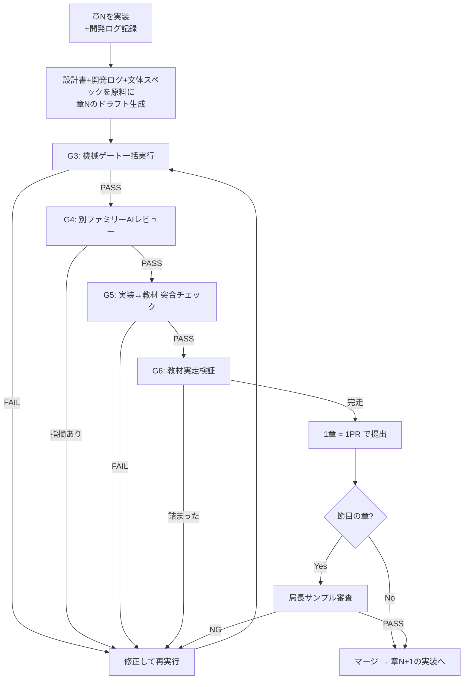

# 10. 教材制作フロー — task-app 16件の手戻りを二度と起こさないための工程設計

ステータス: ドラフト（局長レビュー待ち）

## 0. この文書の位置づけ

`07_開発スケジュール.md` は「アプリ本体」のウォーターフォール工程を定義する。
本書はその後段、**工程10「教材化」の中身**（day記事をどう作るか）を定義する。

前作 task-app（redmine-clone教材）の制作では、git履歴・issue/PR・レビュー結果を
横断調査した結果、**証拠つきの手戻りが16件**確認された。本書はその16件を
1件ずつ潰す形で工程を設計する。「なんとなく気をつける」は禁止。
すべての教訓は**機械ゲートか工程ゲートのどちらか**に落とす。

## 1. 前作の手戻り16件 → 対策の対応表

| # | 前作で起きたこと（証拠） | 本作での対策 | 対策の種類 |
|---|---|---|---|
| 1 | Day01販売ZIPに完成品混入（PR #296） | 教材執筆開始前に「学習者の開始状態」を成果物として定義・凍結（§3 G0） | 工程ゲート |
| 2 | Day07認証APIが既存実装と乖離（PR #296） | 教材は**完成済み実装から逆算**して書く。実装前に教材を書かない（§2 大原則1） | 工程ゲート |
| 3 | BLOCKED enum削除が教材に1.5ヶ月未反映（`8794135`→`0b66dbe`） | 実装変更→教材整合の機械チェック（教材内コードと実装の突合スクリプト）をCIに常設（§4 G5） | 機械ゲート |
| 4 | コメントAPI/UIの実装順と教材進行のズレ（PR #296） | day分割は詳細設計書の依存グラフから機械的に導出し、執筆前に凍結（§3 G1） | 工程ゲート |
| 5 | 外部レビューで26/30日が80点未満（review_results_gpt54.json） | 内部ゲート合格≠完成。**別ファミリーのAIによる外部レビュー**を全dayの必須工程に（§4 G4） | 工程ゲート |
| 6 | day01だけで60コミット・4波の修正ラウンド | 1day完成→レビュー→承認→次day、の**1day単位の直列ゲート**。全day書いてから直す方式を禁止（§2 大原則2） | 工程ゲート |
| 7 | マージ時点で18/30ファイルがゲートFAIL（issue #94） | ゲートFAILの状態でマージ・次工程進行を禁止（ブランチ保護＋CI必須化）（§4） | 機械ゲート |
| 8 | MUI→Tailwind移行が教材着手後に発生 | 本作は `02_技術選定書.md` 承認済みスタックを凍結。変更したくなったら教材執筆を**停止**して技術選定書の改訂承認から回す（§2 大原則3） | 工程ゲート |
| 9 | 差分更新が未実装で毎回フル再生成 | edu-creator汎用化（GENERICIZATION_PLAN.md）に差分更新の実装を含めるか、含めないなら「フル再生成前提の工程」と正直に設計（§5） | ツール |
| 10 | AIの「100%合格」虚偽報告（IMPROVEMENTS.md） | 合否判定はAIの主観禁止。全ゲートをexit codeを返すスクリプトに（§4） | 機械ゲート |
| 11 | 巨大混合コミット161ファイルのtriageに1週間（issue #101） | 1day = 1ブランチ = 1PR。混合コミット禁止（§3 G2） | 工程ゲート |
| 12 | ゲート違反の蓄積でコミット不能に（issue #258） | 違反は発生したdayのPR内で即解消。「あとでまとめて直す」を禁止（§2 大原則2の系） | 工程ゲート |
| 13 | 3回推敲上限で「警告付きそのまま保存」（main_pm.py L233） | 上限到達＝**自動保存ではなく人間へエスカレーション**に変更（edu-creator改修に含める）（§5） | ツール |
| 14 | 品質ゲート導入PR自体が頓挫→10日後に再導入（PR #248→#259） | ゲート類は**教材執筆開始前**に全部導入完了させる。執筆と並行でゲートを作らない（§3 G0） | 工程ゲート |
| 15 | ゲート自体の誤検知バグ（PR #268） | ゲートは導入時に既知の陽性/陰性サンプルでテストしてから有効化（§3 G0） | 機械ゲート |
| 16 | 文体ブレ（関西弁⇄丁寧体が日ごとにバラバラ）＋誇大・情緒的なAI臭い文体で局長に実害（issue #246、PR #266「こういう誇大表現やめてくれ」） | **文体スペックを執筆開始前に凍結**し、`check_tone.py` 相当（関西弁・AI構文・誇大表現・英語直訳調の検出）を1day目から必須ゲートに。task-appで完成済みのcheck_tone.pyを移植（§4 G3） | 機械ゲート |

## 2. 大原則（4つ）— 2026-07-24 局長方針で改訂

1. **教材は「本来の開発フロー」をなぞる。**（局長最重要方針）
   章の順序・手順は、実際の開発者が自然に作る順序そのものにする。
   教育的な切りやすさや生成のしやすさを理由に、現実にはやらない順序・手順へ
   組み替えることを禁止する。完成品からのリバース生成
   （完成コードを逆算して教材の体裁に再構成する方式）も同じ理由で禁止 —
   実際にやってみたら初心者が詰まる教材は、この組み替えから生まれる。
2. **章単位の伴走ループ: 実装しながら、その場で書く。**
   章Nを実装 → 実装中に踏んだ本物のエラー・ハマり・回り道を開発ログ（§5）に記録 →
   そのログを原料に章Nの教材を書く。実装が存在しない機能の教材を書かない
   （前作#2・#4の根絶）のは変わらないが、「アプリ全体を完成させてから
   まとめて執筆」は採らない — 完成後の後知恵では「その時リアルに困った状態」を
   教材に写せないため。後の章の実装で前の章のコードが変わったら、
   **後で直せばよい**（G5突合ゲートが自動検知する。変更を恐れて工程を
   複雑にする方が本末転倒 — 局長判断 2026-07-24）。
3. **1章単位で完結させる。** 執筆→機械ゲート→AIレビュー→実走検証→局長サンプル確認
   （節目のみ）→承認→次章。全章書き上げてからまとめて直す方式は、前作でday01だけ
   60コミット・全35ファイル一括文体変換という結果を生んだので禁止（#6・#11・#12・#16の根絶）。
4. **凍結したものを変えるときは工程を巻き戻す。** スタック・文体スペック・章分割は
   凍結成果物。変更が必要になったら執筆を止めて上流文書の改訂承認から回す。
   「走りながら変える」が前作の手戻りの過半の根本原因（#3・#8の根絶）。
   ※原則2の「実装差分を後で直す」は凍結対象外（コードの細部）の話であり、
   ここで言う凍結対象（スタック・文体・章分割）とは層が違う。

## 3. 執筆前ゲート（G0〜G2: ここを通るまで1文字も書かない）

### G0: 執筆環境の完成（前作#1・#14・#15対策）
- [ ] 設計文書（01〜06・15）が承認済み（アプリ本体の完成は**要求しない** —
      大原則2の伴走ループにより実装と執筆は章単位で並走する）
- [ ] 「学習者の開始状態」（スターターの中身に何を含め、何を含めないか）が
      文書で定義され、混入検査スクリプトが存在する
- [ ] 品質ゲート一式（§4のG3〜G6全部）が導入済みで、既知の陽性/陰性サンプルで
      検知テスト済み
- [ ] 開発ログのテンプレート（§5）が用意されている
- [ ] edu-creator改修（開発ログ駆動の生成方式 — GENERICIZATION_PLAN.mdに反映）が
      完了し、試験生成1本がゲートを通過している

### G1: 章分割の凍結（前作#4対策）
- [ ] `15_カリキュラム骨子案.md` のパート構成を親に、`04_詳細設計書.md` の
      依存関係から章分割表を作成。**分割の第一基準は「本来の開発フローの順序」**
      （大原則1）。教育的な見栄えとぶつかったら開発フロー優先
- [ ] 各章の「その章で完成する状態」「前提とする前章成果」を1行ずつ定義
- [ ] 局長承認 → 凍結

### G2: 文体スペックの凍結（前作#16対策）
- [ ] 声の定義は `12_文体・AI臭さ排除方針.md` が正本（磯貝×阿部の対話形式、
      禁止表現リスト: 誇大・煽り・情緒表現、AI構文、英語直訳調、関西弁）
- [ ] task-appで完成済みの `check_tone.py` をsns-app用に移植し、
      このスペックと同期していることを確認
- [ ] 局長承認 → 凍結

## 4. 章の伴走ループ（1章ごとに直列で回す）



- **G3 機械ゲート**: 構造チェック（コード行数上限・表・図の必須数）＋
  文体チェック（check_tone.py移植版）＋開始状態混入検査。全部exit codeで合否
  （AI主観の合格判定は禁止 — 前作#10対策）
- **G4 外部レビュー**: 生成に使ったAIファミリーと**別ファミリー**のAIが
  採点・指摘（前作#5対策: 内部合格と外部評価の30点乖離の再発防止）。
  レビュー観点に「完成品へのつながりが見えるか・退屈でないか」を必須で含める
  （`11_ターゲット・ペルソナ・UX定義.md` 原則7）。
  推敲上限に達しても合格しない場合は自動保存せず局長へエスカレーション（前作#13対策）
- **G5 実装↔教材突合**: 教材内のコード片が実装リポジトリの実コードと一致するかを
  機械照合（前作#3対策: BLOCKED enum事件の再発防止）。後の章の実装で前の章の
  コードが変わったときも、このゲートが落ちて「後で直す」対象を自動列挙する
  （大原則2の「変わったら後で直す」を成立させる検知網）
- **G6 教材実走検証（新設 — 局長の危惧 2026-07-24 への直接対策）**:
  書き上がった章の手順・コード片**だけ**を、前章までの完成状態から順に実行し、
  章の完成状態に到達できるかを検証する。教材に書いていない暗黙の前提
  （インストール済みのツール・省略された手順・実は先生しか知らない設定）が
  1つでもあれば、ここで初心者と同じように詰まって検出される。
  コード片の抽出実行は機械化し、画面操作を伴う部分は手順書どおりの実走で確認する
- **局長サンプル審査**: 全章を局長が読むのは負担が大きすぎるため、
  節目の章のみ局長審査（`kyokucho-review-gate` の3層フォーマットで提出）。
  それ以外は G3-G6 通過＋PRレビューで進める

## 5. 開発ログ（対話のリアリティの原料 — 大原則2の必須成果物）

章Nの実装中、以下のテンプレートで記録する。これが阿部くんの「すみません、
エラーが出てしまって…」の**原料**になる。記録がない章は、対話のハマり場面を
創作することになり内容の嘘（AI臭さの根源）に戻るため、開発ログの存在を
G3のチェック項目に含める。

```markdown
## 章N 開発ログ
### 詰まり1
- 何をしようとした:
- 出たエラー（全文コピー）:
- 最初に疑ったこと（間違いでもそのまま書く）:
- 実際の原因:
- 解決した手順:
- かかった時間:
- 教材に載せる価値: 高（初心者も確実に踏む）/ 中 / 低（環境固有）
```

- 「教材に載せる価値: 高」の詰まりは、その章の対話に必ず登場させる
- 記録は実装の**その場で**書く（後からまとめて書くと「最初に疑ったこと」が
  美化されて嘘になる — 完成後リバース生成を禁止したのと同じ理由）

## 6. edu-creator側に必要な改修（GENERICIZATION_PLAN.mdへの追記事項）

本フローの前提として、汎用化計画に以下を追加する:

1. **生成方式の転換（最重要 — 局長方針 2026-07-24）**: 「完成コードを読んで
   リバース生成」から「**設計書＋開発ログ（§5）＋文体スペックを原料に生成**」へ。
   生成プロンプトの入力が根本から変わる
2. **推敲上限到達時の挙動変更**: 「警告付きで保存」→「保存せずエスカレーション」（#13）
3. **文体ゲートの組み込み**: check_tone.py移植版をQualityGateの必須ステップに（#16）
4. **実装↔教材突合スクリプト**: 教材内 `// filepath:` コメント付きコード片を
   対象リポジトリの実ファイルとdiffするチェッカー（#3）
5. **教材実走検証（G6）の機械化**: 教材からコード片・コマンドを順に抽出して
   クリーン環境で実行するランナー
6. **差分更新の扱いを決める**: 実装するなら計画に含める、しないなら
   「フル再生成前提」と工程側で正直に扱う（#9）

## 7. この文書の完了条件

- [ ] 16件対応表・大原則（4つ）・ゲート設計（G0〜G6）・開発ログ仕様に局長承認
- [ ] 承認後、§6の6項目を GENERICIZATION_PLAN.md に反映
- [ ] G0チェックリストが全部埋まるまで教材執筆は開始しない
