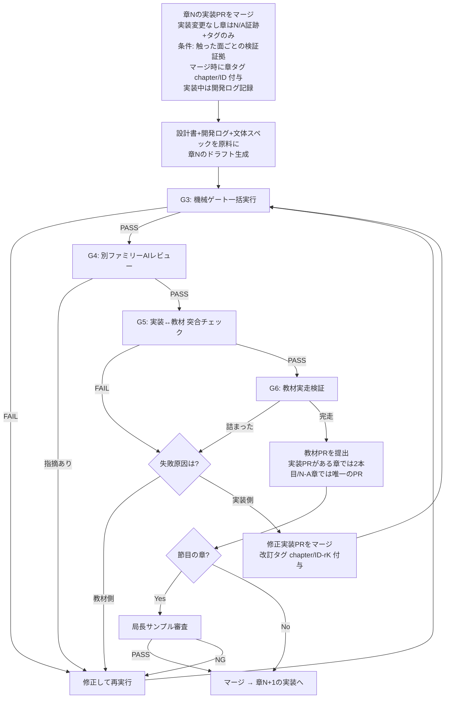

# 10. 教材制作フロー — task-app 16件の手戻りを二度と起こさないための工程設計

ステータス: ドラフト（局長レビュー待ち）

## 0. この文書の位置づけ

`07_開発スケジュール.md` は設計工程を定義する。本書はその後段、
**工程9「伴走フェーズ」の教材側の中身**（章をどう作るか）を定義する。

前作 task-app（redmine-clone教材）の制作では、git履歴・issue/PR・レビュー結果を
横断調査した結果、**証拠つきの手戻りが16件**確認された。本書はその16件を
1件ずつ潰す形で工程を設計する。「なんとなく気をつける」は禁止。
すべての教訓は**機械ゲートか工程ゲートのどちらか**に落とす。

## 1. 手戻り対応表（前作16件＋本作で発生した分）

初版は前作 task-app の手戻り16件だけを載せていた。`13_記録・進捗管理規約.md` §6 が
本表を「生きた文書」と定め、本作で手戻りが発生したら同じ表に行を足すと決めているため、
17行目以降は本作の手戻りが入る。追記の判断者・基準・契機・番号の扱いは
13 §6 に置いた（`material/decisions/D22_記録運用の確定.md` D22-1〜D22-5）。

| # | 起きたこと（証拠。#1〜#16 は前作 task-app、#17 以降は本作） | 対策 | 対策の種類 |
|---|---|---|---|
| 1 | Day01販売ZIPに完成品混入（PR #296） | 教材執筆開始前に「学習者の開始状態」を成果物として定義・凍結（§3 G0） | 工程ゲート |
| 2 | Day07認証APIが既存実装と乖離（PR #296) | 章単位の伴走ループ: その章の実装を済ませ、その実装＋開発ログを原料に書く。実装が存在しない機能の教材を書かない（§2 大原則2） | 工程ゲート |
| 3 | BLOCKED enum削除が教材に1.5ヶ月未反映（`8794135`→`0b66dbe`） | 実装変更→教材整合の機械チェック（教材内コードと実装の突合スクリプト）をCIに常設（§4 G5） | 機械ゲート |
| 4 | コメントAPI/UIの実装順と教材進行のズレ（PR #296） | 章分割は「本来の開発フローの順序」を第一基準に詳細設計の依存グラフから導出し、執筆前に凍結（§3 G1。微調整は軽量改訂手続き） | 工程ゲート |
| 5 | 外部レビューで26/30日が80点未満（review_results_gpt54.json） | 内部ゲート合格≠完成。**別ファミリーのAIによる外部レビュー**を全章の必須工程に（§4 G4） | 工程ゲート |
| 6 | day01だけで60コミット・4波の修正ラウンド | 1章完成→レビュー→承認→次章、の**1章単位の直列ゲート**。全章書いてから直す方式を禁止（§2 大原則3） | 工程ゲート |
| 7 | マージ時点で18/30ファイルがゲートFAIL（issue #94） | ゲートFAILの状態でマージ・次工程進行を禁止（ブランチ保護＋CI必須化）（§4） | 機械ゲート |
| 8 | MUI→Tailwind移行が教材着手後に発生 | 本作は `02_技術選定書.md` 承認済みスタックを凍結。変更したくなったら教材執筆を**停止**して技術選定書の改訂承認から回す（§2 大原則3） | 工程ゲート |
| 9 | 差分更新が未実装で毎回フル再生成 | 決定済み: 承認済み章の自動再生成をしない。改訂は該当章のみの手動改訂PR（§6項目6） | ツール |
| 10 | AIの「100%合格」虚偽報告（IMPROVEMENTS.md） | 機械化できる判定（G3・G5・G6の抽出実行部）はexit codeを返すスクリプトに。人間・AI判断が残るゲート（G4・局長審査）は観点別PASS/FAILの構造化記録を必須にし「見た目で合格」を禁止（§4 — Codex R1 M8対応で正直化） | 機械ゲート |
| 11 | 巨大混合コミット161ファイルのtriageに1週間（issue #101） | 1章 = 実装PR＋教材PR（各1ブランチ。実装変更なしはN/A証跡で代替）。混合コミット禁止（`13_記録・進捗管理規約.md` §3） | 工程ゲート |
| 12 | ゲート違反の蓄積でコミット不能に（issue #258） | 違反は発生した章のPR内で即解消。「あとでまとめて直す」を禁止（§2 大原則3の系。誤検知時の例外運用は13 §7） | 工程ゲート |
| 13 | 3回推敲上限で「警告付きそのまま保存」（edu-creator `main_pm.py:52` の `MAX_REVISION_ROUNDS = 3` と `:186-189` の `Max revision rounds reached, saving anyway...` → `_save_chapter` → `return True`。旧記述の `L233` は実体と違ったため 2026-08-06 に訂正。**この挙動は同日時点の HEAD `872c806` でも未修正のまま現存する**） | 上限到達＝**自動保存ではなく人間へエスカレーション**に変更（edu-creator改修に含める）（§6） | ツール |
| 14 | 品質ゲート導入PR自体が頓挫→10日後に再導入（PR #248→#259） | ゲート類は**教材執筆開始前**に全部導入完了させる。執筆と並行でゲートを作らない（§3 G0） | 工程ゲート |
| 15 | ゲート自体の誤検知バグ（PR #268） | ゲートは導入時に既知の陽性/陰性サンプルでテストしてから有効化（§3 G0） | 機械ゲート |
| 16 | 文体ブレ（関西弁⇄丁寧体が日ごとにバラバラ）＋誇大・情緒的なAI臭い文体で局長に実害（issue #246、PR #266「こういう誇大表現やめてくれ」） | **文体スペックを執筆開始前に凍結**し、`check_tone.py` 相当（関西弁・AI構文・誇大表現・英語直訳調の検出）を1章目から必須ゲートに。task-appで完成済みのcheck_tone.pyを移植（§4 G3） | 機械ゲート |
| 17 | **前作の道具を引き継がず、同種の道具を作り直していた**（証拠: `material/decisions/task-app資産棚卸し.md` §0 — 前作は検査スクリプト28本＋テスト17本・執筆スキル一式・書く前に止めるフック4本を持っていたが、本作が持っていたのは `check_tone.py` 1本で `.claude/` は存在しなかった。同じ根本原因の別の現れ方として、PROGRESS.md:201-213 の「Round 12〜19 の8周を捨てる予定の道具に費やした」がある — 別行にせずここに含める。処置: 2026-08-05 に28本＋17本・スキル・フックを搬入） | 上流の成果物を作り始める前に、前作の同種成果物を棚卸しして引き継ぎ可否を判定する工程を G0 に置く。搬入した28本の分類と配線は B31（分類の実走結果は `decisions/D14_検査スクリプトの実走結果.md`） | 工程ゲート |
| 18 | **B14（カスタム SMTP の要否）の期限切れ**（証拠: `material/PROGRESS.md`「B14 の期限切れ（2026-07-28 に発覚）」。16 B14 は測定場所として捨て試作を指定していたが、捨て試作は 2026-07-27 に完了したのに測定は一度も行われず、完了扱いになった） | 期限を「章分割表の凍結前（B1）」へ再設定済み。再発防止側の対策は **B35**（16 の各項目の「いつ」を機械が解釈できる語彙に閉じ、期限超過を検査で落とせるようにするか）で決める | 工程ゲート |
| 19 | **原稿が1本も無い段階で、最終工程の道具を詰め切った**（証拠: `material/decisions/D23_Vivliostyle採用の影響.md` — 2026-08-06 に Vivliostyle を実測し、壊れ方3件を見つけて B52〜B59・C7 の9件を起票した。測定結果そのものは正しいが、教材本文は当時0本であり、組版は原稿ができてから通す工程である。#17 および PROGRESS.md の「捨てる予定の道具を磨き続けた」と根が同じで、**成果の形（N件起票した）が取れる作業が、目的から離れていることを覆い隠す**） | 工程の下流にある道具は、その入力（原稿）が最低1単位できるまで着手しない。処置は `material/decisions/D24_執筆媒体と組版の順序.md`（章は Markdown で書き、組版はパートAが書き上がってから。B52・B53・B55〜B59 は期限を組版着手時へ付け替え） | 工程ゲート |

## 2. 大原則（4つ）— 2026-07-24 局長方針で改訂

1. **教材は「本来の開発フロー」をなぞる。**（局長最重要方針）
   章の順序・手順は、実際の開発者が自然に作る順序そのものにする。
   教育的な切りやすさや生成のしやすさを理由に、現実にはやらない順序・手順へ
   組み替えることを禁止する。完成品からのリバース生成
   （完成コードを逆算して教材の体裁に再構成する方式）も同じ理由で禁止 —
   実際にやってみたら初心者が詰まる教材は、この組み替えから生まれる。
2. **章単位の伴走ループ: 実装しながら、その場で書く。**
   章Nを実装 → 実装中に踏んだ本物のエラー・ハマり・回り道を開発ログ（§5）に記録 →
   そのログを原料に章Nの教材を書く。実装が存在しない機能の教材を書かない
   （前作#2・#4の根絶）のは変わらないが、「アプリ全体を完成させてから
   まとめて執筆」は採らない — 完成後の後知恵では「その時リアルに困った状態」を
   教材に写せないため。後の章の実装で前の章のコードが変わったら、
   **後で直せばよい**（G5突合ゲートが自動検知する。変更を恐れて工程を
   複雑にする方が本末転倒 — 局長判断 2026-07-24）。
3. **1章単位で完結させる。** 執筆→機械ゲート→AIレビュー→実走検証→局長サンプル確認
   （節目のみ）→承認→次章。全章書き上げてからまとめて直す方式は、前作でday01だけ
   60コミット・全35ファイル一括文体変換という結果を生んだので禁止（#6・#11・#12・#16の根絶）。
4. **凍結したものを変えるときは工程を巻き戻す。** スタック・文体スペック・章分割は
   凍結成果物。変更が必要になったら執筆を止めて上流文書の改訂承認から回す。
   「走りながら変える」が前作の手戻りの過半の根本原因（#3・#8の根絶）。
   ※原則2の「実装差分を後で直す」は凍結対象外（コードの細部）の話であり、
   ここで言う凍結対象（スタック・文体・章分割）とは層が違う。

## 3. 執筆前ゲート（G0〜G2: ここを通るまで1文字も書かない）

### G0: 執筆環境の完成（前作#1・#14・#15対策）
- [ ] `14_マスターロードマップ.md` のPhase 1と**Phase 2の両方**が完了している
      （04/06/08と15の承認・章分割凍結・配布形式決定・道具一式の導入を含む。
      開始条件の正本は14 — Codex R2/R3対応）。
      アプリ本体の完成は**要求しない**（大原則2の伴走ループで実装と執筆は章単位で並走）
- [ ] 「学習者の開始状態」（スターターの中身に何を含め、何を含めないか）が
      文書で定義され、混入検査スクリプトが存在する
- [ ] 品質ゲート一式（§4のG3〜G6、方針同期チェッカー〔13 §5〕）が導入済みで、
      既知の陽性/陰性サンプルで検知テスト済み（Codex R3 MAJOR2対応）。

      進捗（2026-08-06 実走。`decisions/D14_検査スクリプトの実走結果.md`）:
      本条件が要求する「検知テスト」の実体は `scripts/curriculum-qa/test_*.py` の17本である。
      直接実行で **11本合格・6本失敗**。`pytest` では1件も走らない（17本は `def test_*` を
      持たない単体スクリプト形式で、`pytest -q` は「no tests collected」rc=5 を返す）ため、
      呼び方は `python3 <file>` に固定する（D14-5）。加えて **17本は CI で1回も走っていない**
      （`.github/workflows/gates.yml` に Python のステップが無い）。
      本条件を満たしたと宣言するには、失敗6本の処置と CI への配線が要る。
      **OpenAPI 照合コンパレータは 2026-07-26 の構成振り直しで不要になったため対象外**
      （自前 API が無くなった — `02_技術選定書.md` §6）
- [ ] 開発ログのテンプレート（§5）が用意されている
- [ ] **道具4種の導入が完了している**（2026-07-26 改訂）:
      textlint 一式 ／ embedmd ／ 章末スナップショット生成 ／ G6 実走ランナー。
      **旧条件「edu-creator 改修が完了し試験生成1本がゲート通過」から差し替えた。**
      理由: 旧条件は edu-creator の改修完了を要求していたが、その実装は
      16 B13 で保留されており、**G0 が永久に満たせない循環**になっていた。
      edu-creator の役割を「既製品を束ねる薄い司令塔」に変えたことで、
      G0 が要求すべきものは「道具が入っていること」で足りるようになった。

      進捗（2026-08-06 時点に更新）: **4種とも実装され、実測まで済んでいる**
      （textlint 一式・embedmd・章末スナップショット生成 `prototype-chapter/tools/make-snapshot.sh`・
      G6 実走ランナー `prototype-chapter/tools/g6-run.sh`。記録は
      `prototype-chapter/道具検証の記録.md`）。旧記述の「スナップショット生成と
      G6 実走ランナーは未着手」は現物と合っていなかったため訂正した。
      ただし **G6 の実走（`exec`）は未完走**である（共有フックが `npm install` を拒否する。
      同記録 §12）。「導入済み」とだけ書くと、この未完走が隠れる。

      **⚠️ この「4種」は前作の実績に対して貧しい（2026-08-05 追記・B31）。**
      前作 task-app の棚卸しで、前作が**検査スクリプト28本＋テスト17本**を
      持っていたことが判明した（`decisions/task-app資産棚卸し.md`）。
      **4種を全部揃えても、前作が実測で見つけた欠陥型は1つも検出できない**
      （コード直後の「なぜ」の欠落／構造が閉じていないのに「エラーが出なくなります」／
      貼り先の取り違え／所要時間の表と本文のズレ／日本語の途中改行／表記ゆれ）。
      28本は `scripts/curriculum-qa/` へ搬入済みだが**まだ1本も実行していない**。
      「そのまま使う15／手直し6／作り直し3」の分類を B31 で確定させ、
      **確定した一覧でこのチェック項目を置き換える。**
      それまでこの「4種」を根拠に G0 を満たしたと宣言しない。

      **★ 2026-08-06: 組版器（Vivliostyle）が加わり、道具は5種目を持つ**
      （局長決定。`decisions/D23_Vivliostyle採用の影響.md`）。
      `@vivliostyle/cli` 11.1.0 で PDF・EPUB が実際に出ることは実測済み。
      ただし **組版器は合否を返す検査器ではない。**「導入した」と
      「壊れていないことを機械で確かめた」は別物である。
      実測で `vivliostyle build` は壊れた入力（`\)` 入りの embedmd 指示、
      frontmatter に置いた禁止表現、版面をはみ出す長いコード行、404 の画像参照）を
      すべて **exit 0** で通す（D23 §2-4）。
      **したがって G0 の「既知の陽性/陰性サンプルで検知テスト済み」を組版器で満たすには、
      組版器そのものではなく組版後の成果物に対する検査（B53）が FAIL を返すことを示す必要がある。**
      これは G5 について本節が既に書いていること（G5 の緑をコードが正しい証拠に使わない）と
      同じ構造である。**この5種目の書き足しは B31（道具一覧の書き直し）と同じPRで扱う** —
      別々にやると道具一覧の正本が2回書き換わる。
      **未実測**: GitHub Actions 上での組版（Chromium キャッシュ 382MB の効き方を含む）は
      1度も測っていない（B58）。ローカルの温まったキャッシュ上の値しか無い。
- [ ] **教材執筆の強制機構が入っている**（2026-08-05 追加）:
      `.claude/skills/material-writing/` と `.claude/hooks/material-writing-gate.sh`。
      前作の外部レビューで指摘された「AIっぽい・翻訳文みたい」は、
      **書いたあとに直すのでは戻らない**ため、文体スペックを読まずに教材へ書くこと自体を
      PreToolUse で拒否する。G2（文体スペックの凍結）は「凍結する」と決めているだけで
      執行機構を持っていなかった。陽性/陰性6件の検知テスト済み（棚卸し §2）。
      監視対象は `curriculum/**/*.md`（暫定名。B1・B2 で確定）
- [ ] 試験生成物・捨て試作は**教材本文ではない使い捨てフィクスチャ**として
      `material/` の外に置き（現行: `prototype-chapter/`）、カリキュラムにも
      配布物にも含めない。§3の「1文字も書かない」は教材本文（章）についての禁止であり、
      このフィクスチャには適用しない（Codex R4 M5対応）

### G1: 章分割の凍結（前作#4対策）
- [ ] `15_カリキュラム骨子案.md` のパート構成を親に、`04_詳細設計書.md` の
      依存関係から章分割表を作成。**分割の第一基準は「本来の開発フローの順序」**
      （大原則1）。教育的な見栄えとぶつかったら開発フロー優先
- [ ] 各章に**不変の章ID**（slug。例: `auth-login`）を割り当て、「その章で完成する状態」
      「前提とする前章成果」を1行ずつ定義。タグ・PR・進捗台帳はすべて章IDで参照する
      （章IDは途中挿入・順序変更でも不変 — Codex R3 MAJOR7対応）
- [ ] 章IDのライフサイクル（Codex R4 M3対応）: **分割**=元IDを廃止（tombstone）して
      新IDを発行 / **統合**=新IDを発行して旧IDを廃止 / **廃止**=tombstone記録。
      対応関係は章分割表のsupersedes列に記録し、旧タグは履歴として残す
      （以後の参照は対応表経由）。**分割・統合は未着手章に限る**（実装PRマージ済み、
      または教材ドラフト以降へ進んだ章は分割・統合禁止 — タグ・ゲート履歴・進捗の移管が
      定義できないため。着手済み章の手直しは通常の改訂PR路線で行う。Codex R5 M3対応）
- [ ] 局長承認 → 凍結。**凍結の粒度**（Codex R1 M4対応）: 凍結するのはパート構成と
      章の並びの骨格。伴走中に実装上の発見で章の境界・順序の微調整が必要になったら、
      ADR 1本＋局長の1行承認で改訂できる軽量手続きとする。無断変更が禁止なのであって、
      現実に合わせた改訂まで禁止すると「設計時に想像したフロー」を教材化することになり
      大原則1に反する
- [ ] **章IDの採番規則・改名手続き・章分割表の正本パスは
      `material/decisions/D1_教材の置き場と章IDの規約.md` が持つ**（2026-08-06 追加）。
      要点: 章IDは `^[a-z][a-z0-9]*(-[a-z0-9]+)*$`・3〜32文字・末尾セグメントが純粋な数字のものは禁止・
      表の全行（tombstone 済みを含む）で一意・tombstone 済み ID の再利用は禁止（D1-3）。
      改名は**未着手章に限り**、ADR 1本＋表の書換＋関連ファイルの `git mv` ＋旧ID残存0件の確認を
      1PRで行う（D1-4）。着手済み章は上の分割/統合/廃止の経路のみ。
      章分割表の正本は **`material/17_章分割表.md`**、読み取りは
      `scripts/curriculum-qa/chapter_table.py` 1本に集約する（D1-6）
- [ ] **章分割表の列で、11 の原則4・原則5 と「最初の結果」を検査する**（2026-08-06 追加。D5-3）。
      表に `地図` / `見える変化` / `最初の結果` の3列を持たせ、G1 で次を判定する:
      - `地図`（11:85-86）と `最初の結果`（15:45）が空欄の行が1つでもあれば FAIL
      - `見える変化`（11:87-91）が `none` の行が1つでもあれば FAIL。
        代替（ターミナル出力・ログ・ツール画面）を意味する `tool` が**並び順で3章以上連続**したら FAIL
        （11:90 の「連続2章まで」）
      判定は章の並びが確定した表の上でしか行えないため、章単位の G3 ではなく G1 に置く。
      `tool` の3章連続が開発フローの順序と衝突して避けられない場合は、§3 G1 の軽量改訂手続き
      （ADR 1本＋局長の1行承認）で例外を記録してから通す

### G2: 文体スペックの凍結（前作#16対策）
- [ ] 声の定義は `12_文体・AI臭さ排除方針.md` が正本（磯貝×阿部の対話形式、
      禁止表現リスト: 誇大・煽り・情緒表現、AI構文、英語直訳調、関西弁）
- [ ] 文体チェックの実体を **textlint ＋ preset-ja-technical-writing ＋ prh** で構成し、
      このスペックと同期していることを確認（2026-07-26 改訂）。
      **`check_tone.py` の移植は不要になった** — 自作分は prh の YAML 辞書1本に落ちる
      （捨て試作で導入と検知テストを実施済み。記録は `prototype-chapter/道具検証の記録.md`）

      **文体検出については「prh の辞書1本」で足りることを実測で確認した（2026-08-06。
      `decisions/D8_文体検出器の実測と拡張.md`）。** 辞書を 16 ルールから 57 ルールへ拡張し、
      12 §2.1 の禁止6カテゴリすべてに検出器を置いた結果、陽性サンプル70行の検出は
      26/70 → **70/70**、陰性サンプル93行の誤検知は **0件**。`check_tone.py` にしか無い
      検出は0件だったため、**移植しない**（D8-3）。検知テストは
      `prototype-chapter/prh/testdata/` に常設し、`npm run gate:style:selftest` で回す。
      2026-08-05 に付けた「前作は27本足しているので prh 1本では足りない」という但し書きは、
      **文体検出以外の欠陥型（貼り先の取り違え・所要時間のズレ・構造の未閉鎖など）**についてなら
      今も成立する。それらは B31 の分類（`decisions/D14_検査スクリプトの実走結果.md`）で扱い、
      文体の話とは分けて数える。
      なお **`@textlint-ja/preset-ai-writing` は設定キーの名前であって npm のパッケージ名ではない。**
      その名前で `npm install` すると 404 になる。実在するのは
      `@textlint-ja/textlint-rule-preset-ai-writing`（実測: 1.7.0）。現在の依存と設定は
      `prototype-chapter/` 側に置いてあり、ルートの `.textlintrc.json` は依存が無いため
      1度も実行されていない。**どちらを正本にするかは B41 で B2 の実装PRと同時に決める**
- [ ] **文体スペックを読まずに教材へ書けない状態になっている**（2026-08-05 追加）。
      G2 はここまで「凍結する」と決めているだけで、**凍結を守らせる機構が無かった**。
      前作は PreToolUse フックで書き込みそのものを拒否する形にしており、
      `.claude/hooks/material-writing-gate.sh` として移植済み（G0 の項目を見よ）
- [ ] **禁止パターンの辞書は、行を足すたびに検知テストを回す**。
      捨て試作では初回に9パターン中3件を取りこぼした（正規表現が活用形を固定していた）。
      書いた時点では動く気になるが、実際に食わせるまで穴が見えない
- [ ] 局長承認 → 凍結

## 4. 章の伴走ループ（1章ごとに直列で回す）

章Nは**実装PRを先にマージ**し、マージ時に章タグ `chapter/<章ID>` を打つ。教材PRのG5は
この**既に存在する**タグと照合する（タグが先・照合が後 — Codex R2 C1対応）。
実装PRのマージ条件は、章のラベルではなく**そのPRが触った面から合成する（累積式）**
（Codex R3 M4 / R4 M1対応 — 複数の面に触れるPRは該当する証拠を**すべて**要求され、
弱いゲートを選んで迂回できない）:
- テスト可能なアプリコードに触れた → その変更を検証するVitest/Playwrightテストが緑
- **DB スキーマまたは RLS ポリシーに触れた** → マイグレーション適用の記録に加え、
  **「他人の行を触ろうとして拒否される」ことを確かめた記録も必須**
  （旧「OpenAPI照合コンパレータのPASS」に代わる面。Codex R3 M3 の趣旨＝
  契約をCIで強制する、はここへ引き継ぐ。2026-07-26 改訂）
- ネイティブ挙動（権限・ディープリンク・ビルド設定）に触れた → 実機確認記録
  （08の手動確認手順）を添付
- 実行環境面（Supabase のマイグレーション / 環境変数 / Expo SDK 版）に触れた →
  変更後の起動確認（migration 適用・`npx expo start` 成功・関連ヘルスチェック）の記録を添付
  （Codex R5 M1対応。旧記述の Docker Compose / Prisma / Redis・BullMQ は構成変更で消滅）
- CI設定に触れた → 変更対象のワークフローが実際に走って成功した実行結果を証拠に添付
  （無関係なローカル起動記録では代替不可 — Codex R6 M1対応）
- ビルド設定に触れた → 該当ビルドの成功結果を証拠に添付（Codex R6 M1対応）
- 実装リポジトリに変更が無い（A0/A等のPlayground・ターミナル章） → タグ付与のみ行い、
  検証はG6実走に委ねる（この場合、実装PRの代わりに「変更なし」のN/A証跡を残す — R5 M4対応）
- **上記のどれにも分類できない変更面はデフォルトFAIL** — 分類と要求証拠をADRで追加定義して
  からでないとマージできない（未分類面の素通り禁止 — Codex R5 M1対応）



- **G3 機械ゲート**: 構造チェック（初期値は前作実績値: コードブロック25行以内・段落3文以内。
  確定値はPhase 2のゲート実装時に検知テストと共に固定 — Codex R1 m1対応）＋
  文体チェック（**textlint ＋ preset-ja-technical-writing ＋ prh**。2026-07-26 改訂）
  ＋開始状態混入検査＋**方針同期チェック**
  （check_policy_sync.py — 13 §5。配布形式・不採用スタック名・登場人物名の矛盾を検出。
  Codex R9 M2対応で必須実行に昇格）＋開発ログの存在確認（§5）。
  全部exit codeで合否（AI主観の合格判定は禁止 — 前作#10対策）。

  **★ この原則を組版器（Vivliostyle）に適用してはいけない**（2026-08-06 追加。
  `decisions/D23_Vivliostyle採用の影響.md` §2-4）。実測で、`vivliostyle build` の
  終了コードは**組版の破綻を一切検知しない**。長いコード行の切り落とし・画像の 404・
  embedmd 指示行の本文流出・未展開 md でコードが丸ごと消える、のいずれも **exit 0** で
  SUCCESS を返す。非ゼロになるのは config 不正と entry ファイル欠落だけである。
  組版器は「合否を返す検査器」ではないので、**組版後の成果物に対する別の検査**が要る（B53）。

  **★ VFM 採用で、G3 の textlint が一度も見ない場所に「本に印刷される日本語」ができる**
  （2026-08-06 追加。D23 §2-2）。実測で確認した4か所は
  (1) frontmatter の `title`（`<title>` → PDF の目次・しおり）
  (2) 画像の `alt`（VFM が `<figcaption>` に複製して本文として見せる）
  (3) コードフェンスの `:ファイル名`（`<figcaption>` になる）
  (4) ブロックレベルの生 HTML（`<div>` / `<aside>` の中身）。
  禁止表現6件を含む章が `textlint` EXIT=0 で通った。
  **これは 10 §1 #10（AIの100%合格虚偽報告）と同じ失敗をゲート自身がやる形である。**
  当面は 12 §1.1 の執筆規約でこの4か所を禁止し、機械検査に落とすかは B54 で決める。
  なおインラインの生 HTML（`<span>` の中）は textlint が検査するので穴にならない（実測）。

  **★ VFM のルビ記法が prh の禁止表現辞書を無効化する**（2026-08-06 追加。D23 §2-3）。
  `型は便利だと言えるでしょう。` は検出されるが `型は便利だと{言|い}えるでしょう。` は
  **無検出**（`prh/sns-app.yml:143` のパターンがルビ記法で分断される）。
  57ルールのうち漢字を含み複数文字にまたがるパターンはすべて同じ穴を持つ。
  加えて `sentence-length: max 100` は**レンダリング後ではなくソースの文字数**を数えるため、
  読者が見る96字の文が `sentence length(102)` で偽 FAIL する。ルビの扱いは B55 で決める。

  **G6 の対照版も G3 の検査対象に入れる**（2026-08-06 追加。D17-1）。課すのは
  文体チェック・構造チェック・方針同期チェックの3つ。開始状態混入検査と開発ログ存在確認は
  章単位の検査なので本物側で1回課せば足り、対照版に二重に課さない。
  従来 `g3-style.sh` は `*-plain.md` を「わざと手順書調に書いてあるので掛けると必ず落ちる」
  という理由で除外していたが、**実測でこの理由が否定された**（捨て試作の対照版2本に
  textlint を掛けて2本とも exit 0・指摘0件。検出器が死んでいないことは陽性テストで確認済み）。
  比較の相手が文体ゲート不合格の文章では、勝敗が読み比べの前に決まってしまう
- **G4 外部レビュー**: 生成に使ったAIファミリーと**別ファミリー**のAIが
  採点・指摘（前作#5対策: 内部合格と外部評価の30点乖離の再発防止）。
  レビュー観点に「完成品へのつながりが見えるか・退屈でないか」を必須で含める
  （`11_ターゲット・ペルソナ・UX定義.md` 原則7）。
  推敲上限に達しても合格しない場合は自動保存せず局長へエスカレーション（前作#13対策）。
  **合否運用**（Codex R1 M9対応。2026-08-06 に「聞く観点」と「数える観点」を分離）:
  **合否を数える観点は3つ**（技術正確性 / 完成品へのつながり / 文体逸脱）で、
  観点別PASS/FAILを記録し、3観点すべてPASS=合格。
  ★ **「退屈だった箇所」は G4 でも尋ねて受領証に記録するが、PASS/FAIL を付けず合否に数えない。**
  退屈度の判定は G6 の比較評価に一本化する（下記 G6。2026-07-27 実測で確定）。
  レビュアーの主観コメントを退屈度の合否根拠にしない。
  旧記述は同じ段落で「退屈度を含む4観点で全観点PASS=合格」と「退屈度は G6 へ一本化」を
  並べており、G4 の合否が計算できなかった。
  FAIL→修正は2回まで、3回目もFAILなら局長エスカレーション（無限ループ禁止）。
  カウンタは同一の対象タグに対するラウンド数で数え、改訂タグ `chapter/<章ID>-r<K>` が
  打たれたら新しいタグに対して R1 から数え直す（D15-4）。指定AIファミリーが利用不能な
  ときの代替ファミリーを事前に1つ決めておき、どちらを使ったかを記録する
  （**その「事前に決めた1つ」は現時点で存在しない。B38 で決める**）
- **G4 の記録先・様式・発注手順**（2026-08-06 追加。`decisions/D15_G4受領証の様式と発注手順.md`）:
  受領証は **`material/reviews/g4/<章ID>.md`**（1章1ファイル。初回＋修正2回のラウンドは
  同じファイルへ追記）。テンプレートは `material/reviews/_template_G4受領証.md`。
  空欄や `<...>` を残したまま PASS を書くことを禁じ、**未記入欄のある受領証は G4 未実施として扱う**。
  発注は伴走フェーズのオーケストレーター（13 §4 の副長）が行い、1発注1章。
  渡してよい入力は embedmd 展開後の教材ドラフト本文 / `listings/<章ID>/` の全ファイル /
  章分割表の当該行 / 12 / 前章までの章タイトル一覧 / R2 以降のみ前ラウンドの指摘と処置内容。
  渡してはいけないのは 開発ログ / 12 を除く設計書 00〜16 / 生成側のセッション文脈・
  生成プロンプト・推敲途中版 / 対照版 / 他章との束ね。
  受注側は指摘に反駁してよいが、**反駁を根拠に FAIL を PASS へ書き換えない**（D15-7）
- **G5 実装↔教材突合**（Codex R1 C2 / R2 C1・C2対応で再々設計。2026-07-26 に方式を改訂）:

  **★ 方式を「照合」から「引用」へ変えた。** 教材にコードを貼り付けて後から突き合わせるのではなく、
  **教材が実ファイルから引用する**（embedmd）。貼り付けが無いのでズレが発生しようがない。
  引用元は章ごとの実プロジェクト `listings/<章ID>/`（Rust 公式教科書の構成を借りた）。

  **`listings/<章ID>/` と 16 B2「単一 Expo アプリ」の関係**（2026-08-06 追加。D1-5）:
  正本は単一の Expo アプリ（`app/` ＋ `supabase/`）1つだけである。
  `listings/<章ID>/` は **`chapter/<章ID>`（改訂時は `-rK`）タグ時点の正本から
  機械生成される派生物**であり、**手編集は禁止**、git で追跡する。
  `supabase/` は章ごとに分けない。マイグレーションは追記式なので章Nの状態は章N+1の
  前方一致になり、各 listing はその章末時点の `supabase/` を丸ごと持つ。
  **1つの章が追加するマイグレーションは1ファイル以上とし、ファイル名に章IDを含める**
  （`<timestamp>_<章ID>_<内容>.sql`）。listings の内容がタグ時点の正本と一致することは
  機械検査する。§4 の「RLS に触れたら拒否される記録も必須」は**正本に対してのみ**適用し、
  派生物である listings に二重要求しない。
  **未決**: 全章分の listings を git 追跡したときの容量と生成時間は測っていない（B49）。
  超えるなら「追跡」から「CI で生成」へ切り替える。

  ```
  listings/<章ID>/     ← 章ごとの実プロジェクト
     ├─→ 教材が embedmd でここから引用        = G5
     ├─→ そのまま固めれば章末スナップショット  = 16 A7
     └─→ クリーン環境で通るか検証             = G6 の土台
  ```

  **★ この方式が保証しないこと**（2026-07-27 の G4 で実際に見つかった。
  `prototype-chapter/道具検証の記録.md` §9）: G5 は「教材と実ファイルがズレない」ことは
  保証するが、**引用範囲が足りているか**は判定しない。試作では `import` の2行を
  引用範囲から外しており、そのまま書き写した読者は必ず失敗する状態だった。
  `embedmd -d` は最後まで exit 0 を返し続けた。
  **引用範囲の妥当性は G4（別ファミリーレビュー）の技術正確性の観点で見る。**
  G5 が緑であることを、コードが正しいことの証拠に使わない。

  **★ この方式が保証しないこと（2）: 組版した成果物が壊れていないこと**
  （2026-08-06 追加。`decisions/D23_Vivliostyle採用の影響.md` §2-1・§3-1）。
  **G5 の設計はここでは変えない。**引用方式も `embedmd -d` の終了コード判定もそのままである。
  変わったのは、組版工程が G5 の後ろに増えたことだけである。
  実測: `embedmd` は終端正規表現に `\)` を要求する（裸の `)` は Go の RE2 が受け付けず exit 2）。
  一方 VFM は指示行の括弧の中に `)` が1個でもあると（**エスケープしても**）その行を
  リンク参照定義として解釈できず、**指示行を本文として印字し、直後のコードブロックを
  段落へ吸収する**。`prototype-chapter/chapter-expo-first-screen.md:82` が現に該当し、
  組んだ PDF の11ページ目で StyleSheet のコードが1本の走り書き段落に化けた。
  このとき `embedmd -d` も `tools/g5-quote.sh` も `textlint` も `vivliostyle build` も
  **全部 exit 0** である。`});` で閉じる形は React Native / Expo / Supabase で支配的なので
  例外的な形ではない。
  **`/^}\);/` を `/^});/` へ書き換える案は採れない**（embedmd 側が exit 2 で落ちる。実測）。
  実測で両立する手は「終端を `/^}.;/` のように `)` を含まない形にする」「組版用の派生 md から
  指示行を落とす」「`);` を含まない別の行を終端アンカーにする」の3つ。
  執筆規約と検査は B53・B54 で決める。

  **★ 組版工程（2026-08-06 追加。D23 §3-3）**:

  ```
  listings/<章ID>/ → embedmd 展開 → vivliostyle build → PDF / EPUB
  ```

  **順序はこの一方向にしか成立しない。** 逆順（未展開の md を Vivliostyle に渡す）は
  警告もエラーも出さずに SUCCESS を返し、**コードだけが消えた PDF を作る**（実測）。
  工程の順序を間違えたことが成果物からしか分からない。
  また `tools/g5-quote.sh` は「引用指示が1本も無い章」を exit 2 で落とすため、
  指示行を落とした派生 md に当てると必ず落ちる。**G5 の照合対象は必ず正本 md に固定する**
  （既定グロブは `$ROOT/chapter*.md` の非再帰なので、派生物を `build/` 配下に置く限り
  誤検知しない）。

  **合否は `embedmd -d` の終了コード。非ゼロなら FAIL。**
  ★ 実測で確認した注意点: **この終了コードは 1 ではなく 2 を返す**。
  判定を `exit 1` と書くとズレを見逃す（`prototype-chapter/道具検証の記録.md`）。
  日本語コメント入り TypeScript を正規表現の範囲で引用できること、
  引用元を変えると差分が出ること、`-w` で追従できることは実物で確認済み。

  トリアージ台帳は**分類(c)（外部起因の実走失敗）専用に縮小**する。
  分類(a)(b)は引用方式では発生しないため。

  以下は旧方式（タグ照合）の記述であり、上記の引用方式に置き換わった。
  ただし **N/A判定の考え方と、後続章がコードを変えても後続章のPRを止めない原則は生存する**:

  教材内のコード片を、章の実装PRマージ時に打たれた章タグ（`chapter/<章ID>`。章IDはG1で
  割り当てる**不変のslug** — 途中挿入・順序変更でも変わらない。Codex R3 MAJOR7対応）の
  **最新版**のコードと機械照合する（前作#3対策。タグは教材PRのG5実行時点で必ず存在する）。
  **N/A判定**（Codex R8 M2対応）: N/A証跡つきの章（実装変更なし）や、実装リポジトリに
  対応物を持たない教材コード片（Playground・ターミナル演習）は、タグ照合の対象外として
  G5を「N/A-PASS」で記録して通過する — 検査漏れではなく明示の判定として受領証に残す。
  これらのコード片の実行可能性はG6実走（Playground/シェルでの抽出実行）が検証する。
  合否はタグ照合のみで決まるため、後続章がコードを変えても**後続章のPRは止まらない**。
  **乖離レポートの扱い**（R2 C2対応）: 後の章が前の章のファイルを変えるのは
  チュートリアルの正常な進行であり、タグとHEADの差分それ自体は陳腐化ではない。
  差分は**各教材PRマージ後および週1回**スキャンし（RUN契機の曖昧さ排除 — Codex R5 M4対応）、
  `material/drift/` のトリアージ台帳に
  記録する。**台帳の実体は `material/drift/台帳.md`（1ファイル）、行の様式は
  `material/drift/README.md`、読み取りは `scripts/curriculum-qa/drift_ledger.py` 1本に集約する。
  Phase 3 の最初の実装PRより前に器を実在させる**（2026-08-06 追加。D20-3）。
  台帳は3種の行を持つ（Codex R3 M8 / R4 M4 / R6 M3対応）: **RUN行**（**2026-08-06 に走査対象を
  引用方式のもとで意味のある2つへ定義し直した — D20-2**。走査単位は章分割表の生きている章すべて。
  **走査対象A** = その章の最新タグ（`chapter/<章ID>` または `-rK`）時点の正本と HEAD の正本の
  差分のうち、**その章の教材が引用しているファイルに限った**ものの行数。
  **走査対象B** = `listings/<章ID>/` の行のうち、**その章の教材のどの引用範囲にも
  覆われていない**行数。記録項目は 日時／走査した章ID一覧／走査した2点（最新タグ名と HEAD の SHA）／
  Aの件数／Bの件数。0件でも必ず記録し「スキャンが実際に走った」証明にする。
  **走査対象そのものが0件〔生きている章0本・対象ファイル集合が空・章分割表が読めない〕は FAIL**。
  実行責任は伴走フェーズのオーケストレーター＝受注側の**副長**〔D20-1〕。
  走らせる責任者であって、G6 の実走主体でも G4 の判定主体でもない。同時に1人が持ち、
  不在時の代行の指名者は局長）、**G6RUN行**（定期G6再実走
  ごとに日時・対象範囲〔パート/全編〕・結果を記録 — 14のリスク表が定める頻度アンカーに
  対応する受領証）、**ITEM行**（1件 = 差分・分類・根拠・判定者・日付。分類は
  (a)正常な進行 / (b)真の陳腐化 に加えて **(c)外部起因の実走失敗** — G6RUN-FAIL由来で
  実装コミットSHAは不要、差分欄には失敗内容を記録し、処置は依存バージョン更新・
  手順修正等の改訂PR。Codex R9 M1対応）。
  G6RUNの結果がFAILのときは、その内容を未処置ITEMとして自動起票し、処置完了まで
  Phase 3完了（販売期間中は販売継続の「動作確認済み」表記）をブロックする — 受領証は
  「走った証明」であって「通った証明」ではない（Codex R8 M1対応）。このFAIL由来ITEMは
  分類(c)として起票し、**処置完了の条件は「同一範囲のG6RUN再実走がPASSすること」**
  （Codex R9 M1対応 — 処置したつもりで再実走せず閉じることを禁止）。

  **「パート完了」の定義**（2026-08-06 追加。D7-1〜D7-3。工程の順序の正本は 14）:
  **章分割表でそのパートに属する全章（tombstone 済みを除く）の状態が「マージ済み」に
  なった時点**をいう。これが下の Phase 3 完了条件が言う「各パート完了時」の発火時点であり、
  発火した G6RUN 行の対象範囲欄にはそのパート名を書く。
  **完了したパートへ章が追加されたら、そのパートの完了は取り消される**。追加章のマージ後に
  もう一度 G6RUN を回す。先に取った受領証は履歴として残すが、完了条件の充足には使わない。
  （系）**「パート進入」** = そのパートに属するいずれかの章の実装PR（実装変更が無い章は
  N/A証跡）が最初にマージされた時点。07 §4 のローリング見積が使う単位はこちら。
  頻度網羅の判定は目視で行わず `drift_ledger.py` が行う（D20-4。実装は Phase 2）。
  Phase 3完了条件は「ITEMの未分類・未処置ゼロ **かつ** RUN受領証が全教材PRマージ後+毎週を
  網羅 **かつ** G6RUN受領証が各パート完了時+月1を網羅し全件PASS（FAILは処置済み）」で
  証明する:
  (a) **正常な進行** — その変更を後続のいずれかの章が教えている → 改訂不要、分類記録のみ
  (b) **真の陳腐化** — どの章も教えていない変更が過去章の記述を無効化している →
  教材改訂タスクを起票し、該当章のみの手動改訂PR（G6再実行つき）で解消。
  改訂は「その章までの知識で成立する形」に限る（未習のコードを過去章へ持ち込まない）。
  **改訂PRのG5照合先**（Codex R3 C2 / R4 C1対応）: トリアージ台帳の分類(b)エントリに
  陳腐化を引き起こした**実装コミットSHA**を記録しておき、改訂PRのG5は（マージ前から
  存在する）そのSHAのコードと照合する。改訂PRのマージ時に同SHAへ改訂タグ
  `chapter/<章ID>-r<K>` を打ち、以後その章の通常のG5照合先は最新の改訂タグになる
  （「マージ時に作られるタグではマージ前のゲートを通せない」矛盾を照合先の事前確定で解消）。Phase 3の完了条件に「乖離トリアージ台帳の未分類・
  未処置ゼロ」を含める（14参照）
- **G6 教材実走検証（新設 — 局長の危惧 2026-07-24 への直接対策）**:
  書き上がった章の手順・コード片**だけ**を、前章までの完成状態から順に実行し、
  章の完成状態に到達できるかを検証する。教材に書いていない暗黙の前提
  （インストール済みのツール・省略された手順・実は先生しか知らない設定）が
  1つでもあれば、ここで初心者と同じように詰まって検出される。
  コード片の抽出実行は機械化し、画面操作を伴う部分は手順書どおりの実走で確認する。
  **実行主体＝知識隔離の要件**（16 A5で確定）: 実走は**執筆に関与していない文脈ゼロの
  実行体**が行い、同一セッション・同一会話文脈での実走はG6として無効とする。渡してよい
  入力は「その章までの教材テキスト」と「章開始時点のスターター」のみで、設計書・開発ログ・
  実装リポジトリを見せてはならない。実行体が**教材外の知識で補完して進んだ箇所**は、
  進めたからPASSではなく**欠落として記録する**。開発ログで `unobserved`（AIが先回りして
  初心者の詰まりを観測できなかった箇所 — 16 A4）とラベルされた箇所は重点確認項目として渡す

  **★ 面白さの判定は「比較評価」で行う**（2026-07-27 の実測で確定。
  `prototype-chapter/道具検証の記録.md` §8）:

  絶対評価（「この章は面白かったか」「次を読みたいか」）を実測したところ、
  **わざと退屈に書いた章でも「次を読みたい」が3体中2体で「はい」だった**。
  章末の「次章では〜」を読んで期待を答えるため、**この章の面白さを測っていない**。
  よって絶対評価を合否根拠にしない。

  代わりに、各章について**本物から1要素だけを抜いた比較用の版（対照版）**を用意し、
  文脈ゼロの実行体に**両方を読ませて一方を必ず選ばせる**（2026-08-06 改訂。D17-2）。
  **対照版は1章につき2本、G6 read は2ラウンド必須**とする:

  | ラウンド | 対照版 | 抜く要素 |
  |---|---|---|
  | 1 | `plain.md` | 対話を全部抜いた手順書調版（従来の定義） |
  | 2 | `minus.md` | 対話は残し、その章の開発ログで「教材に載せる価値: 高」とラベルされた詰まりの記述だけを抜く |

  抜いた要素は各ファイルの先頭にメタ行として書く。ラウンド2の対象が0件の章は **N/A** として
  記録し、0件であることを G6RUN 受領証に残す。

  **実行体の数と合否条件**（2026-08-06 訂正。D0-2）: 実行体は**偶数体（既定4体）**とし、
  合否は**過半数（N/2+1 以上）**で判定する。旧記述の「3体中2体以上」は実装が拒否する設定で
  （`prototype-chapter/tools/g6-run.sh:23-25` は奇数を exit 1 で弾く。理由は
  「奇数だと順番の偏りだけで本物が過半数を取れてしまう」— 中身が同じ2本で 2/3 が出た実測がある）、
  そのまま走らせると合否条件が一度も評価されない。以下 §4 の「3体」の記述のうち、
  2026-07-27 の**実測記録**としての「3体」はそのまま残す（当時そう測ったという事実のため）。

  | 設問 | 合否 |
  |---|---|
  | どちらの教材を買うか（必ず一方を選ぶ） | **各ラウンドとも本物が過半数（既定4体なら3体以上）で選ばれること** |
  | 本物を読んでいて退屈だった箇所（無ければ「無し」） | 指された箇所が**そのまま書き直し対象**になる |

  **ラウンド2で本物が過半数を取れなかったときの処置は本物側の修正に限る**（D17-3）。
  対照版から要素をさらに抜く／対照版の文章を劣化させる方向の変更で合格させることを禁じる。
  本物側の直し方には順序を課し、**重複の除去・配置の変更を先に試す**。
  **教える内容そのものを消す変更は G6 exec の結果が出るまで行わない。**

  対照版の置き場は `g6/<章ID>/plain.md` と `g6/<章ID>/minus.md`（`curriculum/` の外・git 追跡。
  D17-4）。**ただし公開リポジトリに置いてよいかは C7 の局長回答待ちである**
  （対照版は読者に届けてはいけない検査材料で、`plain.md` は本文の実質的な内容を含む）。

  **作成・更新の工数は測っていない。** 旧記述「比較用の版は本文から対話を抜いて箇条書きに
  直すだけなので短時間で作れる」は対照版が1本だった前提の見立てで、実測値が無い
  （道具検証の記録 §13 の約28分は2章目を1本通しで作った時間であり、対照版の作成時間を
  切り出していない）。工数の行は 07 §4 に別立てで置き、値は本番1章目の実施時に埋める（B47）。
  実測では本物が3/3で選ばれ、退屈版については3体が**同じ範囲**を指した。
  絶対評価が当たり障りのない「はい」に流れるのに対し、
  比較評価は一方を捨てさせるため流れない
- **実装側欠陥の修正経路**（Codex R9 M3対応）: G5/G6の失敗原因が教材でなく**実装側**に
  あると判明した場合は、教材の修正ノードに戻らず、修正用の実装PR（その章の触った面の
  検証証拠を再提出）をマージし、マージ時に改訂タグ `chapter/<章ID>-r<K>` を打つ。
  教材PRのG5照合先はその章の最新タグへ切り替わり、G3〜G6を再実行する。
  **改訂タグを打った章は、対照版2本（`g6/<章ID>/plain.md`・`minus.md`）も同じPRで更新する**
  （2026-08-06 追加。D17-5）。対照版が古いままだと、勝敗が「改訂で良くなったか」ではなく
  「改訂したか」で決まる。同期の確認は差分の目視ではなく、G6 read の受領証（G6RUN行）に
  本物・`plain.md`・`minus.md` の内容ハッシュを記録し、**本物のハッシュが変わったのに
  対照版のハッシュが変わっていなければ FAIL** とする（様式のみ確定。実装は Phase 2）
  （改訂タグ機構はマージ後乖離専用ではなく、教材マージ前に発覚した実装欠陥にも適用する）
- **局長サンプル審査**: 全章を局長が読むのは負担が大きすぎるため、
  節目の章のみ局長審査（`kyokucho-review-gate` の3層フォーマットで提出）。
  それ以外は G3-G6 通過＋PRレビューで進める

## 5. 開発ログ（対話のリアリティの原料 — 大原則2の必須成果物）

**置き場と命名**（2026-08-06 追加。D1-7）: 開発ログは **`dev-logs/<章ID>.md`、1章1ファイル**。
`curriculum/` にも `material/` にも置かない。`curriculum/` 配下は文体ゲートが
スキル読み込みなしの書き込みを deny するが、開発ログは「実装のその場で書く」ことを
要求されており（本節末尾）、書く前にスキル読み込みを挟ませると要求と正面から衝突する。
またエラーの全文コピーを含むので 12 の文体規則を当てる対象ではない。`material/` は設計文書の場所。
1章1ファイルにすると、G3 の「開発ログの存在確認」が `test -f dev-logs/<章ID>.md` の1行で書ける。

章Nの実装中、以下のテンプレートで記録する。これが阿部くんの「すみません、
エラーが出てしまって…」の**原料**になる。記録がない章は、対話のハマり場面を
創作することになり内容の嘘（AI臭さの根源）に戻るため、開発ログの存在を
G3のチェック項目に含める。

```markdown
# 開発ログ — 章 `<章ID>`
### 詰まり1
- 何をしようとした:
- 出たエラー（全文コピー）:
- 最初に疑ったこと（間違いでもそのまま書く）:
- 実際の原因:
- 解決した手順:
- かかった時間:
- friction種別: beginner（初心者が確実に踏む）/ ai-artifact（AI・環境固有）/ unobserved（AIが先回りして観測できず）
- 教材に載せる価値: 高（初心者も確実に踏む）/ 中 / 低（環境固有）
```

- **friction種別ラベル**（16 A4で確定）: 実装の手を動かすのはAIでよいが「初心者制約モード」
  （その章でまだ教えていない知識・道具を先取りしない／エラーはまずメッセージだけを頼りに
  1手打つ）を課す。内部知識で一発正解を書いてしまった箇所は「詰まりなし」ではなく
  `unobserved` として記録し、G6（16 A5）の重点確認項目に送る。
  `ai-artifact` だけで構成された章は対話素材が不足しているとみなしG3で警告する
- 「教材に載せる価値: 高」の詰まりは、その章の対話に必ず登場させる
- 記録は実装の**その場で**書く（後からまとめて書くと「最初に疑ったこと」が
  美化されて嘘になる — 完成後リバース生成を禁止したのと同じ理由）

## 6. edu-creator側に必要な改修（GENERICIZATION_PLAN.mdへの追記事項）

**⚠️ 反映先の `GENERICIZATION_PLAN.md` は存在しない（2026-08-06 確認）。**
edu-creator・task-app の全ブランチ・全履歴・リモート参照を探して0件で、
PROGRESS.md が指すブランチ `docs/edu-creator-generalization-plan` も両リポジトリに無い。
つまり §7 の完了条件「§6の6項目を GENERICIZATION_PLAN.md に反映」は、現状では
反映先が無いため永久に埋まらない。**この行の扱いは C12（edu-creator を作るか捨てるか＝B13）
と同時に局長が決める。ここでは削除も書き換えもしない。**

本フローの前提として、汎用化計画に以下を追加する:

1. **生成方式の転換（最重要 — 局長方針 2026-07-24）**: 「完成コードを読んで
   リバース生成」から「**設計書＋開発ログ（§5）＋文体スペックを原料に生成**」へ。
   生成プロンプトの入力が根本から変わる
2. **推敲上限到達時の挙動変更**: 「警告付きで保存」→「保存せずエスカレーション」（#13）
3. **文体ゲートの組み込み**: check_tone.py移植版をQualityGateの必須ステップに（#16）
4. **実装↔教材突合スクリプト**: 教材内 `// filepath:` コメント付きコード片を
   対象リポジトリの**章タグ時点**のファイルとdiffするチェッカー（#3・C2再設計版）。
   照合対象はコード片に加えコマンド行・設定値も含める（Codex R1 M12対応）。
   説明文の意味的な乖離は機械照合できないため、G6実走と通し読み検品が受け皿
5. **教材実走検証（G6）の機械化**: 教材からコード片・コマンドを順に抽出して
   クリーン環境で実行するランナー
6. **差分更新の扱い — 決定済み**（Codex R1 M11 / R11 m1対応）: 本作は承認済み章の
   自動再生成を一切行わない。改訂は**分類(b)のG5乖離レポート、または分類(c)の
   G6RUN失敗**を起点とする該当章のみの手動改訂PRで行う
   （フル再生成も差分更新機構も採用しない。#9はこの決定で閉じる）

## 7. この文書の完了条件

- [ ] 手戻り対応表・大原則（4つ）・ゲート設計（G0〜G6）・開発ログ仕様に局長承認。
      **承認を依頼する対象は「16件対応表」ではなく、2026-08-06 に表題・列見出しを一般化し
      #17・#18 を追加した表である（2026-08-09 に #19 を追加し **19 行**）**（§1）。承認前に書式が変わったため、
      承認依頼の文面もこの形で出す。表全体の承認か、行の追加は受注側でよいのかという
      承認の粒度そのものは C13 で局長に確認する
- [ ] 承認後、§6の6項目を GENERICIZATION_PLAN.md に反映
- [ ] G0チェックリストが全部埋まるまで教材執筆は開始しない
