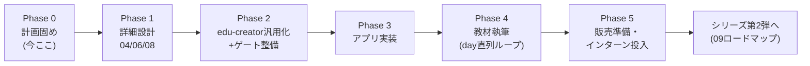

# 14. マスターロードマップ

ステータス: ドラフト（局長レビュー待ち）
役割: 文書00〜13すべてを1枚に束ねた時系列の地図。個別文書と矛盾したらこの文書を直す
（詳細の正はあくまで各文書）。

## 0. 全体像

ウォーターフォール原則: 各Phaseは前Phaseの局長承認ゲートを通過してから着手する。
Phase内の文書間依存は各文書の「着手条件」に従う。

## Phase 0: 計画固め（現在進行中）

| 成果物 | 状態（2026-07-24時点） |
|---|---|
| 00 企画概要 / 01 要件定義 / 02 技術選定 / 03 基本設計 / 05 DB設計 / 07 開発スケジュール | ドラフト済み・局長レビュー待ち |
| 09 シリーズロードマップ / 10 教材制作フロー | ドラフト済み・局長レビュー待ち |
| 11 ペルソナ・UX / 12 文体方針 / 13 記録規約 / 14 本書 | ドラフト済み・局長レビュー待ち |
| **Phase 0完了条件** | 上記全文書に局長承認。未決定事項（質問バッチ）の回答反映済み |

## Phase 1: 詳細設計（Phase 0承認後）

- `04_詳細設計書.md`: 画面12個の詳細（コンポーネント / 状態管理 / バリデーション）、
  Capacitorネイティブ設定、WebSocketイベント一覧
- `06_API設計書.md`: エンドポイント仕様（03と05の両方確定が着手条件）
- `08_テスト計画書.md`: テスト観点一覧（04と06の確定が着手条件）
- **day分割表もここで確定**（04の依存グラフから導出 → 10のG1で凍結）。
  局長判断: 30日固定はしない。依存グラフから自然な日数を出す
  （現時点の粗い見込み: TS基礎パート10章前後 + SNS本編30〜35day + ネイティブ配信5day前後）
- 完了条件: 各文書に局長承認 + day分割表の凍結

## Phase 2: 道具の整備（Phase 1と一部並行可）

アプリ実装の前に、前作の教訓由来の道具を全部そろえる（10のG0を満たす準備）。

1. **edu-creator汎用化**: `GENERICIZATION_PLAN.md`（task-app/edu-creator側にドラフト済み）
   の実装。stack_profile化 / 推敲上限のエスカレーション化 / README実態化。実装はCodex委譲
2. **文体ゲート移植**: check_tone.py移植 + 対話形式チェッカー新規（12 §3）
3. **方針同期チェッカー**: check_policy_sync.py（13 §5）
4. **実装↔教材突合チェッカー**: 10のG5用
5. 完了条件: 全ゲートが既知サンプルで検知テスト済み + sns-app用stack_profileで
   試験生成1本がゲート通過

並行可の根拠: 1〜4はPhase 1の文書内容に依存しない骨格部分から着手できる。
ただし**ゲートの検査ルール確定**はPhase 1の文書確定後。

## Phase 3: アプリ実装（Phase 1承認後）

- `07_開発スケジュール.md` の工程9。Capacitor環境構築（Xcode/Android Studio）込み
- 実装は day分割表の順序で行う（教材が後からその順序をなぞるため、
  実装順=教材順に揃えることが10の大原則1を支える）
- 完了条件: `08_テスト計画書.md` の全テスト通過 + 実機（iOS/Android）での
  動作確認記録 + 局長審査（kyokucho-review-gate形式）

## Phase 4: 教材執筆（Phase 2・3の両方完了後）

- `10_教材制作フロー.md` のG0〜G5ループをそのまま実行
- 序盤: TS基礎パートの新規執筆から着手（Drive上の既存教材はスタイルの正本として
  参照する — 局長訂正 2026-07-24: 原稿の取り込みではない）。文体ゲートの
  検知テストにはこの正本の抜粋を陰性サンプルとして使う
- 本編: day分割表の順に1day直列ループ（生成→G3機械→G4外部AI→G5突合→PR→節目のみ局長審査）
- 進捗は `material/PROGRESS.md` のday状態表で常時可視化（13 §4）
- 完了条件: 全dayマージ済み + 通し読み検品（後述の最終検品）+ 局長審査pass

## Phase 5: 販売準備・インターン投入

- 配布形式の設計: 前作ZIP事件（完成品混入・方針矛盾5.5ヶ月）の教訓を踏まえ、
  「学習者の開始状態」定義（10のG0成果物）から配布物を機械生成し、混入検査を通す
- 最終検品: 教材の指示だけで第三者（社内の非開発メンバー等）が環境構築〜序盤を
  実走できるかのパイロットテスト
- インターン投入とフィードバック回収 → `material/retrospectives/` に記録
- 販売チャネル・価格は局長判断（このフェーズ冒頭で判断キューに載せる）

## リスクと先回り（プレモーテム抜粋）

| リスク | 先回り |
|---|---|
| Phase 3実装が長期化し教材着手が遅れる | 実装をday分割表の順に進めるため、序盤day分の実装が終わった時点でPhase 4序盤（TS基礎組み込み）を先行開始できる（唯一の許可された並行） |
| Capacitor/依存のメジャーバージョン更新で教材が陳腐化 | 教材内で参照する全バージョンを固定し、10のG5突合が乖離を検知 |
| 「売り物かつ社内用」の二兎で品質基準がブレる | 11で品質基準を売り物レベルに固定済み。判断に迷ったら常に「ペルソナB（独学者）が独りで完走できるか」を基準にする |
| edu-creator汎用化が想定より重い | Phase 2で行き詰まったら「本作はsns-app向け設定を直書き、汎用化はシリーズ第2弾までに完了」へ縮退する判断を局長に諮る（黙って延ばさない） |
