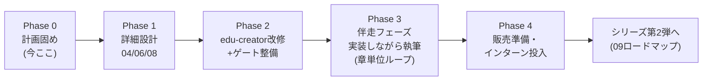

# 14. マスターロードマップ

ステータス: ドラフト（局長レビュー待ち）
役割: 文書00〜15すべてを1枚に束ねた時系列の地図。**工程の順序・開始条件の正本は本書**
（Codex R1 C1対応 — 内容の詳細は各文書が正、工程の順序が食い違ったら本書に従い、
矛盾を見つけたら本書か相手文書を同一PRで直す）。

## 0. 全体像



ウォーターフォール原則: 各Phaseは前Phaseの局長承認ゲートを通過してから着手する。
Phase内の文書間依存は各文書の「着手条件」に従う。

## Phase 0: 計画固め（現在進行中）

| 成果物 | 状態（2026-07-24時点） |
|---|---|
| 00 企画概要 / 01 要件定義 / 02 技術選定 / 03 基本設計 / 05 DB設計 / 07 開発スケジュール | ドラフト済み・局長レビュー待ち |
| 09 シリーズロードマップ / 10 教材制作フロー | ドラフト済み・局長レビュー待ち |
| 11 ペルソナ・UX / 12 文体方針 / 13 記録規約 / 14 本書 / 15 カリキュラム骨子 | ドラフト済み・局長レビュー待ち |
| 16 決定バックログ | ドラフト済み・局長レビュー待ち（**未決定事項の唯一の正本**） |
| **Phase 0完了条件** | 上記全文書に局長承認。未決定事項（質問バッチ）の回答反映済み。`16_決定バックログ.md` のC群（局長判断6件）に回答済み |

## Phase 1: 詳細設計（Phase 0承認後）

- `04_詳細設計書.md`: 画面16個の詳細（コンポーネント / 状態管理 / バリデーション）、
  ディープリンク設定、Realtime の購読対象一覧、RLS ポリシーの実装単位
- `06_API設計書.md`: **Supabase のテーブルアクセス方式と RLS ポリシー定義**に内容が変わる
  （自前 API のエンドポイント仕様は構成変更により消滅）。03と05の両方確定が着手条件
- `08_テスト計画書.md`: テスト観点一覧（04と06の確定が着手条件）
- **章分割表もここで確定**（`15_カリキュラム骨子案.md` のパート構成を親に、04の依存関係と
  「本来の開発フローの順序」から導出 → 10のG1で凍結）。局長判断: 30日固定はしない。
  **章数目安は未確定**（旧47〜58章は構成変更で無効。捨て試作の実測後に15 §3へ記入する）
- 配布形式（ZIP/Webサイト等）もここで決定する（Codex R1 M14対応）
- 完了条件: 各文書に局長承認 + 章分割表の凍結 + 配布形式の決定 +
  **05 の未解決13点すべての解消**（§4 の6点だけではない。2026-07-28 に7点を追加して
  集約した。内訳は 05 §4 の一覧と `16_決定バックログ.md` B4・B19・B21・B24・B25・B27・B28）
  + 01へのFR13（ネイティブ機能）追記・再承認（Codex R3対応）
  ※ **本書が工程の順序と完了条件の正本**（`00_企画概要.md` §50）。ここが6点のままだと、
  あとから集約した7点が未解決のまま Phase 1 完了を宣言できてしまう

## Phase 2: 道具の整備（Phase 1と一部並行可）

アプリ実装の前に、前作の教訓由来の道具を全部そろえる（10のG0を満たす準備）。

**改訂（2026-07-26）**: 先例調査で、自作する予定だった道具のうち3つが既製品で置き換えられると
判明した。加えて技術構成の変更で1つが不要になった。**自作5種 → 既製品4種＋自作2種**に減る。

### 導入する既製品（4種）

| # | 道具 | 何に使うか | 自作していた場合の代替物 |
|---|---|---|---|
| 1 | **textlint** ＋ `textlint-rule-preset-ja-technical-writing` | 文体ゲート（10 G3）。です／ます混在・一文が長すぎる・読点過多を検出 | check_tone.py の移植 |
| 2 | **textlint-rule-prh** | 表記ゆれと禁止表現。商業技術書の公開ルール集（WEB+DB PRESS / 技術書典）を `imports` で取り込み、**自作分は YAML 1ファイルだけ**（関西弁・誇大表現・AI構文の禁止パターン） | check_tone.py の禁止語リスト |
| 3 | **embedmd** | 教材が実ファイルからコードを引用する。`-d` で差分を exit code に返せる | 実装↔教材の突合チェッカー |
| 4 | **listings 方式**（Rust 公式教科書の構成を借りる） | 章ごとに実際にビルドできる小プロジェクトを `listings/<章ID>/` に置く | — |

### 自作する道具（2種）

| # | 道具 | なぜ自作か |
|---|---|---|
| 5 | 章末スナップショット生成（16 A7） | `listings/<章ID>/` を固めるだけの薄いスクリプト（数十行） |
| 6 | **G6 実走ランナー** | クリーン環境で章を実走させる仕組み。既製品（markdown-doctest）が6年停止しているため唯一の重い自作 |

### G5 の設計が「検出」から「構造的に起こさない」へ変わる

旧設計は、教材に貼ったコード片と実装を機械照合して**ズレを検出**し、
トリアージ台帳で分類する方式だった。embedmd で**教材が実ファイルから引用する**方式に変えると、
ズレが発生しようがない。台帳は分類(c)（外部起因の実走失敗）専用に縮小できる。

**listings を置くと、1つの現物が3つのゲートを同時に満たす:**

```
listings/<章ID>/     ← 章ごとの実プロジェクト
   ├─→ 教材が embedmd でここから引用        = G5（ズレが起きない）
   ├─→ そのまま固めれば章末スナップショット  = A7
   └─→ クリーン環境で通るか検証             = G6 の土台
```

### edu-creator の役割が変わる

**不要にはならない。役割が「全部自作の重い生成器」から「既製品4つを束ねる薄い司令塔」へ変わる。**
保守対象が減るぶん、シリーズ第2弾・第3弾への使い回しはむしろ楽になる。

→ これにより **10 の G0 の条件を「edu-creator改修完了」から「道具4種の導入完了」に
差し替えられ、B13（実装保留）との循環が解ける。**

### 消滅した道具

- **OpenAPI 照合コンパレータ**: Supabase はクライアント SDK 経由で DB を叩くため、
  自前 API の仕様書を正本に置く前提そのものが消滅した（`02_技術選定書.md` §6）
- **方針同期チェッカー**（check_policy_sync.py・13 §5）は生存。技術非依存のため

### 完了条件

全ゲートが既知サンプルで検知テスト済み（誤検知テストを含む）＋ 捨て試作1章が
G3〜G6 を実際に通過していること。

並行可は「前Phase承認後に次へ」というウォーターフォール原則の**明示的な例外**として
ここで宣言する（Codex R1 M1対応）: 既製品4種の導入はPhase 1の文書内容に依存しないため
先行してよい。**ゲートの検査ルール確定**はPhase 1の文書確定後。

## Phase 3: 伴走フェーズ — 実装しながら教材を書く（Phase 1・2完了後）

旧Phase 3（アプリ実装）と旧Phase 4（教材執筆）は、局長方針（2026-07-24:
「実装しながら教材も書かないと、作るときの困る状態をリアルタイムで表現できない」）
により**1つの伴走フェーズに統合**した。

- 進め方: `10_教材制作フロー.md` §4の章伴走ループ。
  章Nを実装（本来の開発フローの順序で）→ 開発ログに本物の詰まりを記録 →
  章Nの教材を書く → G3〜G6ゲート → PR → 次章
- 序盤: パートA0〜A（道具・TS基礎）は実装対象が軽い（ターミナル・Playground中心）ため、
  伴走ループの練習台としても最適。ここで工程の勝手を掴んでからパートBへ
- 後の章の実装が前の章のコードを変えたら、G5突合ゲートの検知リストに従って
  **後で直す**（先回りの複雑な工程は組まない — 局長判断）
- **旧構成にあった「パートDでの Xcode / Android Studio セットアップ」は消滅**した。
  Expo Go は QR を読むだけで実機に出るため、最重要の挫折ポイントが構造的に無くなった
  （`02_技術選定書.md` §2）。代わりにパートA0 の1章目で実機表示まで到達する
- 完了条件: 全章マージ済み + `08_テスト計画書.md` の全テスト通過 +
  実機（iOS/Android）での動作確認記録 + G5乖離トリアージ台帳のITEM未分類・未処置ゼロ＋RUN受領証の頻度網羅＋G6RUN受領証の頻度網羅〔各パート完了時+月1〕かつ全件PASS（FAILは未処置ITEM化し処置完了までブロック — R8 M1）（R2 C2 / R4 M4 / R6 M3対応） +
  通し読み検品 + 局長審査pass
- 進捗は `material/PROGRESS.md` の章状態表で常時可視化（13 §4）

## Phase 4: 販売準備・インターン投入（旧Phase 5 — 伴走統合により繰り上げ）

- 配布形式は**Phase 1で決定済み**（11 §5参照 — Codex R1 M14対応で前倒し）。ここでは
  決定済みの形式に従い、前作ZIP事件（完成品混入・方針矛盾5.5ヶ月）の教訓を踏まえ、
  「学習者の開始状態」定義（10のG0成果物）から配布物を機械生成し、混入検査を通す
- 最終検品: 教材の指示だけで第三者（社内の非開発メンバー等）が**全編を通しで完走**
  できるかのパイロットテスト（最低1名・質問なし条件 — Codex R1 M16対応。
  序盤だけの実走では「独学で完走できる」という商品要件を検証できない）
- インターン投入とフィードバック回収 → `material/retrospectives/` に記録
- 販売チャネル・価格は局長判断（このフェーズ冒頭で判断キューに載せる）
- 販売継続期間中の定期G6再実走（四半期ごと — 14リスク表参照）の引き継ぎ先を指名し運用開始。受領証契約（G6RUN行）は伴走フェーズと同一形式を引き継ぐ。四半期G6RUNのFAILは未処置ITEM化し、処置完了まで販売物の「動作確認済み」表記を停止する（Codex R5 m1 / R6 M3 / R8 M1対応）

## リスクと先回り（プレモーテム抜粋）

| リスク | 先回り |
|---|---|
| 伴走ループで後の章の実装が前の章の教材を陳腐化させる | 恐れて工程を複雑にしない（局長判断:「変わったら後で直す」）。G5突合が変更を自動列挙し、直す対象を見落とさない |
| 開発ログの記録が面倒で薄くなり、対話のリアリティが失われる | ログの存在をG3チェック項目に含めて機械強制（10 §5）。「その場で記録」を伴走ループの手順に組み込み済み |
| Expo SDK / Supabase の仕様変更で教材が陳腐化 | 教材内で参照する全バージョンをlockfileで固定。**ただし Supabase 側の仕様変更は lockfile で止められない**（自分のリポジトリに無いため）。外部パッケージの新リリースや上流手順の破損はリポジトリのHEADを変えないためG5では検知できない — 定期的なG6再実走（クリーン環境実走）で検知する。運用アンカー（Codex R5 m1対応）: 伴走中は各パート完了時＋月1回、販売継続期間中は四半期ごとに再実走し、**G6RUN受領証**（10 §4の行型）として同じ `material/drift/` 台帳に記録（責任者=伴走フェーズのオーケストレーター。販売後の引き継ぎ先はPhase 4で指名） |
| 「売り物かつ社内用」の二兎で品質基準がブレる | 11で品質基準を売り物レベルに固定済み。判断に迷ったら常に「ペルソナB（独学者）が独りで完走できるか」を基準にする |
| edu-creator汎用化が想定より重い | Phase 2で行き詰まったら「本作はsns-app向け設定を直書き、汎用化はシリーズ第2弾までに完了」へ縮退する判断を局長に諮る（黙って延ばさない） |
