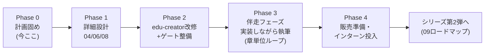

# 14. マスターロードマップ

ステータス: ドラフト（局長レビュー待ち）
役割: 文書00〜15すべてを1枚に束ねた時系列の地図。**工程の順序・開始条件の正本は本書**
（Codex R1 C1対応 — 内容の詳細は各文書が正、工程の順序が食い違ったら本書に従い、
矛盾を見つけたら本書か相手文書を同一PRで直す）。

## 0. 全体像

ウォーターフォール原則: 各Phaseは前Phaseの局長承認ゲートを通過してから着手する。
Phase内の文書間依存は各文書の「着手条件」に従う。

## Phase 0: 計画固め（現在進行中）

| 成果物 | 状態（2026-07-24時点） |
|---|---|
| 00 企画概要 / 01 要件定義 / 02 技術選定 / 03 基本設計 / 05 DB設計 / 07 開発スケジュール | ドラフト済み・局長レビュー待ち |
| 09 シリーズロードマップ / 10 教材制作フロー | ドラフト済み・局長レビュー待ち |
| 11 ペルソナ・UX / 12 文体方針 / 13 記録規約 / 14 本書 / 15 カリキュラム骨子 | ドラフト済み・局長レビュー待ち |
| **Phase 0完了条件** | 上記全文書に局長承認。未決定事項（質問バッチ）の回答反映済み |

## Phase 1: 詳細設計（Phase 0承認後）

- `04_詳細設計書.md`: 画面12個の詳細（コンポーネント / 状態管理 / バリデーション）、
  Capacitorネイティブ設定、WebSocketイベント一覧
- `06_API設計書.md`: エンドポイント仕様（03と05の両方確定が着手条件）
- `08_テスト計画書.md`: テスト観点一覧（04と06の確定が着手条件）
- **章分割表もここで確定**（`15_カリキュラム骨子案.md` のパート構成を親に、04の依存関係と
  「本来の開発フローの順序」から導出 → 10のG1で凍結）。局長判断: 30日固定はしない。
  章数目安は15 §3（合計43〜52章）
- 配布形式（ZIP/Webサイト等）もここで決定する（Codex R1 M14対応）
- 完了条件: 各文書に局長承認 + 章分割表の凍結 + 配布形式の決定

## Phase 2: 道具の整備（Phase 1と一部並行可）

アプリ実装の前に、前作の教訓由来の道具を全部そろえる（10のG0を満たす準備）。

1. **edu-creator改修**: `GENERICIZATION_PLAN.md`（task-app/edu-creator側にドラフト済み）
   の実装。**生成方式を開発ログ駆動へ転換**（10 §6の最重要項目）/ stack_profile化 /
   推敲上限のエスカレーション化 / README実態化。実装はCodex委譲（局長GO後）
2. **文体ゲート移植**: check_tone.py移植 + 対話形式チェッカー新規（12 §3）
3. **方針同期チェッカー**: check_policy_sync.py（13 §5）
4. **実装↔教材突合チェッカー**: 10のG5用
5. 完了条件: 全ゲートが既知サンプルで検知テスト済み + sns-app用stack_profileで
   試験生成1本がゲート通過

並行可は「前Phase承認後に次へ」というウォーターフォール原則の**明示的な例外**として
ここで宣言する（Codex R1 M1対応）: 1〜4はPhase 1の文書内容に依存しない骨格部分のみ
先行してよい。**ゲートの検査ルール確定**はPhase 1の文書確定後。

## Phase 3: 伴走フェーズ — 実装しながら教材を書く（Phase 1・2完了後）

旧Phase 3（アプリ実装）と旧Phase 4（教材執筆）は、局長方針（2026-07-24:
「実装しながら教材も書かないと、作るときの困る状態をリアルタイムで表現できない」）
により**1つの伴走フェーズに統合**した。

- 進め方: `10_教材制作フロー.md` §4の章伴走ループ。
  章Nを実装（本来の開発フローの順序で）→ 開発ログに本物の詰まりを記録 →
  章Nの教材を書く → G3〜G6ゲート → PR → 次章
- 序盤: パートA（TS基礎）は実装対象がPlayground中心のため、
  伴走ループの練習台としても最適。ここで工程の勝手を掴んでからパートBへ
- 後の章の実装が前の章のコードを変えたら、G5突合ゲートの検知リストに従って
  **後で直す**（先回りの複雑な工程は組まない — 局長判断）
- Capacitor環境構築（Xcode/Android Studio）はパートDの実装時に行い、
  そのセットアップの詰まりも開発ログに記録して教材の厚み（最重要の挫折ポイント対策）にする
- 完了条件: 全章マージ済み + `08_テスト計画書.md` の全テスト通過 +
  実機（iOS/Android）での動作確認記録 + 通し読み検品 + 局長審査pass
- 進捗は `material/PROGRESS.md` の章状態表で常時可視化（13 §4）

## Phase 4: 販売準備・インターン投入（旧Phase 5 — 伴走統合により繰り上げ）

- 配布形式は**Phase 1で決定済み**（11 §5参照 — Codex R1 M14対応で前倒し）。ここでは
  決定済みの形式に従い、前作ZIP事件（完成品混入・方針矛盾5.5ヶ月）の教訓を踏まえ、
  「学習者の開始状態」定義（10のG0成果物）から配布物を機械生成し、混入検査を通す
- 最終検品: 教材の指示だけで第三者（社内の非開発メンバー等）が**全編を通しで完走**
  できるかのパイロットテスト（最低1名・質問なし条件 — Codex R1 M16対応。
  序盤だけの実走では「独学で完走できる」という商品要件を検証できない）
- インターン投入とフィードバック回収 → `material/retrospectives/` に記録
- 販売チャネル・価格は局長判断（このフェーズ冒頭で判断キューに載せる）

## リスクと先回り（プレモーテム抜粋）

| リスク | 先回り |
|---|---|
| 伴走ループで後の章の実装が前の章の教材を陳腐化させる | 恐れて工程を複雑にしない（局長判断:「変わったら後で直す」）。G5突合が変更を自動列挙し、直す対象を見落とさない |
| 開発ログの記録が面倒で薄くなり、対話のリアリティが失われる | ログの存在をG3チェック項目に含めて機械強制（10 §5）。「その場で記録」を伴走ループの手順に組み込み済み |
| Capacitor/依存のメジャーバージョン更新で教材が陳腐化 | 教材内で参照する全バージョンを固定し、10のG5突合が乖離を検知 |
| 「売り物かつ社内用」の二兎で品質基準がブレる | 11で品質基準を売り物レベルに固定済み。判断に迷ったら常に「ペルソナB（独学者）が独りで完走できるか」を基準にする |
| edu-creator汎用化が想定より重い | Phase 2で行き詰まったら「本作はsns-app向け設定を直書き、汎用化はシリーズ第2弾までに完了」へ縮退する判断を局長に諮る（黙って延ばさない） |
