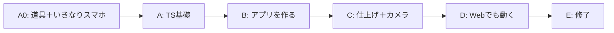

# 15. カリキュラム骨子案（パート構成）

ステータス: ドラフト（局長レビュー待ち）
役割: 教材全体をパート単位で固める。章単位の分割は `04_詳細設計書.md` の
依存グラフ確定後（`10_教材制作フロー.md` G1）に行うが、その分割の骨格になる
パート構成・各パートの体験ゴール・退屈リスク対策をここで先に凍結する。

改訂: 2026-07-26。技術構成が Expo + Supabase へ変わり、**物語の順序が逆転した**
（旧: 終盤でやっとスマホに入る → 新: 1章目から自分のスマホで動く）。
経緯は `02_技術選定書.md` §2。

設計の根拠にした局長決定（2026-07-24）:
- 長くなるのは構わない。禁止は「つまらない章」「何につながるか見えない章」
  「初心者に興味のないセキュリティガチガチ」
- 先生と生徒が一緒に進めている感（対話形式）が体験の核

## 0. 教材全体の物語（1行）

> 「道具に慣れて、**いきなり自分のスマホに画面を出す** → TypeScript を覚える →
> SNS の機能が1つずつ増えていく → カメラが使える → 同じコードが Web でも動く」
> — 1つの言語で世界が広がっていく物語として全パートを貫く。

### 旧構成から何が変わったか（この節が改訂の核）

| | 旧（Capacitor + NestJS） | 新（Expo + Supabase） |
|---|---|---|
| 最初にスマホで動く時点 | パートD（終盤） | **パートA0（1章目）** |
| 最大の挫折ポイント | Xcode / Android Studio のセットアップ | **消滅**（Expo Go は QR を読むだけ） |
| リアルタイム | 独立パートC（5〜7章） | **独立パートをやめ、必要な章に溶かす** |
| サーバー作り | パートBに NestJS | **本教材から外し第3弾へ**（`09_教材シリーズロードマップ.md`） |
| Web | 出発点（ブラウザで動く） | **終盤の証明**（同じコードが Web でも動く） |

「終盤でやっと自分のスマホに入る」は、最後まで読み切った人しかハイライトに
到達できない構成だった。新構成は逆で、**1章目に一番効く体験を置く**。

## 1. パート構成（A0〜E）

### パートA0: はじめの一歩 — 「道具に慣れて、自分のスマホに画面を出す」

| 項目 | 内容 |
|---|---|
| 体験ゴール | ターミナル・エディタ・Node.js/npm・Git の基本操作ができ、**Expo Go で QR を読んで、自分の書いた画面が自分のスマホに出る** |
| 扱う範囲 | 開発環境の準備 / ターミナル基礎 / VS Code / Node.js と npm / Git 入門（保存と巻き戻し） / Expo プロジェクトの作成 / Expo Go を入れて実機表示 / 画面の文字を書き換えて即反映を見る |
| 完成品への地図 | 「いま出したこの真っ白な画面が、最後には SNS になる」を完成品の画面と並べて見せる |
| 退屈リスクと対策 | 道具の説明は退屈になりやすい → **このパートの終点が「自分のスマホでアプリが動く」**なので、道具の章にも目的が見えている。各章「3分で目に見える結果」は従来どおり必須 |
| 旧構成との差 | 旧 A0 が扱っていた HTML/CSS/DOM は**外す**。React Native は `div` を使わないため、ここで教えても直後に使わない。Web の話はパートD で必要になった時点で扱う |

### パートA: TypeScript 基礎 — 「読める・書ける」になる

| 項目 | 内容 |
|---|---|
| 体験ゴール | コードを書き、動かし、エラーを自力で読める |
| 扱う範囲 | 変数と定数 / 型 / 演算子 / 配列 / オブジェクト / 関数 / 条件分岐 / ループ / クラス（既存正本教材と同じ範囲を新規執筆） |
| 完成品への地図 | 「このあと作る SNS の投稿1件は、ここで学ぶ"オブジェクト"そのもの」— 例材を SNS の投稿・ユーザーに統一し、全章が本編の予告編を兼ねる |
| 退屈リスクと対策 | A0 で既に自分のスマホが動いているため、**基礎を学ぶ動機がある状態**で入れる。旧構成では何も動いていない状態で基礎に入っていた |
| スキップ導線 | パート冒頭に「腕試し問題」を置き、解けた人はパートB へ直行できると明記 |

### パートB: アプリを作る — 「自分の SNS が育っていく」

旧パートB（Web版SNS）と旧パートC（リアルタイム）を統合したパート。本教材の本体。

| 項目 | 内容 |
|---|---|
| 体験ゴール | 認証・投稿・タイムライン・いいね・フォロー・プロフィールが**自分のスマホで**動く |
| 扱う範囲 | Expo Router（画面の作り方と行き来）/ React Native の UI（`View` / `Text` / `Pressable` / リスト表示）/ Supabase プロジェクトの作成 / テーブル設計 / **RLS（行レベルセキュリティ）** / Supabase Auth（登録・ログイン・メール確認・パスワード再発行）/ Storage（画像）/ Realtime（通知と新着反映） |
| 完成品への地図 | パート冒頭に完成 SNS の全画面図を提示し、各章で「今日はここ」を塗る（11 の原則4） |
| リアルタイムの扱い | **独立パートを廃止**。通知の章・タイムラインの章の中に溶かす（局長方針「リアルタイムはどうでもいい」を反映）。自前 WebSocket・Redis・BullMQ は扱わない |
| 退屈リスクと対策 | DB 側の作業が続く区間が生まれやすい → 「毎章、見える変化1つ以上」（11 の原則5）を章分割の必須条件にする。RLS の章は必ず「アプリを改造して他人の行を触ろうとすると DB に拒否される」実演で終える |
| セキュリティの扱い | パスワードのハッシュ化は Supabase の責務なので**教材から消える**。代わりに **RLS を自分で書く**。「ポリシーを書き忘れたテーブルは全公開になる」を1分で体験→即修正、の粒度（11 の原則6） |

### パートC: 仕上げ — 「スマホらしい機能まで入れる」

| 項目 | 内容 |
|---|---|
| 体験ゴール | 検索・ハッシュタグ・ブックマークが揃い、**端末のカメラで撮った写真をその場で投稿できる** |
| 扱う範囲 | 検索 / ハッシュタグ（既存投稿への遡り適用＝バックフィルを含む。後付け機能が既存データとどうぶつかるかという実務頻出テーマとして教材化 — Codex R1 M6対応）/ ブックマーク / **カメラ（`expo-camera`。01 の FR15）** / 見た目の調整 |
| 完成品への地図 | 「ここまでで SNS として一通り揃う」— 機能表を埋め終える章 |
| 退屈リスクと対策 | 追加機能の連続で単調になりやすい → **カメラをこのパートに置く**ことで、ネイティブならではの体験を中盤の山にする |

### パートD: Web でも同じものを動かす — 「TypeScript Everywhere の証明」

| 項目 | 内容 |
|---|---|
| 体験ゴール | **これまで書いてきた同じコードが、ブラウザでも動く**のを自分の目で見る |
| 扱う範囲 | Expo の web 出力 / native と web で挙動が違う箇所の手当て / ブラウザで動かすときに初めて要る Web の知識（URL・ブラウザがページを表示するまで） |
| 完成品への地図 | シリーズの看板「1つの言語でどこでも作れる」を証明する場所。ここが本教材の最終ハイライト |
| 誇大に言わない | 「1行も直さずに動く」とは書かない。native 前提の箇所は手当てが要る（Codex R1 M15 の指摘は構成が変わっても有効） |
| 分量 | **未実測**。捨て試作で Expo の web 出力を実際に動かして章数を決める（`02_技術選定書.md` §7 の未決定事項と連動） |

### パートE: 修了 — 「人に説明できる状態にする」

| 項目 | 内容 |
|---|---|
| 体験ゴール | 学んだ技術の全体地図を描け、自分の作ったものを人に説明できる |
| 扱う範囲 | 学んだ技術の総復習（先生と生徒の対話で全体地図を描く）/ 1分で人に説明する台本づくり |
| 修了体験 | 最終章は「自分が作ったものを1分で人に説明する」台本を生徒が作り先生が磨く対話で締める（ペルソナA＝面接、ペルソナB＝ポートフォリオ説明にそのまま使える成果物） |

## 2. パート間の依存と順序

- **A0 → A の順序の理由**: 何も動いていない状態で文法から入ると、学ぶ動機が湧かない。
  先に自分のスマホで画面を出しておく
- **C → D の順序の理由**: Web 出力は「同じコードが別の場所でも動く」証明であり、
  証明する対象（＝完成した機能）が揃っていないと成立しない。だから機能を作り終えた後に置く
- **D を最後のハイライトに置く理由**: 旧構成では最大の挫折ポイント（Xcode）が
  ハイライト直前にあり、そこで脱落すると看板を一度も体験できなかった。
  新構成は挫折ポイントが消え、看板は最後に軽く証明できる

## 3. 章数の目安

**未確定。現時点で数字を出さない。**

旧構成の 47〜58章から、次の3つが構造的に減る:

- リアルタイムの独立パート（旧C・5〜7章）が消え、必要な章に溶ける
- Xcode / Android Studio のセットアップ章（旧D の大半）が消える
- NestJS の章（旧B の一部）が消える

一方で増えるのが、RLS の章とメール確認・パスワード再発行（FR13・FR14）の章。
**差し引きの数字は捨て試作で1章あたりの工数を実測してから出す**
（局長方針「1章を大きくして章数を減らす」もこの実測の上に乗せる）。
根拠のない数字をここに書くと、以降の全工程がその数字を前提に組まれるため書かない。

## 4. この骨子の完了条件

- [ ] パート構成 A0〜E・順序・各体験ゴールに局長承認
- [ ] 捨て試作の実測にもとづく章数目安の記入
- [ ] 承認後、`14_マスターロードマップ.md` Phase 1 の章分割（G1）はこの骨子を親として行う

**2026-08-06 追加の論点（B1 で決める）**: 組版に Vivliostyle を採ったことで、
本書のパート構成（A0〜E）が **1冊の PDF の中でどう見えるか**が新しい論点になった。
Vivliostyle の `entry` 配列は章のリストであり、パートという階層を持たない。
パート扉（章ではない本文ページ）を作るなら、それも `entry` の1要素として書く必要がある。
「パート扉を置くか、置かないか」は章分割表（17）の行の数に影響するので B1 と同時に決める。
組版のスタイル自体は B52（`decisions/D23_Vivliostyle採用の影響.md`）。
