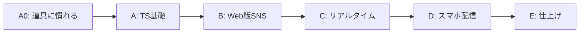

# 15. カリキュラム骨子案（パート構成）

ステータス: ドラフト（局長レビュー待ち）
役割: 教材全体をパート単位で固める。章単位の分割は `04_詳細設計書.md` の
依存グラフ確定後（`10_教材制作フロー.md` G1）に行うが、その分割の骨格になる
パート構成・各パートの体験ゴール・退屈リスク対策をここで先に凍結する。

設計の根拠にした局長決定（2026-07-24）:
- 長くなるのは構わない。禁止は「つまらない章」「何につながるか見えない章」
  「初心者に興味のないセキュリティガチガチ」
- 先生と生徒が一緒に進めている感（対話形式）が体験の核

## 0. 教材全体の物語（1行）

> 「TypeScriptを覚える → 自分のSNSがブラウザで動く → 友だちとリアルタイムにつながる →
> 自分のスマホに入る」— 1つの言語で世界が広がっていく物語として全パートを貫く。

## 1. パート構成（A〜E）

### パートA0: はじめの一歩 — 「開発者の道具に慣れる」（Codex R1 C3対応で新設）

| 項目 | 内容 |
|---|---|
| 体験ゴール | ターミナル・エディタ・Node.js/npm・Gitの基本操作ができ、「Webページが表示される仕組み」（HTTP・HTML/CSS・DOM）を自分の言葉で説明できる |
| 扱う範囲 | 開発環境の準備 / ターミナル基礎 / VS Code / Node.jsとnpm / Git入門（保存と巻き戻し） / Webの仕組み（ブラウザがページを表示するまで） / HTML/CSSの最小限 |
| 完成品への地図 | 「これから作るSNSの画面は全部HTML/CSSでできている」を、完成品の画面を素材に見せる |
| 退屈リスクと対策 | 道具の説明は退屈になりやすい → 全章「3分で目に見える結果」（最初のコマンド実行、最初のHTML表示等）を必ず置く |

### パートA: TypeScript基礎 — 「読める・書ける」になる

| 項目 | 内容 |
|---|---|
| 体験ゴール | Playgroundでコードを書き、動かし、エラーを自力で読める |
| 扱う範囲 | 変数と定数 / 型 / 演算子 / 配列 / オブジェクト / 関数 / 条件分岐 / ループ / クラス（既存正本教材と同じ範囲を新規執筆） |
| 完成品への地図 | 「このあと作るSNSの投稿1件は、ここで学ぶ"オブジェクト"そのもの」のように、SNSの実データを例に使って基礎とゴールを最初からつなぐ |
| 退屈リスクと対策 | 基礎文法は退屈になりやすい → 例材を果物や動物でなく**SNSの投稿・ユーザー**に統一し、全章が本編の予告編を兼ねる |
| スキップ導線 | パート冒頭に「腕試し問題」を置き、解けた人はパートBへ直行できると明記 |

### パートB: Web版SNSを作る — 「自分のSNSがブラウザで動く」

| 項目 | 内容 |
|---|---|
| 体験ゴール | 認証・投稿・タイムライン・いいね・フォロー・プロフィールがブラウザで動く |
| 扱う範囲 | 環境構築（Docker Compose一発起動 — 02参照） / React+Vite（コンポーネント・状態管理・非同期通信の基礎から段階導入） / TanStack Router / 画面実装 / NestJS API / PostgreSQL+Prisma / 画像アップロード |
| 完成品への地図 | パート冒頭に完成SNSの全画面図を提示し、各章で「今日はここ」を塗る（11の原則4） |
| 早期公開体験 | 前作day04「ネットに公開」の成功パターンを踏襲し、**ガワだけでも早期にURLで見られる状態**を序盤に置く（friends/家族に見せられる = 継続動機） |
| 退屈リスクと対策 | API・DBの裏側作業が続く区間が生まれやすい → 「毎章、見える変化1つ以上」（11の原則5）を章分割の必須条件にする |
| セキュリティの扱い | パスワードのハッシュ化は「平文保存したらどうなるか」を先生と生徒の対話で1分体験→即実装、の粒度。JWT等の理屈の深掘りは付録へ（11の原則6） |

### パートC: リアルタイム — 「友だちとつながる瞬間」

| 項目 | 内容 |
|---|---|
| 体験ゴール | 2つのブラウザ窓を並べ、片方でいいねすると**もう片方に通知が即座に出る**のを自分の目で見る |
| 扱う範囲 | WebSocket（通知・新着反映）/ Redis / 非同期ジョブ（BullMQ: 通知配信・サムネイル生成） |
| 完成品への地図 | 「SNSがSNSらしくなるのはここ」— 静的なWebアプリとの違いを体験で示すパート |
| 退屈リスクと対策 | Redis/キュー等の裏方インフラは初心者の興味から最も遠い → 導入は必ず「目の前の困りごと」から（例: フォロワー1万人に通知を送ると画面が固まる→だから裏で順番に処理する仕組みが要る、という順番で対話に組み込む） |

### パートD: スマホに入れる — 「TypeScript Everywhereの証明」（本教材のハイライト）

| 項目 | 内容 |
|---|---|
| 体験ゴール | パートB/Cで作った**同じコード**が自分のiPhone/Androidで動く。ホーム画面にアイコンが並ぶ |
| 扱う範囲 | Capacitor導入 / Xcode・Android Studioセットアップ / 実機ビルド / カメラ等ネイティブ機能1つ以上 |
| 完成品への地図 | 「アプリのUIコードはそのままスマホアプリになる」体験そのものが地図（ネイティブ設定ファイルや権限まわりの追加作業はある — 誇大に言わない。Codex R1 M15対応） |
| 退屈リスクと対策 | 環境構築（Xcode等）が最大の挫折ポイント → セットアップ章は他のどの章よりも細かいステップ分割＋「よくあるエラー」を厚くする。Mac無し学習者向けの扱いは`08_テスト計画書.md`と合わせてPhase 1で確定 |

### パートE: 仕上げ — 「人に見せられる完成品にする」

| 項目 | 内容 |
|---|---|
| 体験ゴール | 検索・ハッシュタグ・ブックマークを足して機能一式が揃い、人に説明できる状態で修了 |
| 扱う範囲 | 検索 / ハッシュタグ（既存投稿への遡り適用＝バックフィルを含む。後付け機能が既存データとどうぶつかるかという実務頻出テーマとして教材化 — Codex R1 M6対応） / ブックマーク / 仕上げの見た目調整 / ふりかえり（学んだ技術の全体地図を先生と生徒で総復習） |
| 修了体験 | 最終章は「自分が作ったものを1分で人に説明する」台本を生徒が作り先生が磨く対話で締める（ペルソナA=面接、ペルソナB=ポートフォリオ説明にそのまま使える成果物） |

## 2. パート間の依存と順序

- C→Dの順序の理由: リアルタイム通知が動いた状態でスマホに入れると、アプリを開いて
  いる間の通知がスマホ画面でも動く体験がパートDのハイライトを補強するため
  （アプリを閉じていても届くOSプッシュ通知はスコープ外 — `01_要件定義書.md` FR9参照）
- E（検索等）を最後に回す理由: 画面・API土台（B〜D）の上に追加する機能群のため、
  ハイライト（D）を先に持ってきて中だるみを防げる。ただし「完全に独立」ではない —
  ハッシュタグは既存投稿へのバックフィルが必要（上記、Codex R1 M6対応）

## 3. 章数の目安（確定はPhase 1のG1で）

| パート | 章数目安 |
|---|---|
| A0: 道具に慣れる | 4〜6章 |
| A: TS基礎 | 9〜10章 |
| B: Web版SNS | 20〜24章 |
| C: リアルタイム | 5〜7章 |
| D: スマホ配信 | 5〜6章 |
| E: 仕上げ | 4〜5章 |
| 合計 | **47〜58章** |

局長方針（長さより質）に基づき、この数字は上限ではなく目安。G1の章分割で
「毎章見える変化1つ以上」（基盤章の例外は11の原則5）を満たすために増減する。

## 4. この骨子の完了条件

- [ ] パート構成A〜E・順序・各体験ゴールに局長承認
- [ ] 承認後、`14_マスターロードマップ.md` Phase 1の章分割（G1）はこの骨子を親として行う
