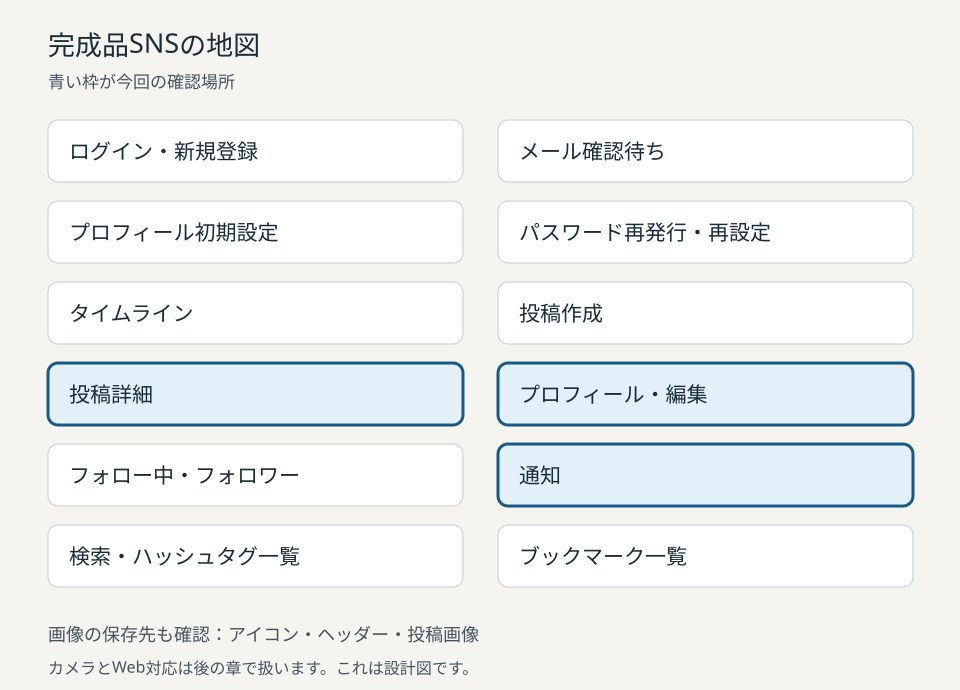

# 他人のデータが守られることを確かめる

## この章でできるようになること

磯貝）プロフィール、投稿、画像、いいね、フォロー、通知で、本人に許す操作と他人に許さない操作を確かめます。画面の結果と、保存されたデータの結果を分けて確認できるようになりましょう。

阿部）前章のパスワード再設定で、もう一度ログインできるところまで作りました。今回は、そのログイン後の権限を確かめるんですね。

磯貝）前章のSNSを使います。AさんとBさんの通常アカウント、検証用の投稿と画像、通知を用意してください。日常の投稿や画像を試験には使いません。

阿部）以前保存した、ログインだけが動く状態から始めてもよいですか。

磯貝）進められません。プロフィール編集、画像投稿、フォロー、返信とリポスト、いいね、通知まで動く前章の状態が必要です。足りない機能を、権限の確認中に作り足す章にはしません。

磯貝）アプリは公開接続情報と通常利用者のセッションを使います。管理キーやDB passwordは入れません。AとBの情報、接続先、検証対象が足りないときは、推測して埋めずに準備を確認してください。

## 完成品SNSと今回の確認場所



磯貝）色の付いたプロフィール、投稿詳細、通知が今回の確認場所です。画像の実体を保存するStorageも、同じ利用者の境界を確かめます。

| 画面・保存先 | 本人の操作 | 他人に許さない操作 |
| --- | --- | --- |
| プロフィール | 表示名、自己紹介、アイコン、ヘッダーの更新 | 別の利用者のプロフィール更新 |
| 投稿詳細 | 投稿、返信、リポスト、いいね、自分の投稿の論理削除 | 他人名義の投稿やいいね、他人の投稿の削除 |
| プロフィールのフォロー表示 | 自分からのフォローと解除 | 別の利用者のフォロー関係の作成や削除 |
| 通知 | 自分宛ての通知の閲覧と既読化 | 他人宛ての閲覧、通知の直接作成、既読以外の列の変更 |
| 画像の保存先 | 自分のフォルダへの保存と削除、前章で提供する差し替え・移動 | 他人のフォルダへの保存、移動、削除 |

阿部）この候補では、他人のプロフィールや投稿は読めても、変更はできないんですね。

磯貝）読める範囲と変更できる範囲を分けます。通知は読む範囲も本人だけです。プロフィールの公開範囲がまだ決まっていない開始状態では、先に前章の方針を確定してください。

## ログインと操作の許可を分ける

阿部）ログインできたら、アプリから送る操作はどれも許されると思っていました。

磯貝）マンションの入口に入れても、別の人の部屋の鍵は開きませんね。認証で「誰か」を確かめた後、認可で「どこへ何をしてよいか」を確かめます。

磯貝）データベースでは、テーブルや列の権限と、行を絞るRLSを組み合わせます。用語として、RLSはRow Level Security、行単位のアクセス制御です。

阿部）他人のデータに保存ボタンが出なければ、変更されないのではありませんか。

磯貝）ボタンを隠すだけでは、別のクライアントが送る操作を止められません。通常利用者のクライアントから、対象だけを他人の行に変えた操作を試します。管理者のSQL画面で成功した結果は、この確認に使いません。

## 最初に見える結果を確かめる

磯貝）Aでログインし、検証用の自分のプロフィールを開きます。表示名を試験用の値へ変えて保存し、読み直した画面に反映されるか確認してください。

阿部）本人の保存を先に通して、保存処理そのものが動くと確かめるんですね。

磯貝）同じ通常セッションのまま、確認用コードで更新対象をBのIDに変えます。Bの行が試験開始時に存在することと、AからBのプロフィールを読めることを、準備記録で確かめておきます。

磯貝）更新結果は、エラーの有無だけで見ません。変更された行を返す形にして、本人では1行、他人では0行になるかを確認します。

```ts
const result = await client
  .from('users')
  .update({ display_name: proposedName })
  .eq('id', targetUserId)
  .select('id');
```

磯貝）`.select('id')`は、変更した行のIDを返す指定です。UPDATEには読む権限も必要なので、読む側のRLSとSELECT権限も確認します。Bの行を読めない設定では、この試験の0行を更新条件だけの結果として扱えません。

阿部）0行でもエラーがないと、成功したように見えます。

磯貝）要求が終わったことと、行を変更できたことは別です。試験では、応答、戻った行数、保存前後の値を並べます。Bの表示名が変わっていないことまで確認しましょう。

磯貝）保存前後は、準備担当がDBから別に読み取り、対象IDと表示名を確認した記録と照合します。通常セッションの操作を試す処理と、このDB照合を分けるため、アプリへ管理キーを入れません。

| 確認するもの | A自身の行 | Bの行をAから更新 |
| --- | --- | --- |
| 応答 | 更新要求が正常に終わる | 更新要求が正常に終わる場合もある |
| 戻った行 | 対象の1行 | 0行（保存前後の照合が必要） |
| 読み直した画面 | 試験用の表示名 | Bの表示名は元のまま |
| 独立したDB照合 | 表示名は変更値。他の列は不変（前章で自動更新すると定めた列は、その規則と照合） | 対象行の値が変わっていない |

磯貝）本人の表示名が変わり、他人の表示名が変わらなければ、最初の結果を確認できました。DB照合の記録がなければ、画面の観察までとして残します。

## 0行と、要求の失敗を読み分ける

阿部）では、0行なら必ずRLSで拒否されたと考えてよいですか。

磯貝）存在しないIDを指定しても0行です。IDが違う、行が既に消えた、条件が合わない場合もあります。試験前の対象と条件をそろえた上で、DBに変更がないことを照合します。

| 結果 | 読み取れること | 確認すること |
| --- | --- | --- |
| エラーなし、対象1行 | 要求が終わり、その行を返した | 許可した変更だけが保存されたか |
| エラーなし、0行 | 条件に合う行を返さなかった | 対象の存在、条件、保存前後の状態 |
| 権限エラー | その操作や列の権限がない | 試す操作が予定した拒否例か |
| 構文・型・制約のエラー | 要求の形や値に問題がある場合と、予定した制約違反がある | 予定した拒否コードなら別に記録する。それ以外は権限確認に数えず、要求を直す |
| 通信エラー・応答不明 | 実行結果を確認できない | 成功とも未変更とも決めず、状態を読み直す |

磯貝）RLSのUPDATEには、対象を読むSELECTの条件も関係します。更新用の条件だけでなく、読む側の条件と列の権限も合わせて見てください。

磯貝）本人の行でも、変えてよい列は限られます。プロフィールの`id`、`created_at`、`updated_at`を変える要求も個別に試し、拒否と保存値の不変を確かめてください。

磯貝）この候補の前章では、プロフィールは許可した列だけにUPDATE権限を付け、投稿の直接UPDATEとDELETE権限を外しています。禁止列や直接操作の`42501`は、この権限設定で確かめる応答です。行RLSで対象を絞った0行の結果とは分けます。

| 通常クライアントからの操作 | この候補で確認する応答 | 別に確かめる状態 |
| --- | --- | --- |
| 他人名義の投稿・いいね・フォローのINSERT | 権限エラー`42501` | 行が追加されていない |
| 他人のプロフィールUPDATEやいいね・フォローDELETE | `.select()`付きではエラーなし・0行 | 対象行の値と存在が変わらない |
| プロフィールの禁止列変更、投稿の直接UPDATE/DELETE、通知の直接INSERT | 権限エラー`42501` | 対象行や禁止列が変わらない |
| 削除済みの親への返信など | この候補では`42501`。開始記録にある実装のコードと照合する | 子行が作られていない |
| Storageの削除・移動 | Storage固有の応答として記録する | オブジェクトの存在、保存先、内容が予定どおり |

磯貝）INSERTの拒否も0行だとは考えないでください。操作ごとの応答を、この表と開始記録で照合します。前章で予定した制約やトリガーのエラーは、構文の間違いと分けて記録しましょう。

磯貝）許さない変更が通ったら、そこで試験を止めます。通常セッションを終了し、準備担当へ対象IDと操作を渡してください。

磯貝）試験行は、準備担当が所有記録と照合して回収します。権限を直した前章から、開始状態を作り直してください。

## 投稿と返信の名義を確かめる

磯貝）投稿の本文や削除日時を、直接UPDATEする要求は本人でも拒否されるかを試します。投稿では、AがAの名義で作成できることを確認します。BのIDを作者にした投稿は、Aの通常セッションから作れないことを確かめます。

阿部）返信では相手の投稿を選ぶだけなので、作者のIDも送っているとは意識していませんでした。その値を書き換えて送ったら、どうなりますか。

磯貝）返信先と作者は別の値です。返信先はBの投稿でも、作者は送信したAです。作者をBへ書き換えた要求が拒否されるかを試しましょう。

磯貝）返信、無言リポスト、引用リポストも、それぞれ本人名義の許可操作と他人名義の拒否操作を試します。削除済みの親を指定する場合も、予定した拒否になるか確認します。

磯貝）削除には前章の限定RPCを使います。本人の未削除投稿では`true`、他人の投稿では`false`になるかを確かめ、保存先の状態も照合します。

```ts
const result = await client.rpc('soft_delete_post', {
  p_post_id: targetPostId,
});
```

阿部）`false`は、通信に失敗したという意味ですか。

磯貝）RPCが正常に返した`false`は、変更できる行がなかったという意味です。応答を確認できない場合とは分けます。本人の操作で`true`が返れば、一覧を読み直してください。

磯貝）一覧から消えただけでは、物理行が消えたかまでは分かりません。独立したDB照合では、行が残り、`deleted_at`が設定されたことを確認します。

磯貝）直接の物理DELETEも、本人の通常セッションから試して拒否されるかを確認します。削除APIの応答に加え、試験用投稿の物理行が残っているかを照合してください。

## 画像の行と、画像の実体を分ける

阿部）`post_media`を守れば、画像も全部守れますか。

磯貝）`post_media`は投稿に結びつく画像の情報です。画像の実体はStorageにあります。両方を確かめます。

磯貝）画像の行は、親の投稿の作者だけが変更できるかを試します。他人の投稿へ画像を結びつける操作や、他人の画像情報を変える操作は拒否されるか確認してください。

磯貝）Storageでは、自分のフォルダへ試験画像を保存します。前章が差し替えや移動を提供していれば、それぞれ個別に試します。提供していない操作は、開始記録にある拒否条件を確かめます。

阿部）自分の画像を他人のフォルダへ移すときは、自分の画像だから通りますか。

磯貝）移動前の所有者だけでなく、移動後の場所も確認します。他人のフォルダへ移せないことを試してください。BからAのフォルダへの保存と、Aの画像の削除も別々に確認します。

磯貝）削除のAPIが返すエラーや件数は、DBのUPDATEと同じとは限りません。Storageの応答と、対象の画像が残っているかを別に記録します。準備担当が`storage.objects`の対象バケットとパスを照合し、画像の持ち主の通常セッションで元画像を取得した内容も確かめます。

磯貝）エラーがなかっただけで、削除できたと決めません。公開URLはキャッシュされた画像を返すこともあるため、その表示だけで保存先の残存や権限を判定しないでください。

阿部）アイコンの保存が通れば、投稿画像の保存も通るはずですね。

磯貝）バケットが違えば別の確認です。アイコン、ヘッダー、投稿画像で使う保存先を、前章の設定と照合してください。

磯貝）公開バケットでは、公開URLでの読み取りはRLSのSELECT検査になりません。画像が表示された結果を、本人だけが読めた証拠へ読み替えないでください。

## いいねとフォローを本人名義で操作する

磯貝）いいねは、AがAの`user_id`で付け外しできるかを確認します。Bの名義でいいねを作る操作と、Bのいいねを消す操作は通らないかを試します。

阿部）自分のいいねを外す要求で、`user_id`をBのIDに変えたらどうなりますか。

磯貝）Bのいいねは消せません。件数を表示するために読み取れることと、関係を消せることは別です。拒否操作の後にも、Bのいいねが残っているかを照合しましょう。

磯貝）フォローも同じように、自分がフォローする側の行を作り、解除します。他人の`follower_id`で関係を作ったり、他人の関係を消したりできないことを確かめます。

## 通知は本人宛てだけを読み、既読だけを変える

磯貝）Aへの検証用通知を作る操作を、Bから行います。Aで通知を開き、いいね、返信、フォロー、リポストによる4種類の通知をそれぞれ確認してください。Bの通知一覧からA宛ての通知は読めないかを試します。

阿部）通知はAの行なので、Aならどの列を変えてもよいのですか。

磯貝）RLSが絞るのは行です。本人の行を更新できる条件だけでは、`actor_id`や`type`の変更を防げません。既読化で変えてよいのは`read_at`だけです。

磯貝）ここは先生の専用コピー試験を読んで、仕組みを考える部分です。コピーの権限変更は学習者の作業ではありません。実際の通知の権限は緩めません。

磯貝）試験では、同じ行の条件で、テーブル全体のUPDATE権限と、`read_at`列だけのUPDATE権限を比べました。`actor_id`だけを変える要求と、`read_at`だけを変える要求は別々に送ります。

| 専用コピーの権限 | 本人の`actor_id`変更 | 本人の`read_at`変更 |
| --- | --- | --- |
| 本人の行を更新できるRLSと、テーブル全体のUPDATE権限 | 1行変更された（実測） | 今回は未測定 |
| 同じRLSと、`read_at`列だけのUPDATE権限 | `42501`で拒否された（実測） | 1行変更された（実測） |

磯貝）専用コピーの試験では、表の1行目の設定で`actor_id`を1行変更できました。2行目の設定では、同じ変更が権限エラーの`42501`で拒否され、本人の既読化だけが通りました。列を制限した設定で他人が既読化すると0行となり、保存値も変わりませんでした。

磯貝）実際の通知では、前章で用意された権限のまま試します。自分宛ての試験通知へ、通常セッションから`actor_id`と`type`の変更を別々に送ってください。どちらも拒否され、元の値が残るかを確認します。

磯貝）専用コピーは仕組みを確かめるためのものです。実際の通知と画面の確認は、コピーの試験とは別に残してください。

阿部）行の条件と、列の権限の両方が必要なんですね。

磯貝）自分宛ての既読化、他人宛ての既読化、既読以外の列の変更を、別々に記録してください。通知の直接INSERTも許可しません。通知は前章で作った生成処理を通して作ります。

## 確認結果をまとめる

阿部）ログインできることと、変更を許されることは別でした。0行は変更成功ではなく、対象や条件も確認します。投稿は行を残して論理削除し、通知は本人の行でも既読以外を変えさせません。

阿部）画像は投稿の情報とStorageの実体を分け、いいねやフォローは操作する人の名義を確認します。画面だけで判断せず、保存前後も照合するんですね。

磯貝）そのとおりです。本人の許可操作、他人の拒否操作、保存前後の状態を一組にしましょう。確認できなかった項目は、成功の件数から外して残してください。

## 演習問題

磯貝）別掲の「RLS確認の演習解答」を読む前に、自分の言葉で答えてください。試験に使う値は、今回用意されたものだけを使います。


### 1. 0行を確かめる

磯貝）AによるBのプロフィール更新がエラーなし・0行で終わりました。RLSによる拒否の確認として残すために、前後で何を調べますか。

### 2. 投稿の削除

磯貝）本人の投稿が画面から消えました。論理削除と物理削除を区別する証拠を説明してください。

### 3. 通知の列

磯貝）`notifications`に本人更新のRLSがあれば、`actor_id`の変更も防げますか。既読化だけを許す方法を書いてください。

### 4. 画像の差し替え

磯貝）前章が画像の差し替えを提供していて、初回アップロードは成功し、差し替えは失敗しました。差し替えに必要な操作と、調べる範囲を説明してください。

### 5. 画像の削除結果

磯貝）他人のStorage画像を消す操作がエラーなしで終わりました。何を照合して、削除できたかを判断しますか。

### 6. 利用者の名義

磯貝）いいねとフォローを他人名義で作らせないために、それぞれどの利用者IDを確かめますか。

### 7. 管理者のクライアント

磯貝）権限の確認を管理者のクライアントで行うと、通常利用者の試験として扱えない理由を説明してください。

## 参照資料

磯貝）行、列、画像の権限の説明は、次の公式資料でも確認できます。

- [SupabaseのRLS](https://supabase.com/docs/guides/database/postgres/row-level-security)
- [Supabaseの列単位の権限](https://supabase.com/docs/guides/database/postgres/column-level-security)
- [Supabase Storageのアクセス制御](https://supabase.com/docs/guides/storage/security/access-control)
